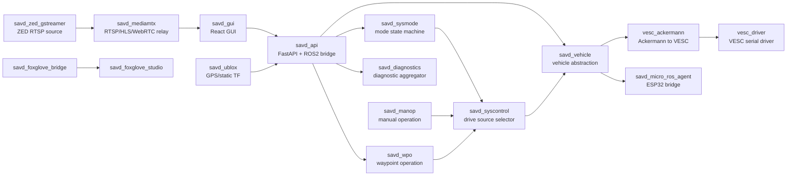

# SAVD Vehicle Container Composition and Source Responsibilities

AI assistance note: this document is based on live vehicle inspection notes and command outputs. The English wording, organization, and explanations were polished with help from OpenAI Codex.

Last updated: 2026-06-02  
Live verification window: around 2026-06-02 11:13-11:18 UTC  
Vehicle host: `172.21.16.162`  
Observed hostname: `GTW-ONX1-E1A4T4E1`  
Observed OS: Ubuntu 22.04.5 LTS, NVIDIA Jetson, aarch64  
Observed Docker version: 28.0.4  

> This document intentionally does not include SSH credentials. Credentials should be distributed separately by the lab and must not be committed to GitHub.

## 1. Purpose

This document explains the Docker container composition of the SAVD small vehicle platform. It focuses on what each container runs, where its source code is located, what runtime interfaces it owns, and how the containers work together to implement the vehicle.

The main questions answered here are:

- Which containers make up the vehicle stack?
- Which source packages are inside each container?
- Which executable, launch file, or service does each container start?
- Which ROS2 topics, services, and actions are used?
- Which container owns each GUI-visible function?
- Which containers are fully active, and which are currently incomplete or stale?

The information is based on a read-only SSH inspection performed on 2026-06-02. The inspection used:

- `docker compose ls`
- `docker compose ps`
- `docker ps -a`
- `docker inspect`
- `docker top`
- source directory inspection inside containers
- launch/config file reading
- ROS2 topic/service/action inspection
- API response checks
- diagnostics response checks
- MediaMTX and ZED GStreamer log checks
- serial device and joystick device checks

No remote files were modified. No containers were restarted. No recovery scripts were executed.

## 2. Runtime Overview

Main project directory on the vehicle:

```text
/home/user/savd/savd_docker
```

Main Compose project:

```text
savd_docker running(17)
```

Compose files currently used:

```text
/home/user/savd/savd_docker/compose.yml
/home/user/savd/savd_docker/compose.zed.yml
/home/user/savd/savd_docker/compose.healthchecks.override.yml
/home/user/savd/savd_docker/compose.zed.dual_stable.override.yml
```

Runtime characteristics:

- The main stack has 17 running containers.
- Most containers use `network_mode=host`, so their ports are exposed directly on the vehicle host.
- `savd_jetson_stats` exists but is currently `Exited (127)`.
- A separate `savd_gui-savd_gui-1` container exists in `Created` state and is not part of the active main stack.

## 3. Vehicle Capabilities

Based on the running containers and inspected source code, the platform supports:

- Browser GUI: `savd_gui`.
- HTTP-to-ROS2 bridge API: `savd_api`.
- Vehicle mode management: `savd_sysmode`.
- Mode-based drive-command source selection: `savd_syscontrol`.
- Manual operation from GUI joystick or physical joystick: `savd_manop` and `savd_teleop`.
- Waypoint operation with pure pursuit path following: `savd_wpo`.
- Vehicle hardware abstraction: `savd_vehicle`.
- VESC motor and steering control: `vesc_ackermann` and `vesc_driver`.
- ESP32/microcontroller communication: `savd_micro_ros_agent`.
- ZED front/rear camera RTSP source: `savd_zed_gstreamer`.
- RTSP/HLS/WebRTC video relay: `savd_mediamtx`.
- U-Blox GPS container: `savd_ublox`, although the real GPS node is currently not launched.
- ROS diagnostics aggregation: `savd_diagnostics`.
- Foxglove debugging: `savd_foxglove_bridge` and `savd_foxglove_studio`.
- Jetson system diagnostics: `savd_jetson_stats`, currently exited.

## 4. High-Level Architecture



## 5. Container Inventory

| Container | Current status | Image | Short role |
| --- | --- | --- | --- |
| `savd_docker-savd_gui-1` | running healthy | `dockertest3.azurecr.io/savd/gui:latest` | React vehicle GUI. |
| `savd_docker-savd_api-1` | running healthy | `ros-humble-api:v1.0` | FastAPI bridge to ROS2. |
| `savd_docker-savd_sysmode-1` | running healthy | `ros-humble-sysmode:v1.0` | Vehicle mode state machine. |
| `savd_docker-savd_syscontrol-1` | running healthy | `ros-humble-syscontrol:v1.0` | Selects active drive-command source. |
| `savd_docker-savd_manop-1` | running healthy | `ros-humble-manop:v1.0` | Manual operation command generation. |
| `savd_docker-savd_wpo-1` | running healthy | `ros-humble-wpo:v1.0` | Waypoint action and pure pursuit. |
| `savd_docker-savd_vehicle-1` | running healthy | `ros-humble-vehicle:v1.0` | Vehicle hardware abstraction. |
| `savd_docker-vesc_ackermann-1` | running healthy | `ros-humble-vesc:v1.0` | Ackermann to VESC motor/servo conversion. |
| `savd_docker-vesc_driver-1` | running healthy | `ros-humble-vesc:v1.0` | Serial VESC driver. |
| `savd_docker-savd_micro_ros_agent-1` | running healthy | `ros-humble-micro-ros-agent:v1.0` | Serial bridge to ESP32/microcontroller. |
| `savd_docker-savd_ublox-1` | running healthy | `ros-humble-ublox:latest` | GPS container; currently static TF only. |
| `savd_docker-savd_teleop-1` | running healthy | `ros-humble-teleop-tools:v1.0` | Physical joystick input. |
| `savd_docker-savd_diagnostics-1` | running healthy | `ros-humble-diagnostics:v1.0` | Aggregates diagnostics for the GUI. |
| `savd_docker-savd_zed_gstreamer-1` | running healthy | `ros-zed-gstreamer-l4t-r36.3.0-zedsdk-5.0.0:latest` | ZED camera RTSP source. |
| `savd_docker-savd_mediamtx-1` | running | `bluenviron/mediamtx:latest` | RTSP/HLS/WebRTC video relay. |
| `savd_docker-savd_foxglove_bridge-1` | running healthy | `ros-humble-foxglove-bridge:v1.0` | ROS2 WebSocket bridge for Foxglove. |
| `savd_docker-savd_foxglove_studio-1` | running healthy | `foxglove:studio` | Browser Foxglove Studio. |
| `savd_docker-savd_jetson_stats-1` | exited 127 | `ros-humble-jetson-stats:v1.0` | Jetson diagnostics, currently unavailable. |
| `savd_gui-savd_gui-1` | created | `gui:latest` | Old/alternate GUI container, not active. |

## 6. External Ports

| Function | Address |
| --- | --- |
| Main GUI | `http://172.21.16.162:3000` |
| REST API | `http://172.21.16.162:8000` |
| API OpenAPI schema | `http://172.21.16.162:8000/openapi.json` |
| Foxglove Studio | `http://172.21.16.162:8080` |
| Foxglove Bridge | `ws://172.21.16.162:8765` |
| ZED GStreamer RTSP source | `rtsp://172.21.16.162:8554/...` |
| MediaMTX RTSP | `rtsp://172.21.16.162:8553/...` |
| MediaMTX HLS | `http://172.21.16.162:8888/...` |
| MediaMTX WebRTC | `http://172.21.16.162:8889/...` |
| MediaMTX metrics | `http://172.21.16.162:9998` |

## 7. Container Details

### 7.1 `savd_docker-savd_gui-1`

Run command:

```text
yarn start
```

Image:

```text
dockertest3.azurecr.io/savd/gui:latest
```

Source paths:

```text
/app
/app/src/App.tsx
/app/src/components/Dashboard.tsx
/app/src/components/ESP32Control.tsx
/app/src/components/HeaderStatus.tsx
/app/src/components/Joystick.tsx
/app/src/components/Mapbox.tsx
/app/src/components/Mode.tsx
/app/src/components/SystemStatus.tsx
/app/src/components/TimeSync.tsx
/app/src/components/VESCInfo.tsx
/app/src/pages/Cameras.tsx
/app/src/pages/Diagnostics.tsx
/app/src/pages/Foxglove.tsx
/app/src/client/services.gen.ts
```

Main dependencies:

```text
React 18
TypeScript
MUI
Mapbox GL
Mapbox Draw
Axios
OpenAPI-generated TypeScript client
```

Confirmed behavior from source:

- `App.tsx` builds the API base URL as:

```text
http://<host>:8000
```

- `Dashboard.tsx` creates the two virtual joysticks.
- `Dashboard.tsx` calls `ManualService.sendJoyCmdsManualSendJoyCmdsPut` about every 50 ms.
- `Dashboard.tsx` embeds camera pages with iframes:

```text
http://<host>:8889/zed-front
http://<host>:8889/zed-rear
```

- `ESP32Control.tsx` reads `/vehicle/parameters` and calls gear/diff/fan APIs.
- `VESCInfo.tsx` reads `/vehicle/parameters` and `/vehicle/odom`.
- `HeaderStatus.tsx` reads `/vehicle/battery_state`.
- `Mapbox.tsx` handles waypoint drawing, WPO goal sending, and WPO pose/path display.
- `SystemStatus.tsx` displays `/diagnostics`.
- `Mode.tsx` gets and sets system modes.

This container does not directly touch hardware. It sends requests through `savd_api`.

### 7.2 `savd_docker-savd_api-1`

Run command:

```text
ros2 launch savd_api savd_api.launch.py
```

Source paths:

```text
/home/ubuntu/ros2_ws/src/savd_api
/home/ubuntu/ros2_ws/src/savd_api/savd_api/main.py
/home/ubuntu/ros2_ws/src/savd_api/utils
/home/ubuntu/ros2_ws/src/savd_api/setup.py
```

Python entry point:

```text
savd_api = savd_api.main:main
```

Main dependencies:

```text
fastapi
uvicorn
pydantic
gpxpy
utm
scipy
requests
httpx
python-jose
passlib
```

Role:

- Provides the REST API used by the GUI.
- Creates ROS2 node `/savd_api/savd_api`.
- Subscribes to ROS2 state and exposes it over HTTP.
- Converts GUI control requests into ROS2 services, topics, and actions.

Confirmed ROS2 subscriptions:

```text
/savd_vehicle/odom
/savd_vehicle/parameters
/savd_vehicle/battery_state
/diagnostics_agg
/gpsfix
/ublox_gps_node/fix
/zed_multi/zed_front/geo_pose
/savd_sysmode/mode
/savd_wpo/path
/savd_wpo/current_pose
/savd_wpo/target_pose
```

Confirmed ROS2 publisher:

```text
/savd_manop/joy_cmds_2
```

Confirmed service clients:

```text
/savd_sysmode/get_modes
/savd_sysmode/set_mode
/savd_vehicle/set_gear
/savd_vehicle/set_diff_lock
/savd_vehicle/set_fan_speed
```

Confirmed action client:

```text
/savd_wpo/waypoints
```

Main HTTP API:

```text
GET  /
GET  /current_time
GET  /diagnostics
GET  /modes/get_modes
GET  /modes/get_current_mode
PUT  /modes/set_mode/{mode}
GET  /vehicle/odom
GET  /vehicle/parameters
GET  /vehicle/battery_state
PUT  /vehicle/set_gear/{gear}
PUT  /vehicle/set_diff_lock/{cmd}
PUT  /vehicle/set_fan_speed/{speed}
PUT  /manual/send_joy_cmds
GET  /sensors/gps/fix
GET  /sensors/navsat/fix
GET  /sensors/geo/pose
PUT  /wpo/send_waypoints
PUT  /wpo/cancel_goal
GET  /wpo/path
GET  /wpo/pure_pursuit/current_pose
POST /token
GET  /users/me/
```

Current API checks:

```text
/modes/get_current_mode -> IDLE
/vehicle/parameters -> vesc_connection=connected, micro_ros_connection=connected
```

### 7.3 `savd_docker-savd_sysmode-1`

Run command:

```text
ros2 launch savd_sysmode savd_sysmode.launch.py
```

Source paths:

```text
/home/ubuntu/ros2_ws/src/savd_sysmode
/home/ubuntu/ros2_ws/src/savd_sysmode/src/savd_sysmode_node.cpp
/home/ubuntu/ros2_ws/src/savd_sysmode/include/savd_sysmode/sysmode.hpp
/home/ubuntu/ros2_ws/src/savd_sysmode/resources/statemachine.xml
```

CMake executable:

```text
savd_sysmode_node
```

Runtime node:

```text
/savd_sysmode/savd_sysmode
```

Role:

- Reads `statemachine.xml`.
- Owns the vehicle mode state machine.
- Periodically publishes the current mode.
- Provides services to set the current mode and list all modes.

Confirmed interfaces:

```text
publish: /savd_sysmode/mode
service: /savd_sysmode/set_mode
service: /savd_sysmode/get_modes
```

Launch parameters:

```text
statemachine_xml_path=/home/ubuntu/ros2_ws/src/savd_sysmode/resources/statemachine.xml
mode_pub_rate_ms=100
```

Modes:

```text
DISABLED
IDLE
ERROR
ESTOP
ERRACK
MANOP
RUTINE
MANOP_MOVE
WPO
WPO_MOVE
WPO_FINAL
WPO_ERROR
```

Important mode metadata:

```text
MANOP      -> /savd_manop/drive_cmds
MANOP_MOVE -> /savd_manop/drive_cmds
WPO        -> /savd_wpo/drive_cmds
WPO_MOVE   -> /savd_wpo/drive_cmds
WPO_FINAL  -> /savd_wpo/drive_cmds
RUTINE     -> /savd_rutine/drive_cmds
```

This is the authoritative source for vehicle mode.

### 7.4 `savd_docker-savd_syscontrol-1`

Run command:

```text
ros2 launch savd_syscontrol savd_syscontrol.launch.py
```

Source paths:

```text
/home/ubuntu/ros2_ws/src/savd_syscontrol
/home/ubuntu/ros2_ws/src/savd_syscontrol/src/savd_syscontrol_node.cpp
/home/ubuntu/ros2_ws/src/savd_syscontrol/include/savd_syscontrol/syscontrol.hpp
```

CMake executable:

```text
savd_syscontrol_node
```

Runtime node:

```text
/savd_syscontrol/savd_syscontrol
```

Role:

- Reads all modes and their `drive_topic` metadata from `savd_sysmode`.
- Subscribes to `/savd_sysmode/mode`.
- Dynamically switches the active drive-command subscription when mode changes.
- Publishes the selected drive command as one unified topic.

Confirmed interfaces:

```text
subscribe: /savd_sysmode/mode
client: /savd_sysmode/get_modes
dynamic subscribe: drive_topic from mode metadata
publish: /savd_syscontrol/drive_cmds
```

Launch remaps:

```text
/mode -> /savd_sysmode/mode
/get_modes -> /savd_sysmode/get_modes
```

This container is the drive-command arbiter.

### 7.5 `savd_docker-savd_manop-1`

Run command:

```text
ros2 launch savd_manop savd_manop.launch.py
```

Source paths:

```text
/home/ubuntu/ros2_ws/src/savd_manop
/home/ubuntu/ros2_ws/src/savd_manop/src/savd_manop_node.cpp
/home/ubuntu/ros2_ws/src/savd_manop/include/savd_manop/manop.hpp
```

CMake executable:

```text
savd_manop_node
```

Runtime node:

```text
/savd_manop/savd_manop
```

Role:

- Manual Operation.
- Receives physical joystick or GUI virtual joystick input.
- Processes joystick only when mode is `MANOP` or `MANOP_MOVE`.
- Converts joystick axes into speed and curvature.
- Can request mode change to `MANOP_MOVE` when valid joystick commands arrive.
- Can return to `MANOP` after joystick timeout.

Confirmed interfaces:

```text
subscribe: /savd_sysmode/mode
subscribe: /savd_manop/joy_cmds
subscribe: /savd_manop/joy_cmds_2
publish: /savd_manop/drive_cmds
client: /savd_sysmode/set_mode
```

Launch parameters:

```text
mode_idle=MANOP
mode_move=MANOP_MOVE
max_linear=2.0
max_angular=0.8
joy_sub_deadline_ms=100
mode_sub_deadline_ms=200
drive_cmds_pub_rate_ms=50
```

Joystick mapping confirmed in source:

```text
linear.x  = axes[1] * max_linear
angular.z = axes[3] * max_angular
```

Input paths:

```text
physical joystick -> /savd_manop/joy_cmds
GUI joystick      -> /savd_manop/joy_cmds_2
```

### 7.6 `savd_docker-savd_wpo-1`

Run command:

```text
ros2 launch savd_wpo savd_wpo.launch.py
```

Source paths:

```text
/home/ubuntu/ros2_ws/src/savd_wpo
/home/ubuntu/ros2_ws/src/savd_wpo/src/savd_wpo_node.cpp
/home/ubuntu/ros2_ws/src/savd_wpo/src/pure_pursuit_node.cpp
/home/ubuntu/ros2_ws/src/savd_wpo/include/savd_wpo/wpo_action_server.hpp
/home/ubuntu/ros2_ws/src/savd_wpo/include/savd_wpo/pure_pursuit.hpp
```

CMake executables:

```text
savd_wpo_node
pure_pursuit
pure_pursuit_test
```

Confirmed runtime processes:

```text
/savd_wpo/savd_wpo_node
/savd_wpo/pure_pursuit_node
```

Role:

- Receives waypoint goals from the GUI through an action server.
- Publishes the full path and the current path segment.
- Pure pursuit uses the segment and TF to compute current pose, target pose, and curvature.
- The WPO action server combines curvature and velocity into drive commands.
- Requests mode transitions such as `WPO_MOVE` and `WPO_FINAL`.

Confirmed interfaces:

```text
action: /savd_wpo/waypoints
subscribe: /savd_sysmode/mode
subscribe: /savd_wpo/curvature
subscribe: /savd_wpo/current_pose
publish: /savd_wpo/drive_cmds
publish: /savd_wpo/path
publish: /savd_wpo/segment
publish: /savd_wpo/current_pose
publish: /savd_wpo/curvature
publish: /savd_wpo/target_pose
client: /savd_sysmode/set_mode
```

Launch parameters:

```text
velocity=0.5
mode_sub_deadline_ms=200
base_link=base_link
```

Source defaults:

```text
min_distance_to_goal=0.2
mode_move=WPO_MOVE
mode_final=WPO_FINAL
pure_pursuit_frequency=20
velocity=0.2
max_curvature=0.8
```

The launch file overrides the WPO velocity to `0.5`.

### 7.7 `savd_docker-savd_vehicle-1`

Run command:

```text
ros2 launch savd_vehicle savd.launch.py
```

Source paths:

```text
/home/ubuntu/ros2_ws/src/savd_vehicle
/home/ubuntu/ros2_ws/src/savd_vehicle/src/savd_node.cpp
/home/ubuntu/ros2_ws/src/savd_vehicle/include/savd_vehicle/savd.hpp
/home/ubuntu/ros2_ws/src/savd_vehicle/include/savd_vehicle/vehicle_wrapper.hpp
```

CMake executable:

```text
savd_node
```

Runtime node:

```text
/savd_vehicle/savd_vehicle
```

Role:

- Vehicle hardware abstraction.
- Receives the final drive command from `savd_syscontrol`.
- Converts it into Ackermann commands for VESC.
- Publishes `SAVDCommand` to ESP32/micro-ROS for fan, gear, front diff, rear diff, and VESC on/off.
- Receives `SAVDState` from ESP32/micro-ROS.
- Converts VESC state into battery state.
- Publishes vehicle parameters for the API/GUI.

Launch remaps:

```text
drive_cmds -> /savd_syscontrol/drive_cmds
vesc_odom  -> /odom
joy        -> /savd_manop/joy_cmds
vesc_state -> /sensors/core
vesc_drive -> /ackermann_cmd
savd_state -> /savd_micro_ros/state
savd_cmds  -> /savd_micro_ros/cmd
/mode      -> /savd_sysmode/mode
/set_mode  -> /savd_sysmode/set_mode
```

Confirmed interfaces:

```text
subscribe: /savd_syscontrol/drive_cmds
subscribe: /savd_manop/joy_cmds
subscribe: /sensors/core
subscribe: /odom
subscribe: /savd_micro_ros/state
subscribe: /savd_sysmode/mode
publish: /ackermann_cmd
publish: /savd_micro_ros/cmd
publish: /savd_vehicle/odom
publish: /savd_vehicle/battery_state
publish: /savd_vehicle/parameters
service: /savd_vehicle/set_fan_speed
service: /savd_vehicle/set_gear
service: /savd_vehicle/set_diff_lock
```

Actuator service behavior:

```text
set_fan_speed: percent 0-100 -> fan_speed 0-255
set_gear: LOW / HIGH
set_diff_lock: REAR_OFF / REAR_ON / FRONT_OFF / FRONT_ON
```

Current `/vehicle/parameters` check:

```text
micro_ros_connection=connected
vesc_connection=connected
vel_max=2.000000
crvt_max=0.800000
servo_gear=HIGH
servo_diff_front=ON
servo_diff_rear=OFF
fan_speed=0
fault_code=0
```

### 7.8 `savd_docker-vesc_ackermann-1`

Run command:

```text
ros2 launch vesc_ackermann vesc_ackermann.launch.py
```

Source paths:

```text
/home/ubuntu/ros2_ws/src/vesc_ackermann
/home/ubuntu/ros2_ws/src/vesc_ackermann/src/ackermann_to_vesc.cpp
/home/ubuntu/ros2_ws/src/vesc_ackermann/src/vesc_to_odom.cpp
```

Executables:

```text
ackermann_to_vesc_node
vesc_to_odom_node
```

Role:

- `ackermann_to_vesc_node`: converts `/ackermann_cmd` into VESC motor speed and servo position commands.
- `vesc_to_odom_node`: converts VESC state and servo command feedback into `/odom` and `/tf`.

Confirmed interfaces:

```text
subscribe: /ackermann_cmd
publish: /commands/motor/speed
publish: /commands/servo/position
subscribe: /sensors/core
subscribe: /sensors/servo_position_command
publish: /odom
publish: /tf
```

Configuration file:

```text
/home/user/savd/savd_docker/config/vesc_config.yaml
```

Important parameters:

```text
speed_to_erpm_gain=8480.0
speed_to_erpm_offset=0.0
steering_angle_to_servo_gain=-0.815
steering_angle_to_servo_offset=0.475
wheelbase=0.535
```

### 7.9 `savd_docker-vesc_driver-1`

Run command:

```text
while [ ! -e /dev/serial/by-id/usb-STMicroelectronics_ChibiOS_RT_Virtual_COM_Port_304-if00 ]; do
  echo 'Waiting for VESC ...'
  sleep 1
done
ros2 launch vesc_driver vesc_driver.launch.py
```

Source paths:

```text
/home/ubuntu/ros2_ws/src/vesc_driver
/home/ubuntu/ros2_ws/src/vesc_driver/src/vesc_driver.cpp
/home/ubuntu/ros2_ws/src/vesc_driver/params/vesc_config.yaml
```

Role:

- Direct serial driver for the VESC motor controller.
- Receives motor and steering commands.
- Publishes VESC core state, IMU state, and servo sensor state.

Serial device:

```text
/dev/serial/by-id/usb-STMicroelectronics_ChibiOS_RT_Virtual_COM_Port_304-if00 -> ttyACM2
```

Confirmed interfaces:

```text
subscribe: /commands/motor/duty_cycle
subscribe: /commands/motor/current
subscribe: /commands/motor/brake
subscribe: /commands/motor/speed
subscribe: /commands/motor/position
subscribe: /commands/servo/position
publish: /sensors/core
publish: /sensors/imu
publish: /sensors/imu/raw
publish: /sensors/servo_position_command
```

Current log confirmation:

```text
Connected to VESC with firmware version 6.5
```

### 7.10 `savd_docker-savd_micro_ros_agent-1`

Run command:

```text
ros2 run micro_ros_agent micro_ros_agent serial --dev /dev/serial/by-id/usb-1a86_USB_Single_Serial_54FC036358-if00 -v4
```

Source/package paths:

```text
/home/ubuntu/ros2_ws/src/micro_ros_setup
/home/ubuntu/ros2_ws/src/uros/micro-ROS-Agent
/home/ubuntu/ros2_ws/src/uros/micro_ros_msgs
/home/ubuntu/ros2_ws/src/savd_interfaces
```

Role:

- Serial bridge between ROS2 and the ESP32/microcontroller.
- `savd_vehicle` publishes `/savd_micro_ros/cmd` through it.
- ESP32 publishes `/savd_micro_ros/state` through it.

Serial device:

```text
/dev/serial/by-id/usb-1a86_USB_Single_Serial_54FC036358-if00 -> ttyACM0
```

Main interfaces:

```text
subscribe: /savd_micro_ros/cmd
publish: /savd_micro_ros/state
publish: /savd_micro_ros/shutdown
```

Current API state:

```text
micro_ros_connection=connected
```

### 7.11 `savd_docker-savd_ublox-1`

Run command:

```text
ros2 launch ublox_gps ublox_gps_node-launch.py
```

Mounts:

```text
/home/user/savd/savd_docker/launch/savd_ublox.launch.py
  -> /home/ubuntu/ros2_ws/src/ublox/ublox_gps/launch/ublox_gps_node-launch.py
/home/user/savd/savd_docker/config/zed_f9p.yaml
  -> /home/ubuntu/ros2_ws/src/ublox/ublox_gps/config/zed_f9p.yaml
```

Source/package paths:

```text
/home/ubuntu/ros2_ws/src/ublox/ublox_gps
/home/ubuntu/ros2_ws/src/ublox/ublox_msgs
/home/ubuntu/ros2_ws/src/ublox/ublox_serialization
/home/ubuntu/ros2_ws/src/ntrip_client
```

Expected role:

- Launch the U-Blox GPS node.
- Publish `/ublox_gps_node/fix` or related GPS topics.
- Support NTRIP/RTK-related configuration.

Current actual behavior:

The launch file creates an `ublox_gps_node` object, but it is commented out in the returned launch description. In the file this appears as a commented `ublox_gps_node,` entry.

`docker top` currently shows only two static transform publishers:

```text
static_tf_map_to_odom: map -> odom
static_tf_utm_to_map: utm -> map, translation 457372 5324834 0
```

Therefore, the real U-Blox GPS node is not running.

GPS serial device exists:

```text
/dev/serial/by-id/usb-u-blox_AG_-_www.u-blox.com_u-blox_GNSS_receiver-if00 -> ttyACM1
```

Current impact:

- `/sensors/gps/fix` has no real fix.
- `/sensors/navsat/fix` has no real fix.
- Diagnostics shows `/savd/U-Blox` as `Stale`.

### 7.12 `savd_docker-savd_teleop-1`

Run command:

```text
while [ ! -e /dev/input/js0 ]; do
  echo 'Waiting for Logitech F710 ...'
  sleep 1
done
ros2 launch joy_teleop joy_teleop.launch.py
```

Source paths:

```text
/home/ubuntu/ros2_ws/src/teleop_tools/joy_teleop
/home/user/savd/savd_docker/launch/savd_teleop.launch.py
```

Role:

- Reads physical joystick input.
- The active launch starts `joy_node`.
- `/joy` is remapped to `/savd_manop/joy_cmds`.
- `joy_teleop_node` is commented out in the launch file.

Current runtime process:

```text
joy_node --ros-args ... -r /joy:=/savd_manop/joy_cmds
```

Current host device check:

```text
ls /dev/input/js* -> no_js_device
```

Current logs still show:

```text
Waiting for Logitech F710 ...
```

Interpretation:

- The container exists and has a `joy_node` process, but the physical joystick path should not be considered reliably ready.
- The GUI virtual joystick does not depend on `/dev/input/js0`; it uses `/savd_manop/joy_cmds_2`.

### 7.13 `savd_docker-savd_diagnostics-1`

Run command:

```text
ros2 launch savd_diagnostics savd_diagnostics.launch.py
```

Source/config paths:

```text
/home/ubuntu/ros2_ws/src/savd_diagnostics
/home/user/savd/savd_docker/config/diagnostics.yaml
```

Role:

- Runs ROS `diagnostic_aggregator`.
- Aggregates subsystem diagnostics.
- `savd_api` subscribes to `/diagnostics_agg`.
- The GUI SYSTEM Status is based on this data.

Configured diagnostic groups:

```text
ManOp
SysControl
SysMode
Vehicle
U-Blox
JetsonStats
ZEDXFront
ZEDXRear
```

Current diagnostics:

```text
/savd/ZEDXFront -> Stale
/savd/ZEDXRear -> Stale
/savd/JetsonStats -> Stale
/savd/ManOp -> OK
/savd/SysControl -> OK
/savd/SysMode -> OK
/savd/U-Blox -> Stale
/savd/Vehicle -> Error
/savd -> Error
```

### 7.14 `savd_docker-savd_zed_gstreamer-1`

Run command:

```text
gst-zed-rtsp-launch --address=0.0.0.0 \
  --stream '/zed-front=( zedsrc camera-sn=47170859 ... rtph264pay ... )' \
  --stream '/zed-rear=( zedsrc camera-sn=42184532 ... rtph264pay ... )'
```

Image:

```text
ros-zed-gstreamer-l4t-r36.3.0-zedsdk-5.0.0:latest
```

Source/program paths:

```text
/usr/bin/gst-zed-rtsp-launch
/home/ubuntu/ros2_ws/src/zed_components
/home/ubuntu/ros2_ws/src/zed_wrapper
/home/ubuntu/ros2_ws/src/zed-ros2-interfaces
```

Role:

- Uses Stereolabs ZED SDK and GStreamer to publish RTSP streams directly.
- The active runtime path is direct GStreamer RTSP, not the ROS2 ZED wrapper path.

Camera serial numbers:

```text
front: 47170859
rear: 42184532
```

RTSP source port:

```text
8554
```

Current status:

- Front source can be relayed by MediaMTX.
- Rear source returns `503 Service Unavailable`.
- ZED GStreamer logs mostly show `Client connected: 127.0.0.1` and do not expose a detailed root cause.

### 7.15 `savd_docker-savd_mediamtx-1`

Run command:

```text
/mediamtx
```

Image:

```text
bluenviron/mediamtx:latest
```

Config:

```text
/home/user/savd/savd_docker/config/mediamtx.yml -> /mediamtx.yml
```

Role:

- Pulls RTSP streams from `savd_zed_gstreamer`.
- Relays them as RTSP/HLS/WebRTC.
- Provides browser-friendly WebRTC pages embedded by the GUI.

Configured paths:

```text
zed-front:
  source: rtsp://localhost:8554/zed-front

zed-rear:
  source: rtsp://localhost:8554/zed-rear
```

Ports:

```text
RTSP: 8553
HLS: 8888
WebRTC: 8889
metrics: 9998
```

Current checks:

```text
front_hls=200
rear_hls=404
```

Current MediaMTX logs:

```text
[path zed-rear] [RTSP source] bad status code: 503 (Service Unavailable)
[WebRTC] closed: no stream is available on path 'zed-rear'
```

Interpretation:

- MediaMTX is not the root cause of the rear camera failure.
- It fails because `rtsp://localhost:8554/zed-rear` is not available.

### 7.16 `savd_docker-savd_foxglove_bridge-1`

Run command:

```text
ros2 run foxglove_bridge foxglove_bridge
```

Role:

- Exposes ROS2 data to Foxglove over WebSocket.
- Port: `8765`.

This container is for debugging and observability, not vehicle control.

### 7.17 `savd_docker-savd_foxglove_studio-1`

Run command:

```text
caddy run --config /etc/caddy/Caddyfile --adapter caddyfile
```

Mount:

```text
/home/user/savd/savd_docker/config/foxglove-layout.json
  -> /foxglove/default-layout.json
```

Role:

- Browser-hosted Foxglove Studio.
- Port: `8080`.

It works together with `savd_foxglove_bridge` to inspect ROS2 topics, TF, and diagnostics.

### 7.18 `savd_docker-savd_jetson_stats-1`

Run command:

```text
ros2 run ros2_jetson_stats ros2_jtop
```

Mount:

```text
/run/jtop.sock -> /run/jtop.sock
```

Expected role:

- Publish Jetson CPU/GPU/temperature/power diagnostics.

Current status:

```text
Exited (127) 7 weeks ago
```

Current logs show it once started:

```text
Jetson Stats has started with interval : 0.5
```

Because the container is exited, diagnostics reports `JetsonStats` as `Stale`.

### 7.19 `savd_gui-savd_gui-1`

Status:

```text
Created
```

Mounts:

```text
/home/user/savd/savd_gui/app -> /app
/app/node_modules volume
```

Interpretation:

- This is another GUI container from the `savd_gui` Compose project.
- It is not the active main-stack GUI.
- The active GUI is `savd_docker-savd_gui-1`.

## 8. Custom ROS Interfaces

Source path:

```text
/home/ubuntu/ros2_ws/src/savd_interfaces
```

### 8.1 `Waypoints.action`

```text
Goal:
  nav_msgs/Path path
  bool restart
  uint16 max_time_between_goals

Result:
  bool finished
  string response_msg

Feedback:
  geometry_msgs/Pose current_goal
  int32 current_waypoint_index
```

Used by `savd_api` to send waypoint goals to `savd_wpo`.

### 8.2 `DriveCmd`

```text
uint32 counter
float32 curvature
float32 curvature_velocity
float32 speed
float32 acceleration
float32 jerk
```

Describes desired curvature, speed, acceleration, and jerk.

### 8.3 `SAVDCommand`

```text
uint8 fan_speed
uint32 servo_gear
uint32 servo_diff_front
uint32 servo_diff_rear
bool vesc_on
bool request_shutdown
bool acknowledge_error
```

Low-level command sent from `savd_vehicle` to ESP32/micro-ROS.

### 8.4 `SAVDState`

Includes:

```text
mode
led_mode
bumper_state
fan_speed
servo_gear
servo_diff_front
servo_diff_rear
vesc_state
shutdown_request
shutdown_time_s
fault_code
```

Low-level state sent from ESP32/micro-ROS to `savd_vehicle`.

### 8.5 Services

```text
GetModes.srv:
  response: Mode[] modes, Success success

SetInt.srv:
  request: int64 data
  response: Success success

SetString.srv:
  request: string data
  response: Success success
```

## 9. Key Control Flows

### 9.1 GUI Virtual Joystick to Wheels

```text
savd_gui Dashboard.tsx
  -> PUT /manual/send_joy_cmds
  -> savd_api
  -> /savd_manop/joy_cmds_2
  -> savd_manop
  -> /savd_manop/drive_cmds
  -> savd_syscontrol
  -> /savd_syscontrol/drive_cmds
  -> savd_vehicle
  -> /ackermann_cmd
  -> vesc_ackermann
  -> /commands/motor/speed
  -> /commands/servo/position
  -> vesc_driver
  -> VESC hardware
```

### 9.2 Physical Joystick to Wheels

```text
/dev/input/js0
  -> joy_node
  -> /savd_manop/joy_cmds
  -> savd_manop
  -> same downstream chain as GUI joystick
```

Current issue: the host currently has no `/dev/input/js*`, so the physical joystick path should not be considered reliable.

### 9.3 Waypoint to Wheels

```text
savd_gui Mapbox.tsx
  -> PUT /wpo/send_waypoints
  -> savd_api
  -> /savd_wpo/waypoints action
  -> savd_wpo_node
  -> /savd_wpo/segment
  -> pure_pursuit_node
  -> /savd_wpo/curvature
  -> savd_wpo_node
  -> /savd_wpo/drive_cmds
  -> savd_syscontrol
  -> /savd_syscontrol/drive_cmds
  -> savd_vehicle
  -> /ackermann_cmd
  -> VESC chain
```

### 9.4 Camera to GUI

```text
ZED front/rear
  -> savd_zed_gstreamer
  -> rtsp://localhost:8554/zed-front or zed-rear
  -> savd_mediamtx
  -> http://172.21.16.162:8889/zed-front or zed-rear
  -> savd_gui iframe
```

## 10. Current Live Status and Issues

### 10.1 Working or Mostly Working

- Main GUI container is running healthy.
- API container is running healthy.
- VESC driver is connected, firmware 6.5.
- micro-ROS/ESP32 connection appears as connected in API parameters.
- Front camera HLS returns 200.
- `savd_sysmode`, `savd_syscontrol`, and `savd_manop` diagnostics are OK.

### 10.2 Broken or Incomplete

| Item | Current behavior | Location |
| --- | --- | --- |
| Rear camera | HLS 404, WebRTC no stream | MediaMTX cannot pull `zed-rear`; source returns 503. |
| U-Blox GPS | diagnostics stale | Real `ublox_gps_node` is commented out; only static TF runs. |
| JetsonStats | container exited 127 | diagnostics stale. |
| Physical joystick | `/dev/input/js*` does not exist | Physical joystick path is not reliable. |
| Vehicle diagnostics | `/savd/Vehicle` Error | No drive command has been received, while VESC/micro-ROS are connected. |
| ZED diagnostics | ZEDXFront/ZEDXRear stale | Camera path is direct GStreamer, not ROS ZED diagnostics. |

## 11. Safe Read-Only Commands

Docker:

```bash
docker compose ls
docker compose ps
docker ps -a --format "table {{.Names}}\t{{.Status}}\t{{.Image}}"
docker inspect <container>
docker top <container> -eo pid,ppid,cmd
docker logs <container> --tail 100
```

API:

```bash
curl http://172.21.16.162:8000/current_time
curl http://172.21.16.162:8000/modes/get_current_mode
curl http://172.21.16.162:8000/vehicle/parameters
curl http://172.21.16.162:8000/diagnostics
```

Devices:

```bash
ls -l /dev/serial/by-id
ls /dev/input/js*
```

## 12. Dangerous Control Interfaces

These are not read-only. They can change the vehicle state or command movement:

```text
PUT /modes/set_mode/{mode}
PUT /manual/send_joy_cmds
PUT /vehicle/set_gear/{gear}
PUT /vehicle/set_diff_lock/{cmd}
PUT /vehicle/set_fan_speed/{speed}
PUT /wpo/send_waypoints
PUT /wpo/cancel_goal
```

These scripts and Docker commands also change runtime state:

```text
./recover_dual_cameras.sh
./start_stack_camera_stable.sh
./start_stack.sh
docker compose restart
docker compose down
docker compose up
```

## 13. Summary

The main control chain is:

```text
GUI/API -> mode/state/control ROS nodes -> vehicle abstraction -> VESC + ESP32
```

The camera chain is:

```text
ZED GStreamer -> MediaMTX -> GUI iframe
```

The debugging chain is:

```text
ROS2 graph -> foxglove_bridge -> foxglove_studio
```

Most important facts:

- The active runtime stack is `savd_docker`, with 17 running containers.
- The core vehicle-control containers are `savd_sysmode`, `savd_syscontrol`, `savd_manop`, `savd_wpo`, and `savd_vehicle`.
- The core hardware-interface containers are `vesc_driver`, `vesc_ackermann`, and `savd_micro_ros_agent`.
- The GUI displays state and sends API requests; it does not directly control hardware.
- Rear camera, GPS, JetsonStats, and physical joystick are the main current follow-up areas.
