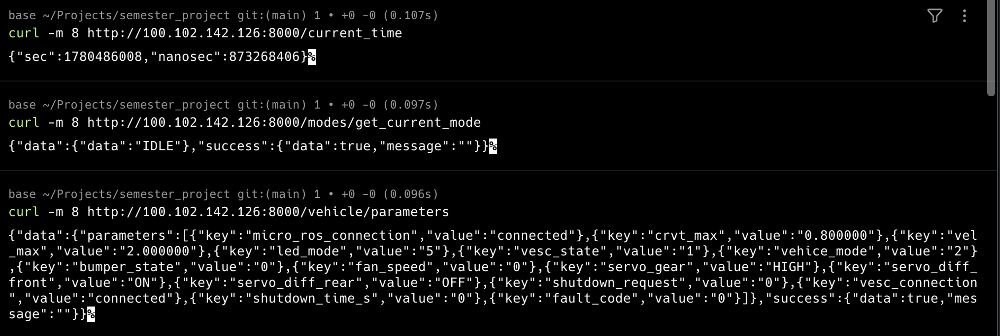
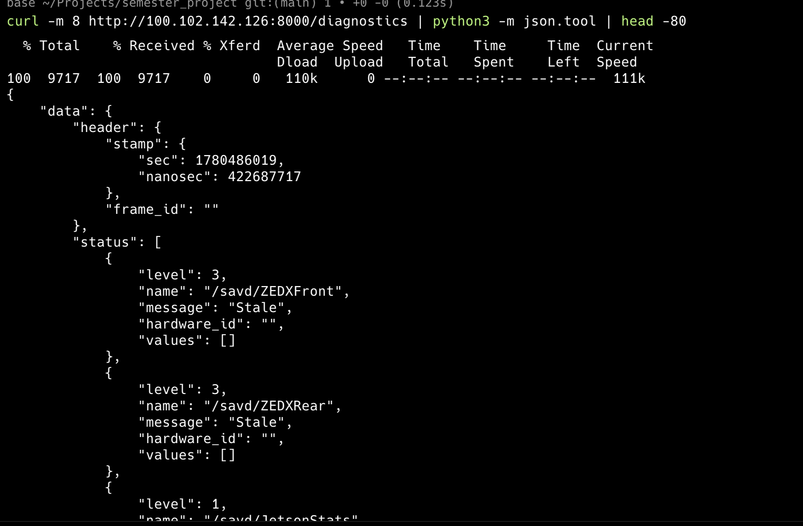
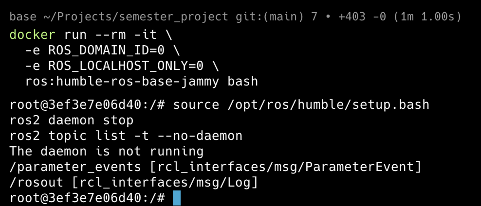
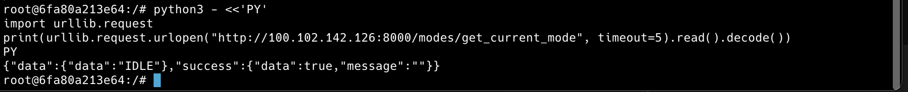
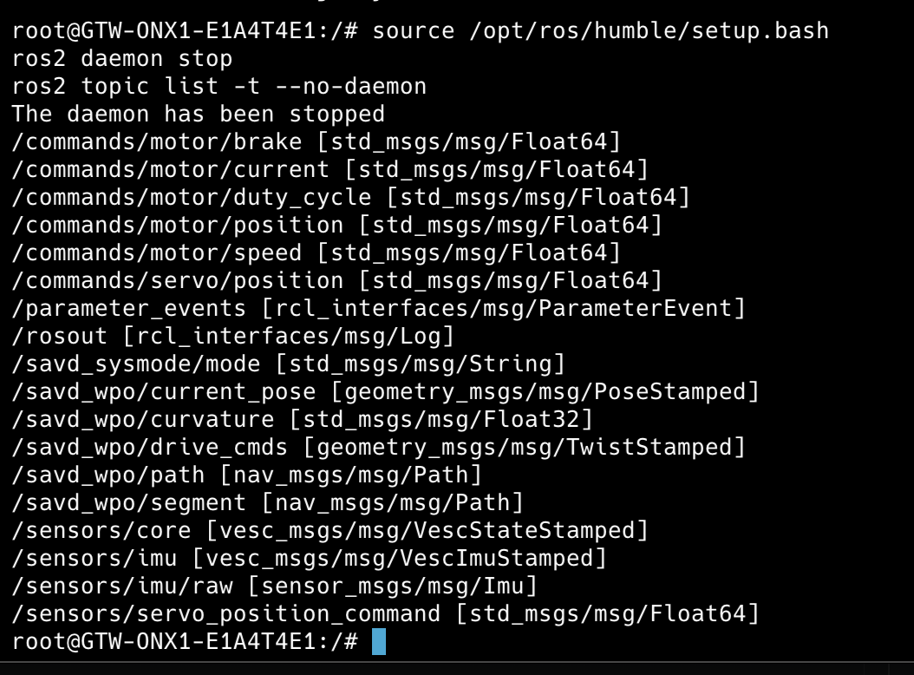
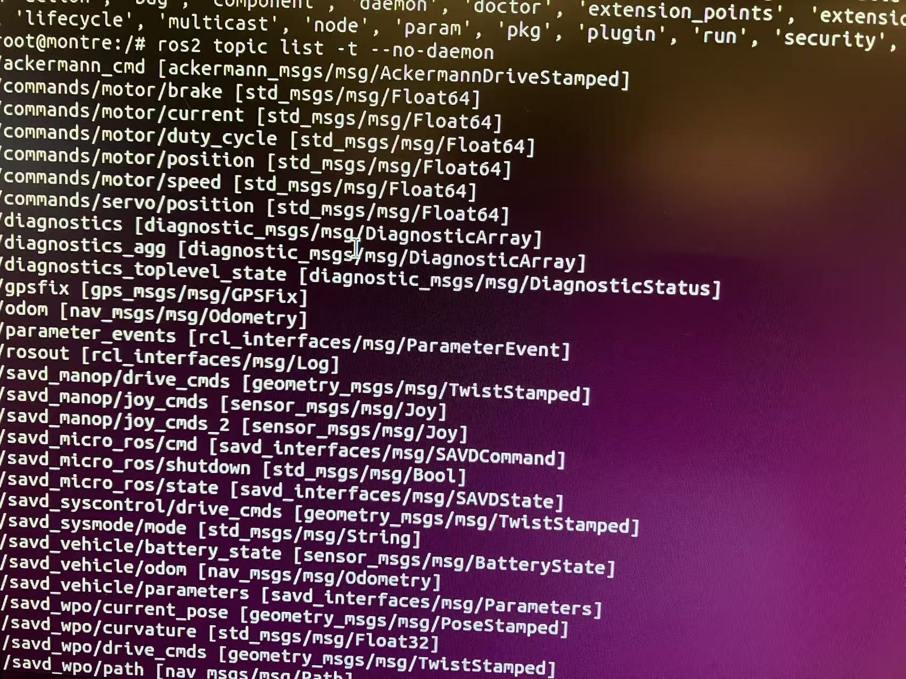

# Raw Test Notes: HTTP Bridge vs Direct ROS2 Subscription

Date: 2026-06-03

This file keeps the raw test evidence separately from the polished comparison report in `compare.md`.

The commands and observed outputs below were produced during the SAVD truck remote-access test. This is intentionally less polished than the formal report.


## 1. Laptop HTTP Test

Test target:

```text
http://100.102.142.126:8000
```

Tested API endpoints:

```text
GET /modes/get_current_mode
GET /vehicle/parameters
GET /diagnostics
```

Observed result:

```text
The HTTP bridge worked from the laptop.
I use tailscale remotely acess the API,it works very well
The API returned current mode, vehicle parameters, and diagnostics.
```

Screenshots:





## 2. Laptop Direct ROS2 Test

I have get the ```ROS_DOMAIN_ID``` by the command below

``` bash
for c in $(docker ps --format '{{.Names}}' | grep '^savd_docker'); do
  echo "===== $c ====="
  docker exec "$c" sh -lc 'printenv | grep -E "ROS_DOMAIN_ID|ROS_LOCALHOST_ONLY|RMW_IMPLEMENTATION|CYCLONEDDS|FASTRTPS" || true'
done
```

Container:

```bash
docker run --rm -it \
  -e ROS_DOMAIN_ID=0 \
  -e ROS_LOCALHOST_ONLY=0 \
  ros:humble-ros-base-jammy bash
```

Commands inside the container:

```bash
source /opt/ros/humble/setup.bash
export ROS_DOMAIN_ID=0
export ROS_LOCALHOST_ONLY=0
ros2 daemon stop
ros2 topic list --no-daemon
```

Screenshots:


```text

We can see the output is not print all the components
its means the ROS2 newwork cant work well via Tailscale(virtual local network) in Mac docker 
```


## 3. HTTP Test From Inside the Same ROS2 Container

Purpose:

```text
Check whether the ROS2 container can reach the truck over normal IP/HTTP.
```

Command:

```bash
python3 - <<'PY'
import urllib.request
print(
    urllib.request.urlopen(
        "http://100.102.142.126:8000/modes/get_current_mode",
        timeout=5,
    ).read().decode()
)
PY
```

Screenshot:



```text
HTTP from inside the ROS2 container worked.
So it prove previous failure is not due to the Tailcale,its due to the ROS network cant handle the complex enviroment.
```

## 4. Truck-Local Direct ROS2 Baseline Test

Environment:

```text
SSH into the SAVD truck, then start a ROS2 client container directly on the truck.
```

Container:

```bash
docker run --rm -it \
  -e ROS_DOMAIN_ID=0 \
  -e ROS_LOCALHOST_ONLY=0 \
  ros:humble-ros-base-jammy bash
```

Commands inside the container:

```bash
source /opt/ros/humble/setup.bash
ros2 daemon stop
ros2 topic list -t --no-daemon
```

Screenshot:



Raw observation:

```text

This proves that the ROS2 client container and ROS2 commands are valid.
However, this is not a true remote test because the client is running on the same truck.
```


## 5. Truck-Local Network ROS2 

Run the same ROS2 client container on a separate Linux machine connected to the same local network as the truck:

```bash
docker run --rm -it \
  -e ROS_DOMAIN_ID=0 \
  -e ROS_LOCALHOST_ONLY=0 \
  ros:humble-ros-base-jammy bash
```

Commands inside the container:

```bash
source /opt/ros/humble/setup.bash
ros2 daemon stop
ros2 topic list -t --no-daemon
```

Screenshot:



In a word, I can say HTTP have a better adaptive in complex network environment.But we need warp the ros bridge by another layer

ROS2 bridge have a more simple config reqiurement in local network enviroment 
