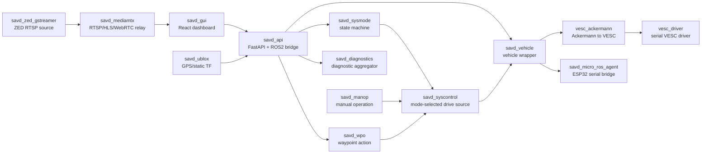

# SAVD 小车 Docker 容器与源码说明

AI 辅助说明：本文档基于小车实时检查记录、命令输出和源码阅读整理，中文表述、结构和解释部分由 OpenAI Codex 辅助润色。

检查日期：2026-06-01  
小车地址：`172.21.16.162`  
登录方式：`ssh user@172.21.16.162`  
主机名：`GTW-ONX1-E1A4T4E1`  
系统：Ubuntu 22.04.5 LTS, Jetson/aarch64, Docker 28.0.4

## 1. 检查范围

这份文档是对小车当前 Docker/ROS2 系统的只读分析，主要看了：

- Docker Compose 配置、容器启动命令、挂载目录和运行状态。
- 每个容器内部能看到的源码目录、launch 文件、配置文件。
- ROS2 节点、话题、服务、action 和 GUI/API 的调用关系。
- GUI 截图里每块功能对应后端哪个容器。
- 当前可见的异常：后摄像头、GPS/U-Blox、Jetson Stats、系统诊断 ERROR 等。

本次没有改远端文件，没有重启容器，没有运行恢复脚本。

## 2. 总体结论

这台小车不是一个单体程序，而是一组 Docker 容器组成的 ROS2 系统。核心可以理解成四层：

1. Web 层：`savd_gui` 提供浏览器 GUI，`savd_api` 把 HTTP 请求转换成 ROS2 话题/服务/action。
2. 决策/模式层：`savd_sysmode` 管理状态机，`savd_syscontrol` 根据当前模式选择控制输入。
3. 控制层：`savd_manop` 处理手动驾驶，`savd_wpo` 处理 waypoint 自动驾驶，`savd_vehicle` 把抽象车辆命令转换成 VESC/ESP32 命令。
4. 硬件/传感器层：`vesc_driver`、`vesc_ackermann`、`savd_micro_ros_agent`、`savd_ublox`、`savd_zed_gstreamer`、`savd_mediamtx` 连接电机、电控、GPS、摄像头。

GUI 上看到的页面基本都来自 `savd_gui`，但实际数据来自 `savd_api`。`savd_api` 再去读写 ROS2 的 topic/service/action。

## 3. 主要目录与 Compose

远端主项目目录：

```text
/home/user/savd/savd_docker
```

当前运行的 Compose 项目：

```text
savd_docker running(17)
```

当前使用的 Compose 文件：

```text
/home/user/savd/savd_docker/compose.yml
/home/user/savd/savd_docker/compose.zed.yml
/home/user/savd/savd_docker/compose.healthchecks.override.yml
/home/user/savd/savd_docker/compose.zed.dual_stable.override.yml
```

关键脚本：

```text
/home/user/savd/savd_docker/recover_dual_cameras.sh
/home/user/savd/savd_docker/start_stack_camera_stable.sh
/home/user/savd/savd_docker/start_stack.sh
/home/user/savd/savd_docker/OPERATIONS_GUIDE.md
```

大部分容器使用 `network_mode: host`，所以端口直接开在小车主机上。

## 4. 访问入口

| 功能 | 地址/端口 | 容器 |
| --- | --- | --- |
| 主 GUI | `http://172.21.16.162:3000` | `savd_gui` |
| REST API | `http://172.21.16.162:8000` | `savd_api` |
| API 文档 JSON | `http://172.21.16.162:8000/openapi.json` | `savd_api` |
| Foxglove Studio | `http://172.21.16.162:8080` | `savd_foxglove_studio` |
| Foxglove Bridge | `ws://172.21.16.162:8765` | `savd_foxglove_bridge` |
| ZED 原始 RTSP | `rtsp://172.21.16.162:8554/...` | `savd_zed_gstreamer` |
| MediaMTX RTSP | `rtsp://172.21.16.162:8553/...` | `savd_mediamtx` |
| MediaMTX HLS | `http://172.21.16.162:8888/...` | `savd_mediamtx` |
| MediaMTX WebRTC | `http://172.21.16.162:8889/...` | `savd_mediamtx` |
| MediaMTX metrics | `http://172.21.16.162:9998` | `savd_mediamtx` |

## 5. 高层数据流



## 6. GUI 截图对应关系

| GUI 区域 | 前端源码 | 后端/API | 进一步对应的 ROS/容器 |
| --- | --- | --- | --- |
| VESC Info: 速度、曲率、VESC 状态 | `/app/src/components/VESCInfo.tsx` | `/vehicle/parameters`, `/vehicle/odom` | `savd_api` -> `savd_vehicle` -> `vesc_ackermann`/`vesc_driver` |
| ESP32 Control: gear、diff、fan | `/app/src/components/ESP32Control.tsx` | `/vehicle/set_gear/{gear}`, `/vehicle/set_diff_lock/{cmd}`, `/vehicle/set_fan_speed/{speed}` | `savd_api` -> `savd_vehicle` -> `savd_micro_ros_agent` -> ESP32 |
| 中间两个视频窗口 | `/app/src/components/Dashboard.tsx` | iframe 直接打开 `:8889/zed-front` 和 `:8889/zed-rear` | `savd_mediamtx` -> `savd_zed_gstreamer` |
| Mapbox 地图、SEND/CANCEL/CENTER | `/app/src/components/Mapbox.tsx` | `/wpo/send_waypoints`, `/wpo/cancel_goal`, GPS/pose/path API | `savd_api` -> `savd_wpo`, `savd_ublox`, ZED geo pose |
| TIME Synced | `/app/src/components/TimeSync.tsx` 和 `/app/src/App.tsx` | `/current_time` | `savd_api` |
| SYSTEM Status | `/app/src/components/SystemStatus.tsx` 和 `/app/src/App.tsx` | `/diagnostics` | `savd_diagnostics` 聚合所有 ROS diagnostics |
| Select MODE | `/app/src/components/Mode.tsx` | `/modes/get_modes`, `/modes/set_mode/{mode}` | `savd_api` -> `savd_sysmode` |
| STOP 红色按钮 | `/app/src/components/Dashboard.tsx` | 设置模式为 `ESTOP` | `savd_api` -> `savd_sysmode` |
| 蓝色虚拟摇杆 | `/app/src/components/Dashboard.tsx` | `/manual/send_joy_cmds`，约 50 ms 周期发送 | `savd_api` -> `/savd_manop/joy_cmds_2` -> `savd_manop` |

GUI 的 API 基地址在 `App.tsx` 里动态生成：

```text
http://<当前网页 hostname>:8000
```

所以打开 `http://172.21.16.162:3000` 时，前端会调用 `http://172.21.16.162:8000`。

## 7. 容器逐个说明

### 7.1 `savd_docker-savd_gui-1`

镜像：

```text
dockertest3.azurecr.io/savd/gui:latest
```

启动命令：

```text
yarn start
```

源码位置：

```text
/app
/app/src/App.tsx
/app/src/components/Dashboard.tsx
/app/src/components/VESCInfo.tsx
/app/src/components/ESP32Control.tsx
/app/src/components/SystemStatus.tsx
/app/src/components/TimeSync.tsx
/app/src/components/Mode.tsx
/app/src/components/Mapbox.tsx
/app/src/components/Cameras.tsx
/app/src/components/Foxglove.tsx
/app/src/client
```

作用：

- 浏览器中显示 SAVD 控制面板。
- 周期性读取 API：时间、诊断、车辆参数、速度/曲率、模式等。
- 通过 API 发送模式切换、STOP、手动摇杆、gear/diff/fan 命令。
- 直接通过 iframe 显示 MediaMTX 的 ZED WebRTC 页面。

和截图的关系：

- 左侧 VESC/ESP32 面板、中间视频、地图、右侧时间/系统/模式、STOP 按钮都在这个前端里。

### 7.2 `savd_docker-savd_api-1`

镜像：

```text
ros-humble-api:v1.0
```

启动命令：

```text
ros2 launch savd_api savd_api.launch.py
```

源码位置：

```text
/home/ubuntu/ros2_ws/src/savd_api
/home/ubuntu/ros2_ws/src/savd_api/savd_api/main.py
/home/ubuntu/ros2_ws/src/savd_api/setup.py
```

作用：

- FastAPI + ROS2 bridge。
- 把 GUI 的 HTTP 请求转换成 ROS2 topic、service、action。
- 给前端提供统一 REST API。

主要订阅：

```text
/savd_vehicle/odom
/savd_vehicle/parameters
/savd_vehicle/battery_state
/diagnostics_agg
/gpsfix
/ublox_gps_node/fix
/zed_multi/zed_front/geo_pose
/savd_sysmode/mode
/savd_wpo/path
/savd_wpo/current_pose
/savd_wpo/target_pose
```

主要发布：

```text
/savd_manop/joy_cmds_2
```

主要 service/action client：

```text
/savd_sysmode/get_modes
/savd_sysmode/set_mode
/savd_vehicle/set_gear
/savd_vehicle/set_diff_lock
/savd_vehicle/set_fan_speed
/savd_wpo/waypoints
```

主要 HTTP API：

```text
/current_time
/diagnostics
/manual/send_joy_cmds
/modes/get_current_mode
/modes/get_modes
/modes/set_mode/{mode}
/vehicle/parameters
/vehicle/odom
/vehicle/battery_state
/vehicle/set_gear/{gear}
/vehicle/set_diff_lock/{cmd}
/vehicle/set_fan_speed/{speed}
/wpo/send_waypoints
/wpo/cancel_goal
/wpo/path
/sensors/gps/fix
/sensors/navsat/fix
/sensors/geo/pose
```

### 7.3 `savd_docker-savd_sysmode-1`

镜像：

```text
ros-humble-sysmode:v1.0
```

启动命令：

```text
ros2 launch savd_sysmode savd_sysmode.launch.py
```

源码位置：

```text
/home/ubuntu/ros2_ws/src/savd_sysmode
/home/ubuntu/ros2_ws/src/savd_sysmode/src
/home/ubuntu/ros2_ws/src/savd_sysmode/resources/statemachine.xml
```

作用：

- 整车模式状态机。
- 当前 GUI 下拉框里的 `IDLE`、`MANOP`、`WPO`、`ESTOP` 等模式来自这里。
- 提供设置模式和获取模式的 ROS2 service。
- 周期性发布当前模式。

主要接口：

```text
publish: /savd_sysmode/mode
service: /savd_sysmode/set_mode
service: /savd_sysmode/get_modes
```

状态机里看到的模式：

```text
DISABLED
IDLE
ERROR
ESTOP
ERRACK
MANOP
RUTINE
MANOP_MOVE
WPO
WPO_MOVE
WPO_FINAL
WPO_ERROR
```

模式元数据里还定义了不同模式的 drive topic，例如：

```text
MANOP -> /savd_manop/drive_cmds
RUTINE -> /savd_rutine/drive_cmds
WPO -> /savd_wpo/drive_cmds
```

### 7.4 `savd_docker-savd_syscontrol-1`

镜像：

```text
ros-humble-syscontrol:v1.0
```

启动命令：

```text
ros2 launch savd_syscontrol savd_syscontrol.launch.py
```

源码位置：

```text
/home/ubuntu/ros2_ws/src/savd_syscontrol
/home/ubuntu/ros2_ws/src/savd_syscontrol/src
```

作用：

- 根据当前模式选择到底听谁的驾驶命令。
- 如果是手动模式，听 `savd_manop`。
- 如果是 waypoint 模式，听 `savd_wpo`。
- 然后把统一后的驾驶命令发给 `savd_vehicle`。

主要接口：

```text
subscribe: /savd_sysmode/mode
client: /savd_sysmode/get_modes
publish: /savd_syscontrol/drive_cmds
```

### 7.5 `savd_docker-savd_manop-1`

镜像：

```text
ros-humble-manop:v1.0
```

启动命令：

```text
ros2 launch savd_manop savd_manop.launch.py
```

源码位置：

```text
/home/ubuntu/ros2_ws/src/savd_manop
/home/ubuntu/ros2_ws/src/savd_manop/src
```

作用：

- Manual Operation，手动驾驶节点。
- 接收实体手柄或 GUI 虚拟摇杆的 Joy 消息。
- 把摇杆输入转换成车辆速度和曲率。
- 必要时调用 `savd_sysmode` 切到手动移动模式。

主要接口：

```text
subscribe: /savd_manop/joy_cmds
subscribe: /savd_manop/joy_cmds_2
subscribe: /savd_sysmode/mode
publish: /savd_manop/drive_cmds
client: /savd_sysmode/set_mode
```

launch 参数里看到：

```text
mode_idle = MANOP
mode_move = MANOP_MOVE
max_linear = 2.0
max_angular = 0.8
```

### 7.6 `savd_docker-savd_wpo-1`

镜像：

```text
ros-humble-wpo:v1.0
```

启动命令：

```text
ros2 launch savd_wpo savd_wpo.launch.py
```

源码位置：

```text
/home/ubuntu/ros2_ws/src/savd_wpo
/home/ubuntu/ros2_ws/src/savd_wpo/src
```

作用：

- Waypoint Operation，负责地图上 SEND 之后的 waypoint 任务。
- 包含 waypoint action server 和 pure pursuit 跟踪节点。
- 接收路径目标，生成当前段、目标点、曲率和驾驶命令。

主要节点：

```text
/savd_wpo/savd_wpo_node
/savd_wpo/pure_pursuit_node
```

主要接口：

```text
action: /savd_wpo/waypoints
subscribe: /savd_wpo/current_pose
subscribe: /savd_wpo/curvature
subscribe: /savd_sysmode/mode
publish: /savd_wpo/drive_cmds
publish: /savd_wpo/path
publish: /savd_wpo/segment
publish: /savd_wpo/target_pose
client: /savd_sysmode/set_mode
```

launch 参数里看到：

```text
velocity = 0.5
min_distance_to_goal = 0.2
mode_idle = WPO
mode_move = WPO_MOVE
mode_final = WPO_FINAL
mode_error = WPO_ERROR
```

### 7.7 `savd_docker-savd_vehicle-1`

镜像：

```text
ros-humble-vehicle:v1.0
```

启动命令：

```text
ros2 launch savd_vehicle savd.launch.py
```

源码位置：

```text
/home/ubuntu/ros2_ws/src/savd_vehicle
/home/ubuntu/ros2_ws/src/savd_vehicle/src
```

作用：

- 整车硬件抽象层。
- 从 `savd_syscontrol` 接收最终驾驶命令。
- 发布给 VESC 的 Ackermann 命令。
- 向 ESP32/micro-ROS 发送 gear、diff、fan 等命令。
- 收集并发布车辆参数、电池状态、里程计状态。

主要接口：

```text
subscribe: /savd_syscontrol/drive_cmds
subscribe: /savd_manop/joy_cmds
subscribe: /sensors/core
subscribe: /odom
subscribe: /savd_micro_ros/state
subscribe: /savd_sysmode/mode
publish: /ackermann_cmd
publish: /savd_micro_ros/cmd
publish: /savd_vehicle/odom
publish: /savd_vehicle/battery_state
publish: /savd_vehicle/parameters
service: /savd_vehicle/set_fan_speed
service: /savd_vehicle/set_gear
service: /savd_vehicle/set_diff_lock
```

参数：

```text
vel_max = 2.0
crvt_max = 0.8
wheelbase = 0.535
```

当前 API 读到的状态：

```text
micro_ros_connection = connected
vesc_connection = connected
servo_gear = HIGH
servo_diff_front = ON
servo_diff_rear = OFF
fan_speed = 0
fault_code = 0
```

### 7.8 `savd_docker-vesc_ackermann-1`

镜像：

```text
ros-humble-vesc:v1.0
```

启动命令：

```text
ros2 launch vesc_ackermann vesc_ackermann.launch.py
```

源码位置：

```text
/home/ubuntu/ros2_ws/src/vesc_ackermann
/home/ubuntu/ros2_ws/src/vesc_ackermann/src/ackermann_to_vesc.cpp
/home/ubuntu/ros2_ws/src/vesc_ackermann/src/vesc_to_odom.cpp
```

作用：

- 把 Ackermann 驾驶命令转换为 VESC 电机速度和舵机位置命令。
- 同时把 VESC 反馈转换成 ROS odom 和 tf。

主要接口：

```text
subscribe: /ackermann_cmd
publish: /commands/motor/speed
publish: /commands/servo/position
subscribe: /sensors/core
subscribe: /sensors/servo_position_command
publish: /odom
publish: /tf
```

### 7.9 `savd_docker-vesc_driver-1`

镜像：

```text
ros-humble-vesc:v1.0
```

启动命令：

```text
ros2 launch vesc_driver vesc_driver.launch.py
```

源码位置：

```text
/home/ubuntu/ros2_ws/src/vesc_driver
/home/ubuntu/ros2_ws/src/vesc_driver/src
/home/user/savd/savd_docker/config/vesc_config.yaml
```

作用：

- 通过串口连接 VESC 电机控制器。
- 接收电机速度、制动、电流、舵机位置等命令。
- 发布 VESC core/IMU/servo 状态。

串口设备：

```text
/dev/serial/by-id/usb-STMicroelectronics_ChibiOS_RT_Virtual_COM_Port_304-if00
```

主要接口：

```text
subscribe: /commands/motor/speed
subscribe: /commands/motor/brake
subscribe: /commands/motor/current
subscribe: /commands/motor/duty_cycle
subscribe: /commands/servo/position
publish: /sensors/core
publish: /sensors/imu
publish: /sensors/imu/raw
publish: /sensors/servo_position_command
```

关键配置：

```text
speed_to_erpm_gain = 8480.0
steering_angle_to_servo_gain = -0.815
steering_angle_to_servo_offset = 0.475
wheelbase = 0.535
```

日志里显示 VESC 已连接，固件版本约为 6.5。

### 7.10 `savd_docker-savd_micro_ros_agent-1`

镜像：

```text
ros-humble-micro-ros-agent:v1.0
```

启动命令：

```text
ros2 run micro_ros_agent micro_ros_agent serial --dev /dev/serial/by-id/usb-1a86_USB_Single_Serial_54FC036358-if00 -v4
```

源码位置：

```text
/home/ubuntu/ros2_ws/src/micro_ros_setup
/home/ubuntu/ros2_ws/src/uros/micro-ROS-Agent
/home/ubuntu/ros2_ws/src/micro_ros_msgs
/home/ubuntu/ros2_ws/src/savd_interfaces
```

作用：

- ROS2 与 ESP32/微控制器之间的串口桥。
- 车辆层通过它控制 gear、front diff、rear diff、fan 等低层执行器。
- 也从微控制器读状态。

串口设备：

```text
/dev/serial/by-id/usb-1a86_USB_Single_Serial_54FC036358-if00
```

主要接口：

```text
subscribe: /savd_micro_ros/cmd
publish: /savd_micro_ros/state
publish: /savd_micro_ros/shutdown
```

### 7.11 `savd_docker-savd_ublox-1`

镜像：

```text
ros-humble-ublox:latest
```

启动命令：

```text
ros2 launch ublox_gps ublox_gps_node-launch.py
```

源码位置：

```text
/home/ubuntu/ros2_ws/src/ublox
/home/ubuntu/ros2_ws/src/ublox_gps
/home/ubuntu/ros2_ws/src/ublox_msgs
/home/ubuntu/ros2_ws/src/ublox_serialization
/home/ubuntu/ros2_ws/src/ntrip_client
/home/user/savd/savd_docker/config/zed_f9p.yaml
```

作用：

- 预期应该连接 U-Blox GPS，发布 NavSatFix/GPSFix。
- 但当前 launch 文件里真正的 `ublox_gps_node` 被注释掉了。
- 当前实际只发布两个 static transform：
  - `map -> odom`
  - `utm -> map`

配置里看到的 GPS 串口：

```text
/dev/serial/by-id/usb-u-blox_AG_-_www.u-blox.com_u-blox_GNSS_receiver-if00
```

当前影响：

- `/sensors/gps/fix` 和 `/sensors/navsat/fix` API 返回没有 fix。
- diagnostics 中 `/savd/U-Blox` 是 `STALE`。

### 7.12 `savd_docker-savd_teleop-1`

镜像：

```text
ros-humble-teleop-tools:v1.0
```

启动命令：

```text
ros2 launch joy_teleop joy_teleop.launch.py
```

源码位置：

```text
/home/ubuntu/ros2_ws/src/teleop_tools/joy_teleop
/home/user/savd/savd_docker/launch/joy_teleop.launch.py
/home/user/savd/savd_docker/config/joy_teleop.yaml
```

作用：

- 读取实体手柄 `/dev/input/js0`。
- 当前 launch 实际只启动 `joy_node`，并把 `/joy` remap 到 `/savd_manop/joy_cmds`。
- `joy_teleop_node` 在 launch 中被注释掉，所以 YAML 里的复杂映射当前没有真正用上。

当前观察：

```text
/dev/input/js0 当前未看到
```

这说明实体手柄可能没有连接，或者系统没有创建 joystick 设备。GUI 的蓝色虚拟摇杆不依赖这个容器，它通过 API 走 `/savd_manop/joy_cmds_2`。

### 7.13 `savd_docker-savd_diagnostics-1`

镜像：

```text
ros-humble-diagnostics:v1.0
```

启动命令：

```text
ros2 launch savd_diagnostics savd_diagnostics.launch.py
```

源码位置：

```text
/home/ubuntu/ros2_ws/src/savd_diagnostics
/home/user/savd/savd_docker/config/diagnostics.yaml
```

作用：

- 运行 ROS `diagnostic_aggregator`。
- 把各节点发布的 diagnostics 聚合成 GUI 的 SYSTEM Status。

聚合组包括：

```text
ManOp
SysControl
SysMode
Vehicle
U-Blox
JetsonStats
ZEDXFront
ZEDXRear
```

当前 GUI 显示 SYSTEM ERROR 的原因来自这里的聚合结果。

### 7.14 `savd_docker-savd_foxglove_bridge-1`

镜像：

```text
ros-humble-foxglove-bridge:v1.0
```

启动命令：

```text
ros2 run foxglove_bridge foxglove_bridge
```

作用：

- 把 ROS2 图通过 WebSocket 暴露给 Foxglove。
- 端口是 `8765`。
- 用于调试 ROS topic、service、tf、诊断等。

### 7.15 `savd_docker-savd_foxglove_studio-1`

镜像：

```text
dockertest3.azurecr.io/savd/foxglove:studio
```

作用：

- 浏览器版 Foxglove Studio。
- 端口是 `8080`。
- 默认布局挂载自：

```text
/home/user/savd/savd_docker/config/foxglove-layout.json
```

环境变量里看到：

```text
DS_TYPE=foxglove-websocket
DS_PORT=9090
UI_PORT=8080
```

### 7.16 `savd_docker-savd_zed_gstreamer-1`

镜像：

```text
ros-zed-gstreamer-l4t-r36.3.0-zedsdk-5.0.0:latest
```

当前启动命令核心：

```text
gst-zed-rtsp-launch --address=0.0.0.0 \
  --stream "/zed-front=( zedsrc camera-sn=47170859 ... rtph264pay ... )" \
  --stream "/zed-rear=( zedsrc camera-sn=42184532 ... rtph264pay ... )"
```

源码/程序位置：

```text
/usr/bin/gst-zed-rtsp-launch
/home/ubuntu/ros2_ws/src/zed-ros2-wrapper
/home/ubuntu/ros2_ws/src/zed-ros2-interfaces
```

作用：

- 直接用 Stereolabs ZED SDK + GStreamer 把两个 ZED 相机转成 RTSP。
- 当前运行路径不是 ROS2 ZED wrapper，而是 GStreamer 直接出流。
- 原始 RTSP 端口是 `8554`。

相机序列号：

```text
front: 47170859
rear: 42184532
```

当前状态：

- `zed-front` 可用。
- `zed-rear` 失败，直接访问源头返回 `503 Service Unavailable`。

### 7.17 `savd_docker-savd_mediamtx-1`

镜像：

```text
bluenviron/mediamtx:latest
```

配置文件：

```text
/home/user/savd/savd_docker/config/mediamtx.yml
```

作用：

- 从 `savd_zed_gstreamer` 拉取 RTSP。
- 再转发成 RTSP/HLS/WebRTC，方便 GUI 浏览器显示。

配置里看到：

```text
zed-front source: rtsp://localhost:8554/zed-front
zed-rear  source: rtsp://localhost:8554/zed-rear
```

端口：

```text
RTSP: 8553
HLS: 8888
WebRTC: 8889
metrics: 9998
```

当前状态：

- `zed-front` 正常，可通过 HLS/WebRTC/RTSP 访问。
- `zed-rear` 异常，MediaMTX 日志持续出现：

```text
[path zed-rear] [RTSP source] bad status code: 503 (Service Unavailable)
```

这和 GUI 下方视频窗口显示 `Error: stream not found` 对应。

### 7.18 `savd_docker-savd_jetson_stats-1`

镜像：

```text
ros-humble-jetson-stats:v1.0
```

启动命令：

```text
ros2 run ros2_jetson_stats ros2_jtop
```

作用：

- 把 Jetson CPU/GPU/温度/功耗等状态发布到 ROS diagnostics。

当前状态：

```text
Exited (127)
```

日志只看到启动后退出。主机上有 `jtop --force` 进程，但 ROS 容器已经退出，所以 diagnostics 里的 `JetsonStats` 是 `STALE`。

### 7.19 `savd_gui-savd_gui-1`

状态：

```text
created
```

Compose 项目：

```text
savd_gui
```

作用判断：

- 这是另一个单独 Compose 项目的 GUI 容器。
- 目前只是 `created`，不是主运行栈的一部分。
- 真正正在服务 `http://172.21.16.162:3000` 的是 `savd_docker-savd_gui-1`。

## 8. 重要 ROS 图摘要

主要节点：

```text
/savd_api/savd_api
/savd_sysmode/savd_sysmode
/savd_syscontrol/savd_syscontrol
/savd_manop/savd_manop
/savd_vehicle/savd_vehicle
/savd_wpo/savd_wpo_node
/savd_wpo/pure_pursuit_node
/ackermann_to_vesc_node
/vesc_driver_node
/vesc_to_odom_node
/savd_micro_ros/savd_micro_ros
/joy
/analyzers
/foxglove_bridge
/static_tf_map_to_odom
/static_tf_utm_to_map
```

重要话题：

```text
/savd_sysmode/mode
/savd_manop/joy_cmds
/savd_manop/joy_cmds_2
/savd_manop/drive_cmds
/savd_wpo/drive_cmds
/savd_syscontrol/drive_cmds
/ackermann_cmd
/commands/motor/speed
/commands/servo/position
/sensors/core
/odom
/savd_vehicle/odom
/savd_vehicle/parameters
/savd_vehicle/battery_state
/savd_micro_ros/cmd
/savd_micro_ros/state
/diagnostics
/diagnostics_agg
```

重要服务：

```text
/savd_sysmode/get_modes
/savd_sysmode/set_mode
/savd_vehicle/set_diff_lock
/savd_vehicle/set_fan_speed
/savd_vehicle/set_gear
```

重要 action：

```text
/savd_wpo/waypoints
```

## 9. 从 GUI 摇杆到车轮的链路

手动 GUI 摇杆链路：

```text
savd_gui Dashboard.tsx
  -> HTTP /manual/send_joy_cmds
  -> savd_api
  -> publish /savd_manop/joy_cmds_2
  -> savd_manop
  -> publish /savd_manop/drive_cmds
  -> savd_syscontrol
  -> publish /savd_syscontrol/drive_cmds
  -> savd_vehicle
  -> publish /ackermann_cmd
  -> vesc_ackermann
  -> publish /commands/motor/speed and /commands/servo/position
  -> vesc_driver
  -> VESC hardware
```

实体手柄链路：

```text
/dev/input/js0
  -> savd_teleop joy_node
  -> /savd_manop/joy_cmds
  -> savd_manop
  -> 后面同上
```

目前实体手柄设备 `/dev/input/js0` 未看到，所以 GUI 摇杆比实体手柄更可靠。

## 10. 从地图 waypoint 到车轮的链路

```text
savd_gui Mapbox.tsx
  -> HTTP /wpo/send_waypoints
  -> savd_api
  -> action /savd_wpo/waypoints
  -> savd_wpo_node
  -> pure_pursuit_node
  -> /savd_wpo/drive_cmds
  -> savd_syscontrol
  -> /savd_syscontrol/drive_cmds
  -> savd_vehicle
  -> /ackermann_cmd
  -> VESC stack
```

地图上的当前位置/路径/目标点来自：

```text
/savd_wpo/path
/savd_wpo/current_pose
/savd_wpo/target_pose
/zed_multi/zed_front/geo_pose
/ublox_gps_node/fix
```

当前 GPS/U-Blox 没有真正运行，所以地图定位功能需要单独确认。

## 11. 摄像头链路

```text
ZED camera
  -> savd_zed_gstreamer / gst-zed-rtsp-launch
  -> rtsp://localhost:8554/zed-front
  -> savd_mediamtx
  -> http://172.21.16.162:8889/zed-front
  -> savd_gui iframe
```

前摄当前正常：

```text
rtsp://172.21.16.162:8553/zed-front
http://172.21.16.162:8888/zed-front/index.m3u8
```

后摄当前异常：

```text
rtsp://172.21.16.162:8554/zed-rear -> 503 Service Unavailable
rtsp://172.21.16.162:8553/zed-rear -> 404 Not Found
```

GUI 里下方视频窗口的 `Error: stream not found` 就是这个问题。

## 12. 当前异常与原因判断

### 12.1 SYSTEM Status 显示 ERROR

API `/diagnostics` 当前聚合结果里有：

```text
STALE /savd/ZEDXFront
STALE /savd/ZEDXRear
STALE /savd/JetsonStats
STALE /savd/U-Blox
ERROR /savd/Vehicle
```

所以 GUI 右侧 SYSTEM Status 显示 `ERROR`。

### 12.2 前摄有画面但 ZEDXFront 诊断 STALE

当前摄像头是 GStreamer 直接 RTSP 出流，不是 ROS2 ZED wrapper 在发布 diagnostics。  
所以可能出现“视频有画面，但诊断里 ZEDXFront 是 STALE”的情况。

### 12.3 后摄没有画面

当前 `zed-rear` 源头就返回 `503 Service Unavailable`，MediaMTX 只是被动转发失败。  
优先排查 `savd_zed_gstreamer` 里面 rear 相机 SN `42184532` 的 ZED SDK/GStreamer 启动状态。

注意：项目里有 `recover_dual_cameras.sh` 和 `start_stack_camera_stable.sh`，但这类脚本可能重启摄像头/容器，建议实际操作前确认小车状态。

### 12.4 U-Blox/GPS stale

当前 `savd_ublox.launch.py` 中真正的 `ublox_gps_node` 被注释掉了，只发布 static TF。  
所以 `/sensors/gps/fix`、`/sensors/navsat/fix` 没有真实 fix，diagnostics 显示 U-Blox stale。

### 12.5 JetsonStats stale

`savd_jetson_stats` 容器已经退出：

```text
Exited (127)
```

所以它不会向 ROS diagnostics 发布状态。

### 12.6 实体手柄可能不可用

当前没有看到：

```text
/dev/input/js0
```

而 `savd_teleop` 是等待/使用这个设备的。  
GUI 虚拟摇杆走 `/savd_manop/joy_cmds_2`，不受这个设备影响。

## 13. 不能随便碰的接口

这些接口可能改变小车实际状态，操作前要确认小车被架空、周围安全、急停可用：

```text
PUT /modes/set_mode/{mode}
PUT /manual/send_joy_cmds
PUT /vehicle/set_gear/{gear}
PUT /vehicle/set_diff_lock/{cmd}
PUT /vehicle/set_fan_speed/{speed}
POST /wpo/send_waypoints
POST /wpo/cancel_goal
```

特别是：

- `STOP` 会设置 `ESTOP`。
- GUI 摇杆会持续发送 Joy 命令。
- gear/diff/fan 会通过 ESP32/micro-ROS 影响底层执行器。
- waypoint SEND 可能触发自动行驶链路。

## 14. 快速排查建议

后摄像头：

1. 先看 `savd_zed_gstreamer` 日志中 rear camera 是否有 ZED SDK 错误。
2. 确认 rear 相机序列号 `42184532` 是否实际在线。
3. 需要恢复时再考虑运行 `recover_dual_cameras.sh`，不要在小车运动风险未排除时直接执行。

GPS：

1. 打开 `savd_ublox.launch.py` 看为什么 `ublox_gps_node` 被注释。
2. 确认 `/dev/serial/by-id/usb-u-blox...` 存在。
3. 如果课程项目需要定位，应该恢复真实 U-Blox 节点或说明当前只用了 static TF。

JetsonStats：

1. 查看 `ros-humble-jetson-stats:v1.0` 容器为什么 `Exited (127)`。
2. 检查镜像内命令、依赖、`/run/jtop.sock` 挂载和 host `jtop` 状态。

实体手柄：

1. 插入 Logitech F710 后确认 `/dev/input/js0` 是否出现。
2. 如果没有，检查手柄模式、接收器、电池、系统 input 设备。

## 15. 一句话总结每个容器

| 容器 | 一句话作用 |
| --- | --- |
| `savd_gui` | React 前端仪表盘，用户看到和点击的主要界面。 |
| `savd_api` | HTTP API 到 ROS2 的桥，GUI 基本都通过它控制车。 |
| `savd_sysmode` | 整车模式状态机，管理 IDLE/MANOP/WPO/ESTOP/ERROR 等模式。 |
| `savd_syscontrol` | 根据当前模式选择手动或自动驾驶命令，并统一输出。 |
| `savd_manop` | 手动驾驶，把 GUI/手柄 Joy 输入转换成 drive command。 |
| `savd_wpo` | waypoint 自动驾驶和 pure pursuit 路径跟踪。 |
| `savd_vehicle` | 车辆硬件抽象，连接驾驶命令、VESC、ESP32 和车辆状态。 |
| `vesc_ackermann` | Ackermann 命令和 VESC 电机/舵机命令之间的转换。 |
| `vesc_driver` | 串口连接 VESC 电机控制器。 |
| `savd_micro_ros_agent` | 串口连接 ESP32/微控制器。 |
| `savd_ublox` | GPS/U-Blox 容器，但当前真实 GPS 节点被注释，只发 static TF。 |
| `savd_teleop` | 实体手柄输入容器，当前缺 `/dev/input/js0`。 |
| `savd_diagnostics` | 聚合 diagnostics，决定 GUI SYSTEM Status。 |
| `savd_foxglove_bridge` | ROS2 到 Foxglove 的 WebSocket 桥。 |
| `savd_foxglove_studio` | 浏览器版 Foxglove 调试界面。 |
| `savd_zed_gstreamer` | 用 ZED SDK/GStreamer 把前后相机转成 RTSP。 |
| `savd_mediamtx` | 把 ZED RTSP 转发成 RTSP/HLS/WebRTC 给 GUI 看。 |
| `savd_jetson_stats` | Jetson 状态诊断容器，当前已退出。 |
| `savd_gui-savd_gui-1` | 另一个旧/备用 GUI 容器，当前只是 created，主系统不用它。 |
