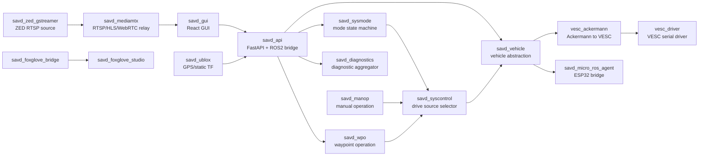

# SAVD 小车容器组成与源码职责说明

AI 辅助说明：本文档基于小车实时检查记录、命令输出和源码阅读整理，中文表述、结构和解释部分由 OpenAI Codex 辅助润色。

最后更新：2026-06-02  
实时复核时间：2026-06-02 11:13-11:18 UTC 左右  
小车主机：`172.21.16.162`  
主机名：`GTW-ONX1-E1A4T4E1`  
系统：Ubuntu 22.04.5 LTS, NVIDIA Jetson, aarch64  
Docker：28.0.4  

> 本文档不包含 SSH 密码。凭据应由实验室单独提供，不应提交到 GitHub。

## 1. 文档目标

这份文档专门解释 SAVD 小车当前 Docker 容器组成、每个容器的源码位置、启动方式、运行时接口和实际作用。重点不是介绍 GUI 怎么用，而是回答：

- 小车到底由哪些容器组成？
- 每个容器里面有哪些源码包？
- 每个容器启动了哪个程序或 ROS2 launch？
- 每个容器发布/订阅哪些 ROS2 topic？
- 哪些容器提供 service/action？
- GUI 上的功能最终落到哪些容器？
- 现在系统中哪些容器正常，哪些容器虽然 up 但功能不完整？

所有结论来自 2026-06-02 重新 SSH 到小车后进行的只读检查，包括：

- `docker compose ls`
- `docker compose ps`
- `docker ps -a`
- `docker inspect`
- `docker top`
- 容器内源码目录检查
- launch/config 文件读取
- ROS2 topic/service/action 检查
- API 响应检查
- diagnostics 响应检查
- MediaMTX 和 ZED GStreamer 日志检查
- 串口与 joystick 设备检查

本次没有修改小车远端文件，没有重启容器，没有运行恢复脚本。

## 2. 当前运行总览

主项目目录：

```text
/home/user/savd/savd_docker
```

当前 Compose 项目：

```text
savd_docker running(17)
```

当前使用的 Compose 文件：

```text
/home/user/savd/savd_docker/compose.yml
/home/user/savd/savd_docker/compose.zed.yml
/home/user/savd/savd_docker/compose.healthchecks.override.yml
/home/user/savd/savd_docker/compose.zed.dual_stable.override.yml
```

运行特征：

- 主栈有 17 个 running 容器。
- 大部分容器使用 `network_mode=host`，所以端口直接暴露在小车主机上。
- `savd_jetson_stats` 容器存在但当前是 `Exited (127)`。
- 另有一个 `savd_gui-savd_gui-1` 容器处于 `Created` 状态，不属于当前主运行栈。

## 3. 小车能做什么

从容器和源码看，这台小车具备以下功能：

- Web GUI 控制台：`savd_gui`。
- HTTP 到 ROS2 的桥接 API：`savd_api`。
- 整车模式管理：`savd_sysmode`。
- 按当前模式选择驾驶命令来源：`savd_syscontrol`。
- GUI 虚拟摇杆/实体手柄手动驾驶：`savd_manop` + `savd_teleop`。
- Waypoint 自动驾驶和 pure pursuit 路径跟踪：`savd_wpo`。
- 车辆硬件抽象：`savd_vehicle`。
- VESC 电机与转向控制：`vesc_ackermann` + `vesc_driver`。
- ESP32/微控制器通信：`savd_micro_ros_agent`。
- ZED 前后摄像头 RTSP 推流：`savd_zed_gstreamer`。
- RTSP/HLS/WebRTC 转发给浏览器：`savd_mediamtx`。
- U-Blox GPS 容器：`savd_ublox`，但当前真实 GPS 节点未启动。
- ROS diagnostics 聚合：`savd_diagnostics`。
- Foxglove 调试：`savd_foxglove_bridge` + `savd_foxglove_studio`。
- Jetson 系统状态诊断：`savd_jetson_stats`，但当前容器已退出。

## 4. 高层架构



## 5. 容器清单

| 容器 | 当前状态 | 镜像 | 一句话作用 |
| --- | --- | --- | --- |
| `savd_docker-savd_gui-1` | running healthy | `dockertest3.azurecr.io/savd/gui:latest` | React 主 GUI。 |
| `savd_docker-savd_api-1` | running healthy | `ros-humble-api:v1.0` | FastAPI 到 ROS2 的桥。 |
| `savd_docker-savd_sysmode-1` | running healthy | `ros-humble-sysmode:v1.0` | 模式状态机。 |
| `savd_docker-savd_syscontrol-1` | running healthy | `ros-humble-syscontrol:v1.0` | 根据模式选择驾驶命令来源。 |
| `savd_docker-savd_manop-1` | running healthy | `ros-humble-manop:v1.0` | 手动驾驶命令生成。 |
| `savd_docker-savd_wpo-1` | running healthy | `ros-humble-wpo:v1.0` | Waypoint action 和 pure pursuit。 |
| `savd_docker-savd_vehicle-1` | running healthy | `ros-humble-vehicle:v1.0` | 整车硬件抽象层。 |
| `savd_docker-vesc_ackermann-1` | running healthy | `ros-humble-vesc:v1.0` | Ackermann 到 VESC motor/servo 命令转换。 |
| `savd_docker-vesc_driver-1` | running healthy | `ros-humble-vesc:v1.0` | 串口连接 VESC。 |
| `savd_docker-savd_micro_ros_agent-1` | running healthy | `ros-humble-micro-ros-agent:v1.0` | 串口连接 ESP32/微控制器。 |
| `savd_docker-savd_ublox-1` | running healthy | `ros-humble-ublox:latest` | GPS 容器，但当前只运行 static TF。 |
| `savd_docker-savd_teleop-1` | running healthy | `ros-humble-teleop-tools:v1.0` | 实体 joystick 输入。 |
| `savd_docker-savd_diagnostics-1` | running healthy | `ros-humble-diagnostics:v1.0` | 聚合 diagnostics 给 GUI。 |
| `savd_docker-savd_zed_gstreamer-1` | running healthy | `ros-zed-gstreamer-l4t-r36.3.0-zedsdk-5.0.0:latest` | ZED 摄像头 RTSP 源。 |
| `savd_docker-savd_mediamtx-1` | running | `bluenviron/mediamtx:latest` | 摄像头流转发成 RTSP/HLS/WebRTC。 |
| `savd_docker-savd_foxglove_bridge-1` | running healthy | `ros-humble-foxglove-bridge:v1.0` | ROS2 到 Foxglove 的 WebSocket 桥。 |
| `savd_docker-savd_foxglove_studio-1` | running healthy | `foxglove:studio` | 浏览器版 Foxglove Studio。 |
| `savd_docker-savd_jetson_stats-1` | exited 127 | `ros-humble-jetson-stats:v1.0` | Jetson 系统状态 diagnostics，当前不可用。 |
| `savd_gui-savd_gui-1` | created | `gui:latest` | 旧/备用 GUI 容器，不是当前主栈。 |

## 6. 对外端口

| 功能 | 地址 |
| --- | --- |
| 主 GUI | `http://172.21.16.162:3000` |
| REST API | `http://172.21.16.162:8000` |
| API OpenAPI | `http://172.21.16.162:8000/openapi.json` |
| Foxglove Studio | `http://172.21.16.162:8080` |
| Foxglove Bridge | `ws://172.21.16.162:8765` |
| ZED GStreamer RTSP 源 | `rtsp://172.21.16.162:8554/...` |
| MediaMTX RTSP | `rtsp://172.21.16.162:8553/...` |
| MediaMTX HLS | `http://172.21.16.162:8888/...` |
| MediaMTX WebRTC | `http://172.21.16.162:8889/...` |
| MediaMTX metrics | `http://172.21.16.162:9998` |

## 7. 逐容器源码与作用

### 7.1 `savd_docker-savd_gui-1`

启动：

```text
yarn start
```

镜像：

```text
dockertest3.azurecr.io/savd/gui:latest
```

源码位置：

```text
/app
/app/src/App.tsx
/app/src/components/Dashboard.tsx
/app/src/components/ESP32Control.tsx
/app/src/components/HeaderStatus.tsx
/app/src/components/Joystick.tsx
/app/src/components/Mapbox.tsx
/app/src/components/Mode.tsx
/app/src/components/SystemStatus.tsx
/app/src/components/TimeSync.tsx
/app/src/components/VESCInfo.tsx
/app/src/pages/Cameras.tsx
/app/src/pages/Diagnostics.tsx
/app/src/pages/Foxglove.tsx
/app/src/client/services.gen.ts
```

主要依赖：

```text
React 18
TypeScript
MUI
Mapbox GL
Mapbox Draw
Axios
OpenAPI-generated TypeScript client
```

源码里确认的行为：

- `App.tsx` 根据当前浏览器 host 设置 API 地址：

```text
http://<host>:8000
```

- `Dashboard.tsx` 创建左右两个虚拟摇杆。
- `Dashboard.tsx` 每约 50 ms 调用 `ManualService.sendJoyCmdsManualSendJoyCmdsPut`。
- `Dashboard.tsx` 用 iframe 加载：

```text
http://<host>:8889/zed-front
http://<host>:8889/zed-rear
```

- `ESP32Control.tsx` 读取 `/vehicle/parameters`，并调用 gear/diff/fan API。
- `VESCInfo.tsx` 读取 `/vehicle/parameters` 和 `/vehicle/odom`。
- `HeaderStatus.tsx` 读取 `/vehicle/battery_state`。
- `Mapbox.tsx` 负责画 waypoint、发送 WPO 目标、读取 WPO pose/path。
- `SystemStatus.tsx` 展示 `/diagnostics` 聚合结果。
- `Mode.tsx` 获取和设置系统模式。

这个容器本身不直接控制硬件。它所有控制命令都通过 `savd_api` 转发。

### 7.2 `savd_docker-savd_api-1`

启动：

```text
ros2 launch savd_api savd_api.launch.py
```

源码位置：

```text
/home/ubuntu/ros2_ws/src/savd_api
/home/ubuntu/ros2_ws/src/savd_api/savd_api/main.py
/home/ubuntu/ros2_ws/src/savd_api/utils
/home/ubuntu/ros2_ws/src/savd_api/setup.py
```

Python entry point：

```text
savd_api = savd_api.main:main
```

主要依赖：

```text
fastapi
uvicorn
pydantic
gpxpy
utm
scipy
requests
httpx
python-jose
passlib
```

作用：

- 提供 HTTP REST API。
- 内部创建 ROS2 node：`/savd_api/savd_api`。
- 订阅 ROS2 数据，给 GUI 提供查询接口。
- 把 GUI 控制请求转为 ROS2 service/action/topic。

源码确认的 ROS2 订阅：

```text
/savd_vehicle/odom
/savd_vehicle/parameters
/savd_vehicle/battery_state
/diagnostics_agg
/gpsfix
/ublox_gps_node/fix
/zed_multi/zed_front/geo_pose
/savd_sysmode/mode
/savd_wpo/path
/savd_wpo/current_pose
/savd_wpo/target_pose
```

源码确认的 ROS2 publisher：

```text
/savd_manop/joy_cmds_2
```

源码确认的 ROS2 service client：

```text
/savd_sysmode/get_modes
/savd_sysmode/set_mode
/savd_vehicle/set_gear
/savd_vehicle/set_diff_lock
/savd_vehicle/set_fan_speed
```

源码确认的 action client：

```text
/savd_wpo/waypoints
```

主要 HTTP API：

```text
GET  /
GET  /current_time
GET  /diagnostics
GET  /modes/get_modes
GET  /modes/get_current_mode
PUT  /modes/set_mode/{mode}
GET  /vehicle/odom
GET  /vehicle/parameters
GET  /vehicle/battery_state
PUT  /vehicle/set_gear/{gear}
PUT  /vehicle/set_diff_lock/{cmd}
PUT  /vehicle/set_fan_speed/{speed}
PUT  /manual/send_joy_cmds
GET  /sensors/gps/fix
GET  /sensors/navsat/fix
GET  /sensors/geo/pose
PUT  /wpo/send_waypoints
PUT  /wpo/cancel_goal
GET  /wpo/path
GET  /wpo/pure_pursuit/current_pose
POST /token
GET  /users/me/
```

当前 API 实测：

```text
/modes/get_current_mode -> IDLE
/vehicle/parameters -> vesc_connection=connected, micro_ros_connection=connected
```

### 7.3 `savd_docker-savd_sysmode-1`

启动：

```text
ros2 launch savd_sysmode savd_sysmode.launch.py
```

源码位置：

```text
/home/ubuntu/ros2_ws/src/savd_sysmode
/home/ubuntu/ros2_ws/src/savd_sysmode/src/savd_sysmode_node.cpp
/home/ubuntu/ros2_ws/src/savd_sysmode/include/savd_sysmode/sysmode.hpp
/home/ubuntu/ros2_ws/src/savd_sysmode/resources/statemachine.xml
```

CMake 可执行文件：

```text
savd_sysmode_node
```

运行时 node：

```text
/savd_sysmode/savd_sysmode
```

作用：

- 读取 `statemachine.xml`。
- 管理整车模式。
- 周期性发布当前 mode。
- 提供设置 mode 和获取 mode 列表的 service。

源码确认接口：

```text
publish: /savd_sysmode/mode
service: /savd_sysmode/set_mode
service: /savd_sysmode/get_modes
```

launch 参数：

```text
statemachine_xml_path=/home/ubuntu/ros2_ws/src/savd_sysmode/resources/statemachine.xml
mode_pub_rate_ms=100
```

状态机模式：

```text
DISABLED
IDLE
ERROR
ESTOP
ERRACK
MANOP
RUTINE
MANOP_MOVE
WPO
WPO_MOVE
WPO_FINAL
WPO_ERROR
```

重要模式元数据：

```text
MANOP      -> /savd_manop/drive_cmds
MANOP_MOVE -> /savd_manop/drive_cmds
WPO        -> /savd_wpo/drive_cmds
WPO_MOVE   -> /savd_wpo/drive_cmds
WPO_FINAL  -> /savd_wpo/drive_cmds
RUTINE     -> /savd_rutine/drive_cmds
```

这个容器是模式权威来源。GUI 下拉框、STOP、manual mode、waypoint mode 最终都要经过它。

### 7.4 `savd_docker-savd_syscontrol-1`

启动：

```text
ros2 launch savd_syscontrol savd_syscontrol.launch.py
```

源码位置：

```text
/home/ubuntu/ros2_ws/src/savd_syscontrol
/home/ubuntu/ros2_ws/src/savd_syscontrol/src/savd_syscontrol_node.cpp
/home/ubuntu/ros2_ws/src/savd_syscontrol/include/savd_syscontrol/syscontrol.hpp
```

CMake 可执行文件：

```text
savd_syscontrol_node
```

运行时 node：

```text
/savd_syscontrol/savd_syscontrol
```

作用：

- 从 `savd_sysmode` 获取所有模式和对应 `drive_topic`。
- 订阅 `/savd_sysmode/mode`。
- 当前模式改变时，动态切换要订阅的 drive topic。
- 把被允许的 drive command 统一发布到 `/savd_syscontrol/drive_cmds`。

源码确认接口：

```text
subscribe: /savd_sysmode/mode
client: /savd_sysmode/get_modes
dynamic subscribe: mode metadata 中的 drive_topic
publish: /savd_syscontrol/drive_cmds
```

launch remap：

```text
/mode -> /savd_sysmode/mode
/get_modes -> /savd_sysmode/get_modes
```

这个容器是“驾驶命令仲裁器”。它决定当前到底是手动命令、WPO 命令，还是没有命令能进入 `savd_vehicle`。

### 7.5 `savd_docker-savd_manop-1`

启动：

```text
ros2 launch savd_manop savd_manop.launch.py
```

源码位置：

```text
/home/ubuntu/ros2_ws/src/savd_manop
/home/ubuntu/ros2_ws/src/savd_manop/src/savd_manop_node.cpp
/home/ubuntu/ros2_ws/src/savd_manop/include/savd_manop/manop.hpp
```

CMake 可执行文件：

```text
savd_manop_node
```

运行时 node：

```text
/savd_manop/savd_manop
```

作用：

- Manual Operation。
- 接收实体 joystick 或 GUI virtual joystick。
- 只在 `MANOP` 或 `MANOP_MOVE` 模式下处理 joystick。
- 把 joystick axes 转成速度和曲率。
- 收到有效 joystick 命令时可调用 `/savd_sysmode/set_mode` 切换到 `MANOP_MOVE`。
- joystick 超时后可切回 `MANOP`。

源码确认接口：

```text
subscribe: /savd_sysmode/mode
subscribe: /savd_manop/joy_cmds
subscribe: /savd_manop/joy_cmds_2
publish: /savd_manop/drive_cmds
client: /savd_sysmode/set_mode
```

launch 参数：

```text
mode_idle=MANOP
mode_move=MANOP_MOVE
max_linear=2.0
max_angular=0.8
joy_sub_deadline_ms=100
mode_sub_deadline_ms=200
drive_cmds_pub_rate_ms=50
```

源码中的 joystick 映射：

```text
linear.x  = axes[1] * max_linear
angular.z = axes[3] * max_angular
```

两条输入链路：

```text
实体手柄 -> /savd_manop/joy_cmds
GUI 摇杆 -> /savd_manop/joy_cmds_2
```

### 7.6 `savd_docker-savd_wpo-1`

启动：

```text
ros2 launch savd_wpo savd_wpo.launch.py
```

源码位置：

```text
/home/ubuntu/ros2_ws/src/savd_wpo
/home/ubuntu/ros2_ws/src/savd_wpo/src/savd_wpo_node.cpp
/home/ubuntu/ros2_ws/src/savd_wpo/src/pure_pursuit_node.cpp
/home/ubuntu/ros2_ws/src/savd_wpo/include/savd_wpo/wpo_action_server.hpp
/home/ubuntu/ros2_ws/src/savd_wpo/include/savd_wpo/pure_pursuit.hpp
```

CMake 可执行文件：

```text
savd_wpo_node
pure_pursuit
pure_pursuit_test
```

运行时进程确认：

```text
/savd_wpo/savd_wpo_node
/savd_wpo/pure_pursuit_node
```

作用：

- 接收 GUI 地图发送的 waypoint action。
- 发布完整 path 和当前 path segment。
- pure pursuit 根据 segment 和 TF 计算当前 pose、target pose 和 curvature。
- WPO action server 把 curvature 和设定 velocity 组合成 drive command。
- 通过 `savd_sysmode` 切换 `WPO_MOVE`、`WPO_FINAL` 等模式。

源码确认接口：

```text
action: /savd_wpo/waypoints
subscribe: /savd_sysmode/mode
subscribe: /savd_wpo/curvature
subscribe: /savd_wpo/current_pose
publish: /savd_wpo/drive_cmds
publish: /savd_wpo/path
publish: /savd_wpo/segment
publish: /savd_wpo/current_pose
publish: /savd_wpo/curvature
publish: /savd_wpo/target_pose
client: /savd_sysmode/set_mode
```

launch 参数：

```text
velocity=0.5
mode_sub_deadline_ms=200
base_link=base_link
```

源码默认参数：

```text
min_distance_to_goal=0.2
mode_move=WPO_MOVE
mode_final=WPO_FINAL
pure_pursuit_frequency=20
velocity=0.2
max_curvature=0.8
```

注意：launch 把 `velocity` 覆盖为 `0.5`。

### 7.7 `savd_docker-savd_vehicle-1`

启动：

```text
ros2 launch savd_vehicle savd.launch.py
```

源码位置：

```text
/home/ubuntu/ros2_ws/src/savd_vehicle
/home/ubuntu/ros2_ws/src/savd_vehicle/src/savd_node.cpp
/home/ubuntu/ros2_ws/src/savd_vehicle/include/savd_vehicle/savd.hpp
/home/ubuntu/ros2_ws/src/savd_vehicle/include/savd_vehicle/vehicle_wrapper.hpp
```

CMake 可执行文件：

```text
savd_node
```

运行时 node：

```text
/savd_vehicle/savd_vehicle
```

作用：

- 整车硬件抽象。
- 接收 `savd_syscontrol` 输出的最终 drive command。
- 转换成 Ackermann command 给 VESC。
- 向 ESP32/micro-ROS 发布 `SAVDCommand`，控制 fan、gear、front diff、rear diff、VESC on/off。
- 从 ESP32/micro-ROS 接收 `SAVDState`。
- 从 VESC 状态生成 battery state。
- 给 GUI/API 发布车辆参数。

launch remap：

```text
drive_cmds -> /savd_syscontrol/drive_cmds
vesc_odom  -> /odom
joy        -> /savd_manop/joy_cmds
vesc_state -> /sensors/core
vesc_drive -> /ackermann_cmd
savd_state -> /savd_micro_ros/state
savd_cmds  -> /savd_micro_ros/cmd
/mode      -> /savd_sysmode/mode
/set_mode  -> /savd_sysmode/set_mode
```

源码确认接口：

```text
subscribe: /savd_syscontrol/drive_cmds
subscribe: /savd_manop/joy_cmds
subscribe: /sensors/core
subscribe: /odom
subscribe: /savd_micro_ros/state
subscribe: /savd_sysmode/mode
publish: /ackermann_cmd
publish: /savd_micro_ros/cmd
publish: /savd_vehicle/odom
publish: /savd_vehicle/battery_state
publish: /savd_vehicle/parameters
service: /savd_vehicle/set_fan_speed
service: /savd_vehicle/set_gear
service: /savd_vehicle/set_diff_lock
```

源码中的 actuator 服务：

```text
set_fan_speed: percent 0-100 -> fan_speed 0-255
set_gear: LOW / HIGH
set_diff_lock: REAR_OFF / REAR_ON / FRONT_OFF / FRONT_ON
```

当前实测 `/vehicle/parameters`：

```text
micro_ros_connection=connected
vesc_connection=connected
vel_max=2.000000
crvt_max=0.800000
servo_gear=HIGH
servo_diff_front=ON
servo_diff_rear=OFF
fan_speed=0
fault_code=0
```

### 7.8 `savd_docker-vesc_ackermann-1`

启动：

```text
ros2 launch vesc_ackermann vesc_ackermann.launch.py
```

源码位置：

```text
/home/ubuntu/ros2_ws/src/vesc_ackermann
/home/ubuntu/ros2_ws/src/vesc_ackermann/src/ackermann_to_vesc.cpp
/home/ubuntu/ros2_ws/src/vesc_ackermann/src/vesc_to_odom.cpp
```

可执行文件：

```text
ackermann_to_vesc_node
vesc_to_odom_node
```

作用：

- `ackermann_to_vesc_node`：把 `/ackermann_cmd` 转换成 VESC motor speed 和 servo position。
- `vesc_to_odom_node`：把 VESC 状态和 servo 命令转换成 `/odom` 和 `/tf`。

源码确认接口：

```text
subscribe: /ackermann_cmd
publish: /commands/motor/speed
publish: /commands/servo/position
subscribe: /sensors/core
subscribe: /sensors/servo_position_command
publish: /odom
publish: /tf
```

使用配置：

```text
/home/user/savd/savd_docker/config/vesc_config.yaml
```

关键参数：

```text
speed_to_erpm_gain=8480.0
speed_to_erpm_offset=0.0
steering_angle_to_servo_gain=-0.815
steering_angle_to_servo_offset=0.475
wheelbase=0.535
```

### 7.9 `savd_docker-vesc_driver-1`

启动：

```text
while [ ! -e /dev/serial/by-id/usb-STMicroelectronics_ChibiOS_RT_Virtual_COM_Port_304-if00 ]; do
  echo 'Waiting for VESC ...'
  sleep 1
done
ros2 launch vesc_driver vesc_driver.launch.py
```

源码位置：

```text
/home/ubuntu/ros2_ws/src/vesc_driver
/home/ubuntu/ros2_ws/src/vesc_driver/src/vesc_driver.cpp
/home/ubuntu/ros2_ws/src/vesc_driver/params/vesc_config.yaml
```

作用：

- 串口连接 VESC 电机控制器。
- 接收 motor/servo 命令。
- 发布 VESC core、IMU、servo sensor 状态。

串口设备：

```text
/dev/serial/by-id/usb-STMicroelectronics_ChibiOS_RT_Virtual_COM_Port_304-if00 -> ttyACM2
```

源码确认接口：

```text
subscribe: /commands/motor/duty_cycle
subscribe: /commands/motor/current
subscribe: /commands/motor/brake
subscribe: /commands/motor/speed
subscribe: /commands/motor/position
subscribe: /commands/servo/position
publish: /sensors/core
publish: /sensors/imu
publish: /sensors/imu/raw
publish: /sensors/servo_position_command
```

当前日志确认：

```text
Connected to VESC with firmware version 6.5
```

### 7.10 `savd_docker-savd_micro_ros_agent-1`

启动：

```text
ros2 run micro_ros_agent micro_ros_agent serial --dev /dev/serial/by-id/usb-1a86_USB_Single_Serial_54FC036358-if00 -v4
```

源码/包位置：

```text
/home/ubuntu/ros2_ws/src/micro_ros_setup
/home/ubuntu/ros2_ws/src/uros/micro-ROS-Agent
/home/ubuntu/ros2_ws/src/uros/micro_ros_msgs
/home/ubuntu/ros2_ws/src/savd_interfaces
```

作用：

- ROS2 与 ESP32/微控制器之间的串口桥。
- `savd_vehicle` 通过它发布 `/savd_micro_ros/cmd`。
- ESP32 通过它发布 `/savd_micro_ros/state`。

串口设备：

```text
/dev/serial/by-id/usb-1a86_USB_Single_Serial_54FC036358-if00 -> ttyACM0
```

主要接口：

```text
subscribe: /savd_micro_ros/cmd
publish: /savd_micro_ros/state
publish: /savd_micro_ros/shutdown
```

当前 API 状态显示：

```text
micro_ros_connection=connected
```

### 7.11 `savd_docker-savd_ublox-1`

启动：

```text
ros2 launch ublox_gps ublox_gps_node-launch.py
```

挂载：

```text
/home/user/savd/savd_docker/launch/savd_ublox.launch.py
  -> /home/ubuntu/ros2_ws/src/ublox/ublox_gps/launch/ublox_gps_node-launch.py
/home/user/savd/savd_docker/config/zed_f9p.yaml
  -> /home/ubuntu/ros2_ws/src/ublox/ublox_gps/config/zed_f9p.yaml
```

源码/包位置：

```text
/home/ubuntu/ros2_ws/src/ublox/ublox_gps
/home/ubuntu/ros2_ws/src/ublox/ublox_msgs
/home/ubuntu/ros2_ws/src/ublox/ublox_serialization
/home/ubuntu/ros2_ws/src/ntrip_client
```

预期作用：

- 启动 U-Blox GPS node。
- 发布 `/ublox_gps_node/fix` 或 GPS 相关话题。
- 支持 NTRIP/RTK 相关配置。

当前实际情况：

源码 launch 里创建了 `ublox_gps_node` 对象，但 return list 中把它注释掉了。文件里能看到被注释的 `ublox_gps_node,` 条目。

当前 `docker top` 只看到两个 static transform：

```text
static_tf_map_to_odom: map -> odom
static_tf_utm_to_map: utm -> map, translation 457372 5324834 0
```

所以当前这个容器没有真正运行 U-Blox GPS node。

串口设备存在：

```text
/dev/serial/by-id/usb-u-blox_AG_-_www.u-blox.com_u-blox_GNSS_receiver-if00 -> ttyACM1
```

当前影响：

- `/sensors/gps/fix` 无真实 fix。
- `/sensors/navsat/fix` 无真实 fix。
- diagnostics 中 `/savd/U-Blox` 是 `Stale`。

### 7.12 `savd_docker-savd_teleop-1`

启动：

```text
while [ ! -e /dev/input/js0 ]; do
  echo 'Waiting for Logitech F710 ...'
  sleep 1
done
ros2 launch joy_teleop joy_teleop.launch.py
```

源码位置：

```text
/home/ubuntu/ros2_ws/src/teleop_tools/joy_teleop
/home/user/savd/savd_docker/launch/savd_teleop.launch.py
```

作用：

- 读取实体 joystick。
- 当前 launch 实际启动 `joy_node`。
- `/joy` 被 remap 到 `/savd_manop/joy_cmds`。
- `joy_teleop_node` 在 launch 里被注释。

当前进程确认：

```text
joy_node --ros-args ... -r /joy:=/savd_manop/joy_cmds
```

当前主机设备检查：

```text
ls /dev/input/js* -> no_js_device
```

当前日志仍显示：

```text
Waiting for Logitech F710 ...
```

解释：

- 这个容器存在并运行，但实体手柄链路不应视为稳定可用。
- GUI 虚拟摇杆不依赖 `/dev/input/js0`，它走 `/savd_manop/joy_cmds_2`。

### 7.13 `savd_docker-savd_diagnostics-1`

启动：

```text
ros2 launch savd_diagnostics savd_diagnostics.launch.py
```

源码/配置：

```text
/home/ubuntu/ros2_ws/src/savd_diagnostics
/home/user/savd/savd_docker/config/diagnostics.yaml
```

作用：

- 运行 ROS `diagnostic_aggregator`。
- 聚合各子系统 diagnostics。
- `savd_api` 订阅 `/diagnostics_agg`。
- GUI 的 SYSTEM Status 来自这里。

配置中的诊断组：

```text
ManOp
SysControl
SysMode
Vehicle
U-Blox
JetsonStats
ZEDXFront
ZEDXRear
```

当前 diagnostics 实测：

```text
/savd/ZEDXFront -> Stale
/savd/ZEDXRear -> Stale
/savd/JetsonStats -> Stale
/savd/ManOp -> OK
/savd/SysControl -> OK
/savd/SysMode -> OK
/savd/U-Blox -> Stale
/savd/Vehicle -> Error
/savd -> Error
```

### 7.14 `savd_docker-savd_zed_gstreamer-1`

启动：

```text
gst-zed-rtsp-launch --address=0.0.0.0 \
  --stream '/zed-front=( zedsrc camera-sn=47170859 ... rtph264pay ... )' \
  --stream '/zed-rear=( zedsrc camera-sn=42184532 ... rtph264pay ... )'
```

镜像：

```text
ros-zed-gstreamer-l4t-r36.3.0-zedsdk-5.0.0:latest
```

源码/程序位置：

```text
/usr/bin/gst-zed-rtsp-launch
/home/ubuntu/ros2_ws/src/zed_components
/home/ubuntu/ros2_ws/src/zed_wrapper
/home/ubuntu/ros2_ws/src/zed-ros2-interfaces
```

作用：

- 用 Stereolabs ZED SDK + GStreamer 直接发布 RTSP。
- 当前运行的是 GStreamer RTSP 模式，不是 ROS2 ZED wrapper 模式。

相机序列号：

```text
front: 47170859
rear: 42184532
```

RTSP 源端口：

```text
8554
```

当前状态：

- front 源能被 MediaMTX 正常转发。
- rear 源返回 `503 Service Unavailable`。
- ZED GStreamer 日志主要显示 `Client connected: 127.0.0.1`，没有直接给出更详细错误。

### 7.15 `savd_docker-savd_mediamtx-1`

启动：

```text
/mediamtx
```

镜像：

```text
bluenviron/mediamtx:latest
```

配置：

```text
/home/user/savd/savd_docker/config/mediamtx.yml -> /mediamtx.yml
```

作用：

- 从 `savd_zed_gstreamer` 拉 RTSP。
- 转发为 RTSP/HLS/WebRTC。
- 给 GUI iframe 使用 WebRTC 页面。

路径配置：

```text
zed-front:
  source: rtsp://localhost:8554/zed-front

zed-rear:
  source: rtsp://localhost:8554/zed-rear
```

端口：

```text
RTSP: 8553
HLS: 8888
WebRTC: 8889
metrics: 9998
```

当前实测：

```text
front_hls=200
rear_hls=404
```

当前 MediaMTX 日志：

```text
[path zed-rear] [RTSP source] bad status code: 503 (Service Unavailable)
[WebRTC] closed: no stream is available on path 'zed-rear'
```

解释：

- MediaMTX 本身不是 rear camera 的根因。
- 它只是从 `rtsp://localhost:8554/zed-rear` 拉流失败。

### 7.16 `savd_docker-savd_foxglove_bridge-1`

启动：

```text
ros2 run foxglove_bridge foxglove_bridge
```

作用：

- 把 ROS2 图通过 WebSocket 暴露给 Foxglove。
- 端口：`8765`。

这个容器主要用于调试，不参与车辆闭环控制。

### 7.17 `savd_docker-savd_foxglove_studio-1`

启动：

```text
caddy run --config /etc/caddy/Caddyfile --adapter caddyfile
```

挂载：

```text
/home/user/savd/savd_docker/config/foxglove-layout.json
  -> /foxglove/default-layout.json
```

作用：

- 浏览器版 Foxglove Studio。
- 端口：`8080`。

它和 `savd_foxglove_bridge` 配合，用于查看 ROS2 topic、TF、diagnostics 等。

### 7.18 `savd_docker-savd_jetson_stats-1`

启动：

```text
ros2 run ros2_jetson_stats ros2_jtop
```

挂载：

```text
/run/jtop.sock -> /run/jtop.sock
```

作用：

- 预期发布 Jetson CPU/GPU/温度/功耗等 diagnostics。

当前状态：

```text
Exited (127) 7 weeks ago
```

当前日志最后显示它曾启动：

```text
Jetson Stats has started with interval : 0.5
```

但容器已经退出，所以 diagnostics 中 `JetsonStats` 为 `Stale`。

### 7.19 `savd_gui-savd_gui-1`

状态：

```text
Created
```

挂载：

```text
/home/user/savd/savd_gui/app -> /app
/app/node_modules volume
```

作用判断：

- 这是另一个 Compose 项目 `savd_gui` 的 GUI 容器。
- 当前不是主运行栈。
- 主 GUI 是 `savd_docker-savd_gui-1`。

## 8. 自定义 ROS 接口

源码位置：

```text
/home/ubuntu/ros2_ws/src/savd_interfaces
```

重要接口：

### 8.1 `Waypoints.action`

```text
Goal:
  nav_msgs/Path path
  bool restart
  uint16 max_time_between_goals

Result:
  bool finished
  string response_msg

Feedback:
  geometry_msgs/Pose current_goal
  int32 current_waypoint_index
```

用途：`savd_api` 通过这个 action 给 `savd_wpo` 发送 waypoint。

### 8.2 `DriveCmd`

```text
uint32 counter
float32 curvature
float32 curvature_velocity
float32 speed
float32 acceleration
float32 jerk
```

用途：描述期望曲率、速度、加速度等车辆控制量。

### 8.3 `SAVDCommand`

```text
uint8 fan_speed
uint32 servo_gear
uint32 servo_diff_front
uint32 servo_diff_rear
bool vesc_on
bool request_shutdown
bool acknowledge_error
```

用途：`savd_vehicle` 发给 ESP32/micro-ROS 的低层执行器命令。

### 8.4 `SAVDState`

包含：

```text
mode
led_mode
bumper_state
fan_speed
servo_gear
servo_diff_front
servo_diff_rear
vesc_state
shutdown_request
shutdown_time_s
fault_code
```

用途：ESP32/micro-ROS 返回给 `savd_vehicle` 的低层状态。

### 8.5 Service

```text
GetModes.srv:
  response: Mode[] modes, Success success

SetInt.srv:
  request: int64 data
  response: Success success

SetString.srv:
  request: string data
  response: Success success
```

## 9. 关键控制链路

### 9.1 GUI 虚拟摇杆到车轮

```text
savd_gui Dashboard.tsx
  -> PUT /manual/send_joy_cmds
  -> savd_api
  -> /savd_manop/joy_cmds_2
  -> savd_manop
  -> /savd_manop/drive_cmds
  -> savd_syscontrol
  -> /savd_syscontrol/drive_cmds
  -> savd_vehicle
  -> /ackermann_cmd
  -> vesc_ackermann
  -> /commands/motor/speed
  -> /commands/servo/position
  -> vesc_driver
  -> VESC hardware
```

### 9.2 实体手柄到车轮

```text
/dev/input/js0
  -> joy_node
  -> /savd_manop/joy_cmds
  -> savd_manop
  -> 后续同 GUI 摇杆链路
```

当前问题：主机上没有 `/dev/input/js*`，所以实体手柄链路当前不可靠。

### 9.3 Waypoint 到车轮

```text
savd_gui Mapbox.tsx
  -> PUT /wpo/send_waypoints
  -> savd_api
  -> /savd_wpo/waypoints action
  -> savd_wpo_node
  -> /savd_wpo/segment
  -> pure_pursuit_node
  -> /savd_wpo/curvature
  -> savd_wpo_node
  -> /savd_wpo/drive_cmds
  -> savd_syscontrol
  -> /savd_syscontrol/drive_cmds
  -> savd_vehicle
  -> /ackermann_cmd
  -> VESC chain
```

### 9.4 摄像头到 GUI

```text
ZED front/rear
  -> savd_zed_gstreamer
  -> rtsp://localhost:8554/zed-front or zed-rear
  -> savd_mediamtx
  -> http://172.21.16.162:8889/zed-front or zed-rear
  -> savd_gui iframe
```

## 10. 当前实时状态与异常

### 10.1 正常或基本可用

- 主 GUI 容器 running healthy。
- API 容器 running healthy。
- VESC driver connected，firmware 6.5。
- micro-ROS/ESP32 connection 在 API 参数中显示 connected。
- front camera HLS 返回 200。
- `savd_sysmode`、`savd_syscontrol`、`savd_manop` diagnostics 为 OK。

### 10.2 异常或功能不完整

| 项目 | 当前表现 | 原因/定位 |
| --- | --- | --- |
| rear camera | HLS 404，WebRTC no stream | MediaMTX 从 `zed-rear` RTSP source 拉流失败，source 返回 503。 |
| U-Blox GPS | diagnostics stale | launch 中真实 `ublox_gps_node` 被注释，只跑 static TF。 |
| JetsonStats | container exited 127 | diagnostics stale。 |
| Physical joystick | `/dev/input/js*` 不存在 | 实体手柄链路不可视为可用。 |
| Vehicle diagnostics | `/savd/Vehicle` Error | 当前没有收到 drive command，虽然 VESC/micro-ROS 连接正常。 |
| ZED diagnostics | ZEDXFront/ZEDXRear stale | 当前摄像头走 direct GStreamer，不等于 ROS ZED diagnostics 正常。 |

## 11. 只读检查命令

这些命令适合新同学先读状态，不会主动控制车辆：

```bash
docker compose ls
docker compose ps
docker ps -a --format "table {{.Names}}\t{{.Status}}\t{{.Image}}"
docker inspect <container>
docker top <container> -eo pid,ppid,cmd
docker logs <container> --tail 100
```

API 只读检查：

```bash
curl http://172.21.16.162:8000/current_time
curl http://172.21.16.162:8000/modes/get_current_mode
curl http://172.21.16.162:8000/vehicle/parameters
curl http://172.21.16.162:8000/diagnostics
```

设备检查：

```bash
ls -l /dev/serial/by-id
ls /dev/input/js*
```

## 12. 危险接口

下面这些不是只读，会改变小车状态或可能导致运动：

```text
PUT /modes/set_mode/{mode}
PUT /manual/send_joy_cmds
PUT /vehicle/set_gear/{gear}
PUT /vehicle/set_diff_lock/{cmd}
PUT /vehicle/set_fan_speed/{speed}
PUT /wpo/send_waypoints
PUT /wpo/cancel_goal
```

运行下面这些脚本或 Docker 命令也会改变系统状态：

```text
./recover_dual_cameras.sh
./start_stack_camera_stable.sh
./start_stack.sh
docker compose restart
docker compose down
docker compose up
```

## 13. 总结

这台小车的主控制链路是：

```text
GUI/API -> mode/state/control ROS nodes -> vehicle abstraction -> VESC + ESP32
```

摄像头链路是：

```text
ZED GStreamer -> MediaMTX -> GUI iframe
```

调试链路是：

```text
ROS2 graph -> foxglove_bridge -> foxglove_studio
```

当前最重要的事实：

- 主运行栈是 `savd_docker`，有 17 个 running 容器。
- 车辆控制核心是 `savd_sysmode`、`savd_syscontrol`、`savd_manop`、`savd_wpo`、`savd_vehicle`。
- 硬件接口核心是 `vesc_driver`、`vesc_ackermann`、`savd_micro_ros_agent`。
- GUI 只负责显示和发 API 请求，不直接碰硬件。
- 后摄像头、GPS、JetsonStats、实体手柄是当前需要继续排查的重点。
