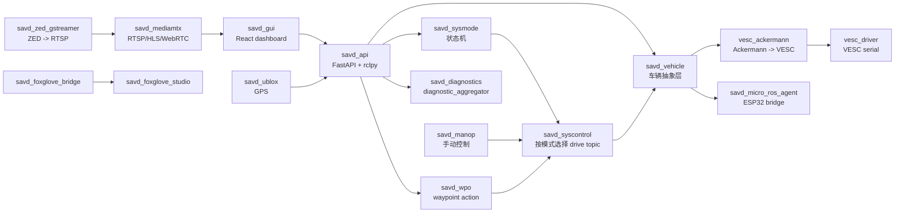

# SAVD 小车容器、源码与开发指南

AI 辅助说明：本文档基于小车实时检查记录、命令输出和源码阅读整理，中文表述、结构和解释部分由 OpenAI Codex 辅助润色。

检查时间：2026-06-02
检查机器：`GTW-ONX1-E1A4T4E1`
系统：Ubuntu 22.04.5 LTS, `aarch64`, NVIDIA Jetson
Docker：28.0.4
常用车端地址：`172.21.16.162`

主要代码和配置目录：

```text
/home/user/savd/savd_docker
/home/user/savd/savd_gui
/home/user/ros2_ws/src
/home/user/scripts
```

这份文档按当前机器上的 Docker 容器、Compose 文件、launch 文件、镜像内源码、GUI 源码和 ROS2 接口整理。重点不是把命令堆出来，而是解释每个容器为什么存在、它启动了什么、源码里有哪些关键方法、这些方法在小车架构里负责什么。

## 1. 先建立整体概念

这台小车不是一个单独程序。它是一组 Docker 容器拼起来的 ROS2 系统。

最短链路可以这样理解：

```text
浏览器 GUI
  -> FastAPI
  -> ROS2 topic/service/action
  -> 模式管理和控制选择
  -> 车辆抽象层
  -> VESC / ESP32 / 摄像头 / GPS / 诊断
```

GUI 不直接控制电机。GUI 发 HTTP 请求给 `savd_api`，`savd_api` 再发 ROS2 消息。真正决定“小车现在能不能动、听谁的命令”的，是 `savd_sysmode` 和 `savd_syscontrol`。

当前主栈由这些 Compose 文件启动：

```text
/home/user/savd/savd_docker/compose.yml
/home/user/savd/savd_docker/compose.zed.yml
/home/user/savd/savd_docker/compose.healthchecks.override.yml
/home/user/savd/savd_docker/compose.zed.dual_stable.override.yml
```

`docker compose ls` 显示项目名是 `savd_docker`，当前 `running(17)`。主栈里定义了 18 个服务，其中 `savd_jetson_stats` 属于栈但现在退出。

## 2. 四层架构

### Web 层

- `savd_gui`：React 前端，跑在 `3000` 端口。
- `savd_api`：FastAPI + ROS2 bridge，跑在 `8000` 端口。

GUI 的 API 基地址在 `App.tsx` 里拼出来：

```text
http://<当前网页 hostname>:8000
```

所以打开 `http://172.21.16.162:3000` 时，前端会请求 `http://172.21.16.162:8000`。

### 模式和选择层

- `savd_sysmode`：状态机。定义 `IDLE`、`MANOP`、`MANOP_MOVE`、`WPO`、`WPO_MOVE`、`ESTOP` 等模式。
- `savd_syscontrol`：根据当前模式选择哪个驾驶源有效。比如 MANOP 模式听 `/savd_manop/drive_cmds`，WPO 模式听 `/savd_wpo/drive_cmds`。

这层是安全边界。不是谁发了速度，小车就听谁。

### 车辆控制层

- `savd_manop`：手动驾驶，把 joystick 消息转成速度和曲率。
- `savd_wpo`： waypoint 自动驾驶，内部有 action server 和 pure pursuit。
- `savd_vehicle`：车辆抽象层，把速度/曲率转成 Ackermann 转向消息，并把 gear、diff、fan 等命令发给 ESP32。
- `vesc_ackermann`：把 Ackermann speed/steering 转成 VESC motor ERPM 和 servo position。
- `vesc_driver`：通过串口和 VESC 硬件通信。
- `savd_micro_ros_agent`：通过串口和 ESP32 / micro-ROS 设备通信。

### 传感器、媒体和诊断层

- `savd_zed_gstreamer`：从 ZED 相机取图像，输出 RTSP。
- `savd_mediamtx`：把 RTSP 转成浏览器能看的 WebRTC/HLS。
- `savd_ublox`：U-Blox GPS 节点。
- `savd_diagnostics`：聚合 ROS diagnostics。
- `savd_jetson_stats`：Jetson 系统状态诊断，当前退出。
- `savd_foxglove_bridge`：把 ROS2 数据开放给 Foxglove。
- `savd_foxglove_studio`：浏览器里的 Foxglove Studio。

## 3. 总数据流



## 3.1 不要按容器名硬背，要按链路读

新人最容易卡住的地方，是看到十几个容器以后不知道谁和谁有关系。读这个项目时，先记住三条闭环。

第一条是运动控制闭环：

```text
GUI 或手柄
  -> savd_api / savd_teleop
  -> savd_manop 或 savd_wpo
  -> savd_syscontrol 按当前 mode 选择唯一有效 drive topic
  -> savd_vehicle
  -> vesc_ackermann
  -> vesc_driver
  -> VESC 硬件
```

这里最关键的是 `savd_syscontrol`。`savd_manop` 和 `savd_wpo` 都可以发驾驶命令，但 `savd_vehicle` 不直接听它们。`savd_vehicle` 只听 `/savd_syscontrol/drive_cmds`。所以调车不动时，不能只看手动或 waypoint 节点有没有发消息，还要看当前 mode 有没有允许这条 drive topic。

第二条是车体状态闭环：

```text
VESC / ESP32
  -> vesc_driver / savd_micro_ros_agent
  -> savd_vehicle
  -> /savd_vehicle/odom, /savd_vehicle/parameters, /savd_vehicle/battery_state
  -> savd_api
  -> savd_gui
```

GUI 里看到的速度、电池、gear、diff、fan、VESC/ESP32 连接状态，主要都不是前端自己算的，而是 `savd_vehicle` 整理后经 API 返回。

第三条是媒体和观测闭环：

```text
ZED camera
  -> savd_zed_gstreamer
  -> savd_mediamtx
  -> savd_gui camera iframe

ROS2 graph
  -> savd_diagnostics / savd_foxglove_bridge
  -> savd_api / savd_foxglove_studio
```

摄像头链路和运动控制链路基本独立。摄像头坏了会影响 GUI 显示和 diagnostics，但不等于手动驾驶链路一定坏。反过来，VESC 能动也不代表摄像头一定正常。

## 3.2 开发时先问“谁拥有这个功能”

定位修改点时，按下面这张表找，不要从所有容器里乱搜。

| 要改或要查的问题 | 先看哪个容器 | 关键源码或配置 |
| --- | --- | --- |
| 有哪些 mode、哪些 mode 能互相切换 | `savd_sysmode` | `resources/statemachine.xml`、`sysmode.hpp` |
| 当前 mode 允许哪个驾驶源控制车 | `savd_syscontrol` | `syscontrol.hpp`、mode metadata 里的 `drive_topic` |
| GUI 摇杆为什么没效果 | `savd_gui`、`savd_api`、`savd_manop`、`savd_syscontrol` | `Dashboard.tsx`、`main.py`、`manop.hpp`、`statemachine.xml` |
| 实体手柄为什么没效果 | `savd_teleop`、`savd_manop` | `/dev/input/js0`、`savd_teleop.launch.py`、`manop.hpp` |
| waypoint 怎么执行 | `savd_api`、`savd_wpo`、`savd_syscontrol` | `wpo_action_client.py`、`wpo_action_server.hpp`、`pure_pursuit.hpp` |
| 速度/曲率怎么变成电机和转向 | `savd_vehicle`、`vesc_ackermann` | `savd.hpp`、`ackermann_to_vesc.cpp` |
| VESC 串口怎么通信 | `vesc_driver` | `vesc_driver.cpp`、`vesc_config.yaml` |
| gear、diff、fan 怎么到 ESP32 | `savd_vehicle`、`savd_micro_ros_agent`、ESP32 固件 | `savd.hpp`、`SAVDCommand.msg`、ESP32 固件仓库 |
| GUI 上车辆参数从哪来 | `savd_vehicle`、`savd_api`、`savd_gui` | `/savd_vehicle/parameters`、`main.py`、`ESP32Control.tsx` |
| diagnostics 为什么报错 | `savd_diagnostics` 和对应子系统 | `diagnostics.yaml`、各容器 updater |
| 摄像头为什么不显示 | `savd_zed_gstreamer`、`savd_mediamtx`、`savd_gui` | ZED GStreamer 启动命令、`mediamtx.yml`、`Cameras.tsx` |

一个实用判断：

```text
如果是“能不能控制车”的问题，先看 mode 和 syscontrol。
如果是“命令如何变成硬件动作”的问题，先看 savd_vehicle、vesc_ackermann、vesc_driver。
如果是“GUI 为什么显示不对”的问题，先看 API 是否有数据，再看前端。
如果是“摄像头/GPS/diagnostics”的问题，先按各自链路查，不要直接怀疑运动控制链路。
```

## 4. 安全边界

下面这些接口会影响真实车体，不能随手测：

```text
PUT /modes/set_mode/{mode}
PUT /manual/send_joy_cmds
PUT /vehicle/set_gear/{gear}
PUT /vehicle/set_diff_lock/{cmd}
PUT /vehicle/set_fan_speed/{speed}
PUT /wpo/send_waypoints
PUT /wpo/cancel_goal
```

任何会让车动的测试，都要先确认：

- 车轮离地或车辆处在安全固定状态。
- 操作者知道如何进入 `ESTOP`。
- GUI 的 STOP 按钮可用。
- 当前模式已确认，不要只看某个容器是否 healthy。
- VESC 和 ESP32 连接状态已经看过。
- 周围没有人和障碍物。

`SYSTEM ERROR` 不等于车一定不会动。它可能只是诊断聚合里某个传感器 stale。

## 5. 当前容器总表

主栈服务可以用下面命令核对：

```bash
cd /home/user/savd/savd_docker
docker compose -f compose.yml -f compose.zed.yml -f compose.healthchecks.override.yml -f compose.zed.dual_stable.override.yml config --services
docker ps -a --filter name=savd_docker
```

当前主栈服务如下。

| 服务名 | 当前容器名 | 当前状态 | 作用 |
| --- | --- | --- | --- |
| `savd_sysmode` | `savd_docker-savd_sysmode-1` | running healthy | 状态机，发布当前模式，提供模式切换服务 |
| `savd_syscontrol` | `savd_docker-savd_syscontrol-1` | running healthy | 根据当前模式选择有效驾驶命令 |
| `savd_manop` | `savd_docker-savd_manop-1` | running healthy | 手动控制，joystick -> drive cmds |
| `savd_wpo` | `savd_docker-savd_wpo-1` | running healthy | waypoint action server + pure pursuit |
| `savd_vehicle` | `savd_docker-savd_vehicle-1` | running healthy | 车辆抽象，连接 VESC 和 ESP32 |
| `savd_api` | `savd_docker-savd_api-1` | running healthy | HTTP API 到 ROS2 的桥 |
| `savd_diagnostics` | `savd_docker-savd_diagnostics-1` | running healthy | 诊断聚合 |
| `savd_ublox` | `savd_docker-savd_ublox-1` | running healthy | U-Blox GPS |
| `vesc_driver` | `savd_docker-vesc_driver-1` | running healthy | VESC 串口驱动 |
| `vesc_ackermann` | `savd_docker-vesc_ackermann-1` | running healthy | Ackermann 命令到 VESC 命令 |
| `savd_teleop` | `savd_docker-savd_teleop-1` | running healthy | 物理手柄 `/dev/input/js0` 到 ROS Joy |
| `savd_micro_ros_agent` | `savd_docker-savd_micro_ros_agent-1` | running healthy | ESP32 micro-ROS 串口代理 |
| `savd_jetson_stats` | `savd_docker-savd_jetson_stats-1` | exited 127 | Jetson 系统状态，当前挂载 `/run/jtop.sock` 失败 |
| `savd_gui` | `savd_docker-savd_gui-1` | running healthy | React GUI |
| `savd_foxglove_bridge` | `savd_docker-savd_foxglove_bridge-1` | running healthy | ROS2 到 Foxglove websocket |
| `savd_foxglove_studio` | `savd_docker-savd_foxglove_studio-1` | running healthy | Foxglove Web UI |
| `savd_zed_gstreamer` | `savd_docker-savd_zed_gstreamer-1` | running healthy | ZED 相机到 RTSP |
| `savd_mediamtx` | `savd_docker-savd_mediamtx-1` | running | RTSP/HLS/WebRTC relay |

还有一个 `savd_gui-savd_gui-1`，状态是 `Created`，属于另一个 Compose project，不是当前 `savd_docker` 主栈运行服务。

## 6. 常用入口

| 功能 | 地址 |
| --- | --- |
| GUI | `http://172.21.16.162:3000` |
| API | `http://172.21.16.162:8000` |
| OpenAPI JSON | `http://172.21.16.162:8000/openapi.json` |
| Foxglove Studio | `http://172.21.16.162:8080` |
| Foxglove Bridge | `ws://172.21.16.162:8765` |
| ZED front WebRTC | `http://172.21.16.162:8889/zed-front` |
| ZED rear WebRTC | `http://172.21.16.162:8889/zed-rear` |
| MediaMTX RTSP | `rtsp://172.21.16.162:8553/zed-front` 或 `/zed-rear` |
| ZED gstreamer RTSP 源 | `rtsp://172.21.16.162:8554/zed-front` 或 `/zed-rear` |
| MediaMTX metrics | `http://172.21.16.162:9998` |

## 7. ROS 命名和 remap 规则

很多源码里写的是相对话题名，比如 `drive_cmds`、`mode`、`set_mode`。实际运行时 launch 文件会加 namespace 或 remap。读代码时一定要同时看 launch。

例子：

| 源码里写的名字 | launch 后实际名字 |
| --- | --- |
| `savd_manop` 里的 `joy_cmds_2` | `/savd_manop/joy_cmds_2` |
| `savd_manop` 里的 `drive_cmds` | `/savd_manop/drive_cmds` |
| `savd_manop` 里的 `/mode` | `/savd_sysmode/mode` |
| `savd_syscontrol` 里的 `drive_cmds` | `/savd_syscontrol/drive_cmds` |
| `savd_vehicle` 里的 `drive_cmds` | `/savd_syscontrol/drive_cmds` |
| `savd_vehicle` 里的 `vesc_drive` | `/ackermann_cmd` |
| `savd_vehicle` 里的 `savd_cmds` | `/savd_micro_ros/cmd` |
| `savd_vehicle` 里的 `savd_state` | `/savd_micro_ros/state` |
| `vesc_ackermann` 里的 `commands/motor/speed` | `/commands/motor/speed` |
| `vesc_driver` 里的 `sensors/core` | `/sensors/core` |

## 8. 手动驾驶链路

GUI 虚拟摇杆链路：

```text
Dashboard.tsx
  sendJoystickCmds()
    -> PUT /manual/send_joy_cmds
      -> savd_api publishes /savd_manop/joy_cmds_2
        -> savd_manop converts Joy axes to TwistStamped
          -> /savd_manop/drive_cmds
            -> savd_syscontrol listens if mode is MANOP or MANOP_MOVE
              -> /savd_syscontrol/drive_cmds
                -> savd_vehicle converts curvature to steering angle
                  -> /ackermann_cmd
                    -> vesc_ackermann
                      -> /commands/motor/speed and /commands/servo/position
                        -> vesc_driver
```

物理手柄链路：

```text
/dev/input/js0
  -> savd_teleop joy_node
    -> /savd_manop/joy_cmds
      -> savd_manop
```

`savd_manop` 里有优先级：如果 `/savd_manop/joy_cmds` 这个物理手柄输入活跃，就不用 GUI 发来的 `/savd_manop/joy_cmds_2`。

## 9. waypoint 链路

```text
Mapbox.tsx
  handleSendWaypoints()
    -> PUT /wpo/send_waypoints
      -> WPOActionClient.feature_collection_to_path()
        -> /savd_wpo/waypoints action
          -> WPOActionServer.execute()
            -> publishes /savd_wpo/segment
              -> PurePursuit receives segment
                -> publishes /savd_wpo/curvature and /savd_wpo/current_pose
            -> WPOActionServer publishes /savd_wpo/drive_cmds
              -> savd_syscontrol listens if mode is WPO or WPO_MOVE
```

## 10. 容器逐个说明

### 10.1 `savd_gui`

镜像：

```text
dockertest3.azurecr.io/savd/gui:latest
```

启动命令：

```text
yarn start
```

源码在宿主机：

```text
/home/user/savd/savd_gui/app
/home/user/savd/savd_gui/app/src
```

它做什么：

- 提供浏览器 dashboard。
- 每秒同步车端时间和诊断。
- 每 500 ms 左右拉取当前模式、车辆参数、ESP32 状态。
- 每 200 ms 拉取 odom，用于速度和曲率仪表。
- 虚拟摇杆激活时每 50 ms 发送一次 Joy 消息。
- iframe 直接打开 MediaMTX WebRTC 页面看摄像头。
- iframe 直接打开 Foxglove Studio。

关键文件和方法：

| 文件 | 方法/组件 | 作用 |
| --- | --- | --- |
| `src/App.tsx` | `OpenAPI.BASE = "http://" + url + ":" + port` | 根据当前网页 hostname 自动设置 API 地址 |
| `src/App.tsx` | `synchronizeTime()` | 调 `/current_time`，算 RTT 和本地/车端时间偏移 |
| `src/App.tsx` | `convertToRows()` | 把 `/diagnostics` 返回的 `DiagnosticArray` 转成表格行，并计算 `ROSStatus` |
| `src/components/Dashboard.tsx` | `sendJoystickCmds()` | 组装 `sensor_msgs/Joy`，发到 `/manual/send_joy_cmds` |
| `src/components/Dashboard.tsx` | `getDriveCmds()` | 按鼠标/触摸摇杆状态决定 linear 和 angular 轴 |
| `src/components/Dashboard.tsx` | `requestMode("ESTOP")` | STOP 按钮，直接请求切到 `ESTOP` |
| `src/components/Joystick.tsx` | `updatePosition()` | 计算摇杆归一化 x/y，并写到 ref |
| `src/components/Joystick.tsx` | `deactivateJoystick()` | 松开后把摇杆视觉位置回中，并把 active 置 false |
| `src/components/VESCInfo.tsx` | `getVehicleLimits()` | 调 `/vehicle/parameters`，更新最大速度、最大曲率、VESC/ESP32 连接状态 |
| `src/components/VESCInfo.tsx` | `getDriveCmds()` | 调 `/vehicle/odom`，显示速度和曲率 |
| `src/components/ESP32Control.tsx` | `handleGearSubmmit()` | 调 `/vehicle/set_gear/{LOW|HIGH}` |
| `src/components/ESP32Control.tsx` | `handleDiffLockRearSubmmit()` | 调 `/vehicle/set_diff_lock/{REAR_ON|REAR_OFF}` |
| `src/components/ESP32Control.tsx` | `handleDiffLockFrontSubmmit()` | 调 `/vehicle/set_diff_lock/{FRONT_ON|FRONT_OFF}` |
| `src/components/ESP32Control.tsx` | `handleFanSpeedSubmmit()` | 调 `/vehicle/set_fan_speed/{0|100}` |
| `src/components/Mode.tsx` | `getCurrMode()` | 调 `/modes/get_current_mode` |
| `src/components/Mode.tsx` | `getModes()` | 调 `/modes/get_modes`，只显示 metadata `internal=false` 的模式 |
| `src/components/Mode.tsx` | `requestMode()` | 调 `/modes/set_mode/{mode}` |
| `src/components/Mapbox.tsx` | `handleSendWaypoints()` | 取选中的 Mapbox line，发给 `/wpo/send_waypoints` |
| `src/components/Mapbox.tsx` | `handleCancelWaypoints()` | 调 `/wpo/cancel_goal` |
| `src/components/Mapbox.tsx` | `fetchGPS()` | 轮询 GPS、ZED geo pose、WPO current pose、WPO path |
| `src/pages/Cameras.tsx` | iframe `:8889/zed-front` 和 `:8889/zed-rear` | 直接显示 MediaMTX WebRTC 页面 |
| `src/pages/Foxglove.tsx` | iframe `:8080/?ds=foxglove-websocket...` | 打开 Foxglove Studio 并连接 bridge |

开发时看这几点：

- 前端 API client 是根据 OpenAPI 生成的，在 `src/client`。
- GUI 的虚拟摇杆不是一直发命令，只有 pointer active 时才发。
- gear 和 diff lock 的开关在前端被限制为 `currMode.startsWith("MAN")`，fan 没有限制。
- Mapbox access token 写在 `Mapbox.tsx`，这属于配置敏感点，后续最好改成环境变量。

### 10.2 `savd_api`

镜像：

```text
dockertest3.azurecr.io/savd/ros-humble-api:v1.0
```

启动命令：

```text
ros2 launch savd_api savd_api.launch.py
```

宿主机挂载：

```text
/home/user/savd/savd_docker/launch/savd_api.launch.py
  -> /home/ubuntu/ros2_ws/src/savd_api/launch/savd_api.launch.py
```

镜像内源码：

```text
/home/ubuntu/ros2_ws/src/savd_api/savd_api/main.py
/home/ubuntu/ros2_ws/src/savd_api/savd_api/utils/clients/subscriber.py
/home/ubuntu/ros2_ws/src/savd_api/savd_api/utils/clients/publisher.py
/home/ubuntu/ros2_ws/src/savd_api/savd_api/utils/clients/services.py
/home/ubuntu/ros2_ws/src/savd_api/savd_api/utils/clients/wpo_action_client.py
/home/ubuntu/ros2_ws/src/savd_api/savd_api/utils/models
```

它做什么：

- 用 FastAPI 暴露 HTTP 接口。
- 用 `rclpy.Node` 订阅 ROS2 数据。
- 把 HTTP PUT/GET 转成 ROS2 topic、service、action。
- 同时跑 uvicorn 和 ROS2 spin：`main()` 里启动一个线程 `rclpy.spin(bridge)`，主线程跑 `uvicorn.run()`。

`ROS2Bridge.__init__()` 里创建的 ROS 接口：

订阅：

```text
/savd_vehicle/odom
/savd_vehicle/parameters
/savd_vehicle/battery_state
/diagnostics_agg
/gpsfix
/ublox_gps_node/fix
/zed_multi/zed_front/geo_pose
/savd_sysmode/mode
/savd_wpo/path
/savd_wpo/current_pose
/savd_wpo/target_pose
```

发布：

```text
/savd_manop/joy_cmds_2
```

服务 client：

```text
/savd_sysmode/get_modes
/savd_sysmode/set_mode
/savd_vehicle/set_gear
/savd_vehicle/set_diff_lock
/savd_vehicle/set_fan_speed
```

action client：

```text
/savd_wpo/waypoints
```

主要 HTTP 路由：

| 路由 | 方法 | 作用 |
| --- | --- | --- |
| `/current_time` | GET | 返回 ROS 当前时间 |
| `/diagnostics` | GET | 返回聚合诊断 |
| `/modes/get_modes` | GET | 调 `/savd_sysmode/get_modes` |
| `/modes/get_current_mode` | GET | 返回订阅到的 `/savd_sysmode/mode` |
| `/modes/set_mode/{mode}` | PUT | 调 `/savd_sysmode/set_mode` |
| `/vehicle/odom` | GET | 返回 `/savd_vehicle/odom` |
| `/vehicle/parameters` | GET | 返回 `/savd_vehicle/parameters` |
| `/vehicle/battery_state` | GET | 返回 `/savd_vehicle/battery_state` |
| `/vehicle/set_gear/{gear}` | PUT | 调 `/savd_vehicle/set_gear` |
| `/vehicle/set_diff_lock/{cmd}` | PUT | 调 `/savd_vehicle/set_diff_lock` |
| `/vehicle/set_fan_speed/{speed}` | PUT | 调 `/savd_vehicle/set_fan_speed` |
| `/manual/send_joy_cmds` | PUT | 发布 `/savd_manop/joy_cmds_2` |
| `/sensors/gps/fix` | GET | 返回 `/gpsfix` |
| `/sensors/navsat/fix` | GET | 返回 `/ublox_gps_node/fix` |
| `/sensors/geo/pose` | GET | 返回 `/zed_multi/zed_front/geo_pose` |
| `/wpo/send_waypoints` | PUT | GeoJSON -> Path -> WPO action |
| `/wpo/cancel_goal` | PUT | cancel WPO action |
| `/wpo/path` | GET | 返回当前 WPO path，转换成 GeoJSON |
| `/wpo/pure_pursuit/current_pose` | GET | WPO 当前 pose 转经纬度 |

关键方法：

| 文件 | 方法 | 作用 |
| --- | --- | --- |
| `main.py` | `create_custom_best_effort_qos()` | 创建 BEST_EFFORT QoS，设置 deadline 和 lifespan |
| `main.py` | `ROS2Bridge.__init__()` | 建立所有 subscriber、publisher、service client、action client，并注册 HTTP route |
| `main.py` | `get_diagnostics()` | 从 `Subscribers` 缓存取 diagnostics |
| `main.py` | `get_modes()` | 调 SysMode service 并转换成 Pydantic model |
| `main.py` | `set_mode()` | 把 HTTP mode 参数转成 `SetString.Request` |
| `main.py` | `send_joy_cmds()` | 把前端 JoyModel 转成 ROS Joy 并 publish |
| `main.py` | `send_waypoints()` | FeatureCollection -> Path -> action goal |
| `subscriber.py` | `SubscriberWrapper.cb_sub()` | 缓存最新 ROS 消息并刷新 watchdog |
| `subscriber.py` | `SubscriberWrapper.cb_timer()` | 超时没收到消息就把 data 置空 |
| `publisher.py` | `PublisherWrapper.publish()` | 包一层 ROS publisher |
| `services.py` | `ServiceWrapper.call_service()` | 等 service，异步调用，返回 response |
| `wpo_action_client.py` | `send_goal()` | 检查 action server，发送 waypoint goal |
| `wpo_action_client.py` | `check_goal_accepted()` | 等 action server 接受或超时 |
| `wpo_action_client.py` | `cancel_goal()` | 取消当前 goal |
| `wpo_action_client.py` | `feature_collection_to_path()` | GeoJSON MultiPoint -> `nav_msgs/Path` |
| `wpo_action_client.py` | `lonlat_to_pose_stamped()` | 经纬度转 UTM 坐标 |
| `wpo_action_client.py` | `pose_stamped_to_lonlat()` | UTM 坐标转经纬度 |

读代码时要注意：

- `services.py` 里有 `self.timout` 和 `self.timeout` 拼写不一致。`cb_timeout()` 设置的是 `self.timeout`，`call_service()` 里循环看的是 `self.timout`。如果 service future 一直不 done，这个 timeout 保护可能不会按预期工作。
- `main.py` 里 `wpo_target_pose` 订阅 `/savd_wpo/target_pose` 时用了 `String` 类型，但 `PurePursuit` 实际发布的是 `geometry_msgs/PoseStamped`。当前 API 没暴露 target pose route，所以影响有限，但这是后续开发要修的点。
- Pydantic model 里有一些 list 默认值写成 `[]`。如果升级到严格模式，建议改成 `Field(default_factory=list)`。

### 10.3 `savd_sysmode`

镜像：

```text
dockertest3.azurecr.io/savd/ros-humble-sysmode:v1.0
```

启动命令：

```text
ros2 launch savd_sysmode savd_sysmode.launch.py
```

宿主机挂载：

```text
/home/user/savd/savd_docker/launch/savd_sysmode.launch.py
  -> /home/ubuntu/ros2_ws/src/savd_sysmode/launch/savd_sysmode.launch.py
/home/user/savd/savd_docker/resources/statemachine.xml
  -> /home/ubuntu/ros2_ws/src/savd_sysmode/resources/statemachine.xml
```

镜像内源码：

```text
/home/ubuntu/ros2_ws/src/savd_sysmode/src/savd_sysmode_node.cpp
/home/ubuntu/ros2_ws/src/savd_sysmode/include/savd_sysmode/sysmode.hpp
/home/ubuntu/ros2_ws/src/savd_sysmode/include/savd_sysmode/utils.hpp
```

它做什么：

- 读取 `statemachine.xml`。
- 保存所有模式、允许的转换、metadata。
- 发布当前模式。
- 提供 `set_mode` 和 `get_modes` 服务。
- 处理 auto transition，比如 `ERRACK -> IDLE`、`WPO_FINAL -> WPO`。

实际 ROS 名字：

```text
node: /savd_sysmode/savd_sysmode
publisher: /savd_sysmode/mode
service: /savd_sysmode/set_mode
service: /savd_sysmode/get_modes
```

关键方法：

| 方法 | 作用 |
| --- | --- |
| `main()` | 初始化 rclcpp，spin `savd::SysMode` |
| `SysMode::SysMode()` | 声明参数，创建 publisher、timer、service、diagnostics，然后调用 `initStatemachine()` |
| `initStatemachine()` | 用 tinyxml2 读取 XML；解析 mode name、transition type、delay、allowed transitions、metadata、privileged；设置 initial mode |
| `setMode()` | 检查目标模式是否合法；检查当前模式是否允许转换；privileged 模式跳过普通转换限制；如果目标模式是 auto，则启动 one-shot timer |
| `getModes()` | 把内部 `modes_` 转成 `savd_interfaces/msg/Mode` 列表返回给 API 和 syscontrol |
| `cbTimer()` | 按 `mode_pub_rate_ms` 周期发布当前模式 |
| `cbTimerOneShot()` | auto 模式延时结束后切到下一个模式 |
| `updateDiagnostics()` | 给 diagnostic updater 返回 StateMachine 状态 |
| `create_custom_best_effort_profile()` | 创建 BEST_EFFORT QoS |

当前状态机来自 `resources/statemachine.xml`。主要模式：

| 模式 | 是否前端可见 | 作用 |
| --- | --- | --- |
| `DISABLED` | 是 | VESC off，禁止驱动 |
| `IDLE` | 是 | 空闲但准备好 |
| `MANOP` | 是 | 手动驾驶准备态 |
| `MANOP_MOVE` | 否 | 手动驾驶正在接收命令 |
| `WPO` | 是 | waypoint 准备态 |
| `WPO_MOVE` | 否 | waypoint 正在执行 |
| `WPO_FINAL` | 否 | waypoint 到达最后点，auto 回 `WPO` |
| `WPO_ERROR` | 否 | waypoint 错误 |
| `ERROR` | 否 | 通用错误模式，privileged |
| `ESTOP` | 是 | 急停，privileged |
| `ERRACK` | 是 | acknowledge error，auto 回 `IDLE` |
| `RUTINE` | 是 | XML 里有，但当前没有看到对应容器/源码在主栈运行 |

metadata 里最重要的是 `drive_topic`。`savd_syscontrol` 会读它来决定该订阅哪个驾驶命令话题。

### 10.4 `savd_syscontrol`

镜像：

```text
dockertest3.azurecr.io/savd/ros-humble-syscontrol:v1.0
```

启动命令：

```text
ros2 launch savd_syscontrol savd_syscontrol.launch.py
```

宿主机挂载：

```text
/home/user/savd/savd_docker/launch/savd_syscontrol.launch.py
  -> /home/ubuntu/ros2_ws/src/savd_syscontrol/launch/savd_syscontrol.launch.py
```

镜像内源码：

```text
/home/ubuntu/ros2_ws/src/savd_syscontrol/src/savd_syscontrol_node.cpp
/home/ubuntu/ros2_ws/src/savd_syscontrol/include/savd_syscontrol/syscontrol.hpp
```

它做什么：

- 启动时调用 `/savd_sysmode/get_modes`。
- 从 mode metadata 里取 `drive_topic`。
- 订阅 `/savd_sysmode/mode`。
- 模式变化时，切换自己订阅的驾驶命令来源。
- 把被允许的驾驶命令统一发布到 `/savd_syscontrol/drive_cmds`。
- 如果发布 deadline 断掉，且上一次速度不是 0，会发一个速度 0 的命令。

实际 ROS 名字：

```text
node: /savd_syscontrol/savd_syscontrol
subscribe: /savd_sysmode/mode
dynamic subscribe: /savd_manop/drive_cmds or /savd_wpo/drive_cmds
publish: /savd_syscontrol/drive_cmds
client: /savd_sysmode/get_modes
```

关键方法：

| 方法 | 作用 |
| --- | --- |
| `main()` | spin `savd::SysControl` |
| `SysControl::SysControl()` | 创建 publisher、mode subscriber、get_modes client、diagnostics |
| `updateModes()` | 等 `/savd_sysmode/get_modes` service，然后异步请求所有模式 |
| `cbClientGetModes()` | 读取每个 mode metadata，把 mode name 映射到 drive topic |
| `cbMode()` | 当前模式变化时，按 drive topic 创建或重置 subscriber |
| `cbDriveCmds()` | 收到当前有效驾驶源后，发布到 `/savd_syscontrol/drive_cmds` |
| `updateDiagnostics()` | 输出 DriveCmds 和 Mode 诊断 |

这就是“控制来源仲裁器”。如果车不动，不要只看 `savd_manop` 有没有发命令，还要看当前 mode 是否允许 `savd_syscontrol` 订阅这个来源。

### 10.5 `savd_manop`

镜像：

```text
dockertest3.azurecr.io/savd/ros-humble-manop:v1.0
```

启动命令：

```text
ros2 launch savd_manop savd_manop.launch.py
```

宿主机挂载：

```text
/home/user/savd/savd_docker/launch/savd_manop.launch.py
  -> /home/ubuntu/ros2_ws/src/savd_manop/launch/savd_manop.launch.py
```

镜像内源码：

```text
/home/ubuntu/ros2_ws/src/savd_manop/src/savd_manop_node.cpp
/home/ubuntu/ros2_ws/src/savd_manop/include/savd_manop/manop.hpp
```

它做什么：

- 订阅物理手柄 Joy：`/savd_manop/joy_cmds`。
- 订阅 GUI Joy：`/savd_manop/joy_cmds_2`。
- 只有当前模式是 `MANOP` 或 `MANOP_MOVE` 时才处理 joystick。
- joystick 第 5 个 button，也就是 `buttons[4]`，必须为 1。GUI 发的 Joy 消息固定把这个按钮设为 1。
- 把 Joy axes 转成 `geometry_msgs/TwistStamped`：

```text
linear.x  = axes[1] * max_linear
angular.z = axes[3] * max_angular
```

launch 默认：

```text
max_linear = 2.0
max_angular = 0.8
joy_sub_deadline_ms = 100
drive_cmds_pub_rate_ms = 50
```

实际 ROS 名字：

```text
node: /savd_manop/savd_manop
subscribe: /savd_sysmode/mode
subscribe: /savd_manop/joy_cmds
subscribe: /savd_manop/joy_cmds_2
publish: /savd_manop/drive_cmds
client: /savd_sysmode/set_mode
```

关键方法：

| 方法 | 作用 |
| --- | --- |
| `main()` | spin `savd::ManOp` |
| `ManOp::ManOp()` | 创建 mode/Joy subscriber、drive publisher、set_mode client、诊断和 watchdog timer |
| `cbMode()` | 缓存当前模式 |
| `cbJoystickCmds1()` | 处理物理手柄输入，并标记物理输入活跃 |
| `cbJoystickCmds2()` | 处理 GUI 输入，但只有物理输入不活跃时才接管 |
| `cbJoystickCmds()` | 检查模式、axes/buttons 长度、deadman button，然后发布 drive command |
| `setMode()` | 请求 SysMode 切换到 `MANOP_MOVE` 或回 `MANOP` |
| `cbClientSetMode()` | 处理模式切换服务响应 |
| `joyTimerCallback()` | joystick 超时后诊断 WARN；如果在 `MANOP_MOVE`，自动请求回到 `MANOP` |
| `timerCallback()` | set mode service 调用超时保护 |

开发时注意：如果 GUI 摇杆没效果，先看当前 mode 是否是 `MANOP` 或 `MANOP_MOVE`，再看 `/savd_manop/joy_cmds_2` 有没有消息，最后看 `/savd_manop/drive_cmds` 有没有消息。

### 10.6 `savd_wpo`

镜像：

```text
dockertest3.azurecr.io/savd/ros-humble-wpo:v1.0
```

启动命令：

```text
ros2 launch savd_wpo savd_wpo.launch.py
```

宿主机挂载：

```text
/home/user/savd/savd_docker/launch/savd_wpo.launch.py
  -> /home/ubuntu/ros2_ws/src/savd_wpo/launch/savd_wpo.launch.py
```

镜像内源码：

```text
/home/ubuntu/ros2_ws/src/savd_wpo/src/savd_wpo_node.cpp
/home/ubuntu/ros2_ws/src/savd_wpo/src/pure_pursuit_node.cpp
/home/ubuntu/ros2_ws/src/savd_wpo/include/savd_wpo/wpo_action_server.hpp
/home/ubuntu/ros2_ws/src/savd_wpo/include/savd_wpo/pure_pursuit.hpp
```

这个容器启动两个节点：

| 节点 | 作用 |
| --- | --- |
| `/savd_wpo/savd_wpo_node` | waypoint action server，控制执行流程和模式切换 |
| `/savd_wpo/pure_pursuit_node` | pure pursuit 控制器，算目标点和曲率 |

`WPOActionServer` 接口：

```text
action server: /savd_wpo/waypoints
subscribe: /savd_sysmode/mode
subscribe: /savd_wpo/curvature
subscribe: /savd_wpo/current_pose
publish: /savd_wpo/drive_cmds
publish: /savd_wpo/segment
publish: /savd_wpo/path
client: /savd_sysmode/set_mode
```

`PurePursuit` 接口：

```text
subscribe: /savd_wpo/segment
publish: /savd_wpo/curvature
publish: /savd_wpo/current_pose
publish: /savd_wpo/target_pose
TF lookup: target_frame -> base_link
```

`WPOActionServer` 关键方法：

| 方法 | 作用 |
| --- | --- |
| `WPOActionServer::WPOActionServer()` | 创建 action server、mode/curvature/pose subscriber、drive/path publisher、set_mode client |
| `handle_goal()` | 至少两个 waypoint 才接受 |
| `handle_cancel()` | 接受 cancel 请求 |
| `handle_accepted()` | 新线程执行 goal，避免阻塞 executor |
| `execute()` | 主循环；切 `WPO_MOVE`；发布当前 path segment；拿 curvature 生成 drive cmd；到最后点后切 `WPO_FINAL` |
| `curvatureCallback()` | 缓存 pure pursuit 曲率 |
| `poseCallback()` | 缓存当前 pose |
| `cbMode()` | 缓存当前 mode |
| `setMode()` | 请求 SysMode 切换 WPO 状态 |
| `distanceBetween()` | 判断是否到达 waypoint |

`PurePursuit` 关键方法：

| 方法 | 作用 |
| --- | --- |
| `PurePursuit::PurePursuit()` | 创建 publisher/subscriber/timer 和 TF listener |
| `cbTimer()` | 周期获取当前 pose；controller active 时执行 pure pursuit |
| `getCurrentPose()` | TF lookup，把 `base_link` 转到目标坐标系 |
| `cbSegment()` | 收到 path segment 后激活控制器 |
| `executePurePursuit()` | 对当前两点 path segment 计算目标点和曲率 |
| `findIntersections()` | 求 lookahead 圆和线段的交点 |
| `calculateCurvature()` | 根据目标点和当前朝向算曲率 |
| `steerTowardClosestPoint()` | 找不到交点时，朝线段最近点转向 |
| `getClosestPointOnLine()` | 当前点投影到线段 |
| `normalizeAngle()` | 角度归一化到 `[-pi, pi]` |
| `getYawFromQuaternion()` | 四元数转 yaw |

开发时注意：

- `findIntersections()` 直接算斜率 `k = dy / dx`，如果两点 x 坐标相同，存在除零风险。垂直路径段需要额外处理。
- WPO 依赖 TF：`target_frame` 默认从 path segment header 来，初始是 `utm`。如果 `utm -> ... -> base_link` TF 不通，pure pursuit 不会稳定输出。
- action server 只有在 `WPO` 或 `WPO_MOVE` 才认为模式正确。

### 10.7 `savd_vehicle`

镜像：

```text
dockertest3.azurecr.io/savd/ros-humble-vehicle:v1.0
```

启动命令：

```text
ros2 launch savd_vehicle savd.launch.py
```

宿主机挂载：

```text
/home/user/savd/savd_docker/launch/savd_vehicle.launch.py
  -> /home/ubuntu/ros2_ws/src/savd_vehicle/launch/savd.launch.py
```

镜像内源码：

```text
/home/ubuntu/ros2_ws/src/savd_vehicle/src/savd_node.cpp
/home/ubuntu/ros2_ws/src/savd_vehicle/include/savd_vehicle/savd.hpp
/home/ubuntu/ros2_ws/src/savd_vehicle/include/savd_vehicle/vehicle_wrapper.hpp
```

它做什么：

- 接收 `/savd_syscontrol/drive_cmds`。
- 把速度和曲率转成 Ackermann：

```text
speed = twist.linear.x
steering_angle = atan(wheelbase * twist.angular.z)
```

- 发布 `/ackermann_cmd` 给 `vesc_ackermann`。
- 接收 VESC 状态，转成 battery state 和 connection 参数。
- 接收 ESP32 状态，转成 vehicle parameters。
- 定时发布 `/savd_micro_ros/cmd` 给 ESP32，包括：

```text
acknowledge_error
vesc_on
servo_gear
servo_diff_front
servo_diff_rear
fan_speed
request_shutdown
```

实际 ROS 名字：

```text
node: /savd_vehicle/savd_vehicle
subscribe: /savd_syscontrol/drive_cmds
subscribe: /savd_sysmode/mode
subscribe: /sensors/core
subscribe: /odom
subscribe: /savd_micro_ros/state
subscribe: /savd_manop/joy_cmds
publish: /ackermann_cmd
publish: /savd_micro_ros/cmd
publish: /savd_vehicle/odom
publish: /savd_vehicle/parameters
publish: /savd_vehicle/battery_state
service: /savd_vehicle/set_fan_speed
service: /savd_vehicle/set_gear
service: /savd_vehicle/set_diff_lock
client: /savd_sysmode/set_mode
```

关键方法：

| 方法 | 作用 |
| --- | --- |
| `VehicleWrapper::VehicleWrapper()` | 创建通用 odom/parameters/battery publisher 和 drive subscriber |
| `VehicleWrapper::cbDriveCmds()` | 纯虚函数，由 `SAVD` 实现 |
| `SAVD::SAVD()` | 声明车辆参数，创建 VESC/ESP32/mode/Joy 接口、service、timer、diagnostics |
| `cbDriveCmds()` | `TwistStamped` -> `AckermannDriveStamped` |
| `cbMode()` | 根据当前 mode 决定 `vesc_on_`；`ERRACK` 时置 `acknowledge_error_` |
| `cbSAVDState()` | 处理 ESP32 状态；如果 ESP32 报错则请求 `ERROR`；组装 `/savd_vehicle/parameters` |
| `cbVescState()` | 从 VESC state 发布 battery state，并刷新 VESC watchdog |
| `cbOdom()` | 转发 VESC odom 到 `/savd_vehicle/odom` |
| `cbCmdTimer()` | 每 50 ms 发布 `SAVDCommand` 给 ESP32 |
| `cbWdTimerState()` | 1 秒 watchdog，判断 micro-ROS 和 VESC 是否 timeout |
| `cbServiceFanSpeed()` | API 控 fan，0-100% 转 0-255 |
| `cbServiceGear()` | `LOW/HIGH` 转 servo pulse width |
| `cbServiceDiffLock()` | `REAR_ON/OFF`、`FRONT_ON/OFF` 转 servo pulse width |
| `cbJoyCmds()` | 物理手柄按钮切模式、gear、diff lock |
| `setMode()` | 请求 SysMode 切到 `ERROR`、`ERRACK` 等 |

launch 默认关键参数：

```text
wheelbase = 0.535
vel_max = 2.0
crvt_max = 0.8
vesc_off_modes = ["DISABLED"]
servo_gear_pw_min_max = [1800, 1200]
servo_diff_front_pw_min_max = [1800, 1200]
servo_diff_rear_pw_min_max = [1200, 1800]
```

读代码时要注意：

- `SAVD` 构造函数里注册 diagnostics 时，`MicroROSConn` 和 `VESCConn` 绑定到了 `"State"` key，但后面 watchdog 更新的是 `"MicroROSConn"` 和 `"VescConn"`。这会导致对应诊断项可能不按预期显示。
- `params_["vehice_mode"]` 拼写少了 `l`，前端现在不依赖这个 key，但后续如果做参数显示要注意。

### 10.8 `vesc_ackermann`

镜像：

```text
dockertest3.azurecr.io/savd/ros-humble-vesc:v1.0
```

启动命令：

```text
ros2 launch vesc_ackermann vesc_ackermann.launch.py
```

宿主机挂载：

```text
/home/user/savd/savd_docker/launch/vesc_ackermann.launch.py
  -> /home/ubuntu/ros2_ws/src/vesc_ackermann/launch/vesc_ackermann.launch.py
/home/user/savd/savd_docker/config/vesc_config.yaml
  -> /home/ubuntu/ros2_ws/src/vesc_driver/params/vesc_config.yaml
```

镜像内源码：

```text
/home/ubuntu/ros2_ws/src/vesc_ackermann/src/ackermann_to_vesc.cpp
/home/ubuntu/ros2_ws/src/vesc_ackermann/src/vesc_to_odom.cpp
```

这个容器启动两个节点：

| 节点 | 作用 |
| --- | --- |
| `ackermann_to_vesc_node` | `/ackermann_cmd` -> motor speed / servo position |
| `vesc_to_odom_node` | VESC telemetry + servo command -> `/odom` |

关键方法：

| 文件 | 方法 | 作用 |
| --- | --- | --- |
| `ackermann_to_vesc.cpp` | `AckermannToVesc::AckermannToVesc()` | 读取转换参数，创建 publisher/subscriber |
| `ackermann_to_vesc.cpp` | `ackermannCmdCallback()` | `speed_to_erpm_gain * speed + offset` 转 ERPM；`steering_gain * steering_angle + offset` 转 servo |
| `vesc_to_odom.cpp` | `VescToOdom::VescToOdom()` | 读取 odom、base frame、wheelbase 等参数，订阅 VESC state 和 servo command |
| `vesc_to_odom.cpp` | `vescStateCallback()` | VESC speed + steering -> 里程计积分，并发布 `/odom` 和 TF |
| `vesc_to_odom.cpp` | `servoCmdCallback()` | 缓存最近 servo command，用于估算角速度 |

当前 VESC 配置：

```text
speed_to_erpm_gain: 8480.0
speed_to_erpm_offset: 0.0
steering_angle_to_servo_gain: -0.815
steering_angle_to_servo_offset: 0.475
wheelbase: 0.535
servo_min: 0.18
servo_max: 0.85
speed_min: -46250.0
speed_max: 46250.0
publish_tf: true
```

### 10.9 `vesc_driver`

镜像：

```text
dockertest3.azurecr.io/savd/ros-humble-vesc:v1.0
```

启动命令：

```text
while [ ! -e /dev/serial/by-id/usb-STMicroelectronics_ChibiOS_RT_Virtual_COM_Port_304-if00 ]; do
  echo 'Waiting for VESC ...'
  sleep 1
done
ros2 launch vesc_driver vesc_driver.launch.py
```

宿主机挂载：

```text
/dev -> /dev
/home/user/savd/savd_docker/launch/vesc_driver.launch.py
  -> /home/ubuntu/ros2_ws/src/vesc_driver/launch/vesc_driver.launch.py
/home/user/savd/savd_docker/config/vesc_config.yaml
  -> /home/ubuntu/ros2_ws/src/vesc_driver/params/vesc_config.yaml
```

镜像内源码：

```text
/home/ubuntu/ros2_ws/src/vesc_driver/src/vesc_driver.cpp
/home/ubuntu/ros2_ws/src/vesc_driver/src/vesc_interface.cpp
/home/ubuntu/ros2_ws/src/vesc_driver/src/vesc_packet.cpp
/home/ubuntu/ros2_ws/src/vesc_driver/src/vesc_packet_factory.cpp
```

它做什么：

- 打开 VESC 串口。
- 订阅 motor/servo command。
- 定时向 VESC 请求状态和 IMU 数据。
- 把 VESC 返回的数据发布成 ROS 消息。

接口：

```text
subscribe: /commands/motor/duty_cycle
subscribe: /commands/motor/current
subscribe: /commands/motor/brake
subscribe: /commands/motor/speed
subscribe: /commands/motor/position
subscribe: /commands/servo/position
publish: /sensors/core
publish: /sensors/imu
publish: /sensors/imu/raw
publish: /sensors/servo_position_command
```

关键方法：

| 方法 | 作用 |
| --- | --- |
| `VescDriver::VescDriver()` | 连接串口，创建 publisher/subscriber，启动 50 Hz timer |
| `timerCallback()` | 初始化阶段请求 firmware version；工作阶段请求 state 和 IMU |
| `vescPacketCallback()` | 处理 `Values`、`FWVersion`、`ImuData` packet，并发布 ROS 消息 |
| `vescErrorCallback()` | 记录 VESC 接口错误 |
| `dutyCycleCallback()` | 下发 duty cycle |
| `currentCallback()` | 下发 motor current |
| `brakeCallback()` | 下发 brake current |
| `speedCallback()` | 下发 motor speed ERPM |
| `positionCallback()` | 下发 motor position |
| `servoCallback()` | 下发 servo position，并发布 clipped servo 位置 |
| `CommandLimit::CommandLimit()` | 从参数读 min/max，做边界检查 |
| `CommandLimit::clip()` | 超限命令裁剪 |

这部分是第三方 VESC ROS2 驱动，SAVD 主要通过 `vesc_config.yaml` 调参数。

### 10.10 `savd_micro_ros_agent`

镜像：

```text
dockertest3.azurecr.io/savd/ros-humble-micro-ros-agent:v1.0
```

启动命令：

```text
ros2 run micro_ros_agent micro_ros_agent serial \
  --dev /dev/serial/by-id/usb-1a86_USB_Single_Serial_54FC036358-if00 -v4
```

宿主机挂载：

```text
/dev -> /dev
```

源码位置：

```text
/home/ubuntu/ros2_ws/src/uros/micro-ROS-Agent/micro_ros_agent/src/main.cpp
```

它做什么：

- 作为 micro-ROS Agent，连接串口设备。
- ESP32 端作为 micro-ROS client，通过这个 agent 加入 ROS graph。
- `savd_vehicle` 通过 `/savd_micro_ros/cmd` 发命令，通过 `/savd_micro_ros/state` 收状态。具体 topic 由 ESP32 固件创建，不在这个容器源码里定义。

关键方法：

| 方法 | 作用 |
| --- | --- |
| `main()` | 创建 `uros::agent::Agent` |
| `micro_ros_agent.create()` | 解析 serial/udp 等参数并初始化 agent |
| `micro_ros_agent.run()` | 进入 agent 主循环 |

开发时注意：

- 这个容器不包含 ESP32 固件业务逻辑。要改 gear/diff/fan 的底层行为，需要找 ESP32 固件仓库。
- 容器只负责把 micro-ROS client 和 ROS2 DDS 世界接起来。

### 10.11 `savd_teleop`

镜像：

```text
dockertest3.azurecr.io/savd/ros-humble-teleop-tools:v1.0
```

启动命令：

```text
while [ ! -e /dev/input/js0 ]; do
  echo 'Waiting for Logitech F710 ...'
  sleep 1
done
ros2 launch joy_teleop joy_teleop.launch.py
```

宿主机挂载：

```text
/dev/input -> /dev/input
/home/user/savd/savd_docker/launch/savd_teleop.launch.py
  -> /home/ubuntu/ros2_ws/src/teleop_tools/joy_teleop/launch/joy_teleop.launch.py
```

实际 launch 内容：

```text
package: joy
executable: joy_node
remap: /joy -> /savd_manop/joy_cmds
```

它做什么：

- 等待 Logitech F710 这类手柄设备 `/dev/input/js0`。
- 启动 ROS `joy_node`。
- 把 Linux joystick 事件转成 `sensor_msgs/Joy`。
- 发布到 `/savd_manop/joy_cmds`。

当前 healthcheck override 会把“正在等待 Logitech F710 的进程”也算作 healthy。所以 `savd_teleop` healthy 不等于手柄一定已经接上。要确认手柄是否真的可用，看 `/dev/input/js0` 或容器日志。

镜像内有 `teleop_tools/joy_teleop` 源码，但当前 launch 注释掉了 `joy_teleop` 节点，只跑 `joy_node`。所以这里不是做速度映射，它只负责把手柄原始轴和按钮发出来。速度映射在 `savd_manop`。

### 10.12 `savd_ublox`

镜像：

```text
dockertest3.azurecr.io/savd/ros-humble-ublox:latest
```

当前容器启动命令：

```text
ros2 launch ublox_gps ublox_gps_node-launch.py
```

注意这个名字容易误导。`components/compose.ublox.yml` 虽然执行的是 `ublox_gps_node-launch.py`，但它把宿主机的 SAVD launch 挂载覆盖到了容器里的这个路径：

```text
/home/user/savd/savd_docker/launch/savd_ublox.launch.py
  -> /home/ubuntu/ros2_ws/src/ublox/ublox_gps/launch/ublox_gps_node-launch.py
```

所以当前实际执行内容就是宿主机这个 SAVD launch：

```text
/home/user/savd/savd_docker/launch/savd_ublox.launch.py
```

这个 launch 里 `ublox_gps_node` 和 NTRIP include 都被注释掉了，只发布两个 static TF：

```text
map -> odom
utm -> map
```

因此当前主栈里虽然有 `savd_ublox` 容器，API 也订阅 `/ublox_gps_node/fix`，但按当前 launch 内容不会启动真正的 U-Blox 节点，也不会产生新的 `/ublox_gps_node/fix`。

如果重新启用 `ublox_gps_node`，会用到的 U-Blox 节点源码在：

```text
/home/ubuntu/ros2_ws/src/ublox/ublox_gps/src/node.cpp
/home/ubuntu/ros2_ws/src/ublox/ublox_gps/src/node_main.cpp
```

U-Blox 配置：

```text
/home/user/savd/savd_docker/config/zed_f9p.yaml
```

关键参数：

```text
device: /dev/serial/by-id/usb-u-blox_AG_-_www.u-blox.com_u-blox_GNSS_receiver-if00
frame_id: gps
uart1.baudrate: 115200
tmode3: 1
sv_in.min_dur: 300
sv_in.acc_lim: 3.0
publish.all: true
```

关键方法：

| 方法 | 作用 |
| --- | --- |
| `main()` | spin `ublox_node::UbloxNode` |
| `UbloxNode::UbloxNode()` | 创建 `Gps`、`Gnss`、diagnostic updater，调用 `initialize()` |
| `getRosParams()` | 读取串口、frame、baudrate、GNSS、RTCM、rate 等参数 |
| `initializeIo()` | 按配置打开 serial/tcp/udp |
| `processMonVer()` | 读取设备 firmware/product 信息 |
| `addFirmwareInterface()` | 根据 protocol version 选择 firmware handler |
| `addProductInterface()` | 根据产品类别添加 HPG、TIM、ADR 等 product handler |
| `configureUblox()` | 配置 rate、SBAS、PPP、dynamic model、fix mode、datum 等 |
| `subscribe()` | 根据参数订阅 U-Blox 原始消息并发布 ROS topic |
| `pollMessages()` | 定期 poll AID/INF 等消息 |
| `rtcmCallback()` | 收 RTCM correction 并发给 GPS |
| `shutdown()` | 关闭 GPS 连接 |

开发时先确认一件事：如果要恢复真实 GPS，需要在 `savd_ublox.launch.py` 里重新启用 `ublox_gps_node`，然后检查 `zed_f9p.yaml` 里的串口设备是否存在。

### 10.13 `savd_diagnostics`

镜像：

```text
dockertest3.azurecr.io/savd/ros-humble-diagnostics:v1.0
```

启动命令：

```text
ros2 launch savd_diagnostics savd_diagnostics.launch.py
```

宿主机挂载：

```text
/home/user/savd/savd_docker/launch/savd_diagnostics.launch.py
  -> /home/ubuntu/ros2_ws/src/savd_diagnostics/launch/savd_diagnostics.launch.py
/home/user/savd/savd_docker/config/diagnostics.yaml
  -> /home/ubuntu/ros2_ws/src/savd_diagnostics/config/diagnostics.yaml
```

源码/配置：

```text
/home/ubuntu/ros2_ws/src/savd_diagnostics/launch/savd_diagnostics.launch.py
/home/ubuntu/ros2_ws/src/savd_diagnostics/config/diagnostics.yaml
```

它做什么：

- 启动 `diagnostic_aggregator/aggregator_node`。
- 订阅各节点发出的 `/diagnostics`。
- 按 `diagnostics.yaml` 把状态聚合到 `/diagnostics_agg`。
- GUI 和 API 读的是 `/diagnostics_agg`。

关键配置组：

| path | startswith | 作用 |
| --- | --- | --- |
| `ManOp` | `savd_manop` | 手动控制诊断 |
| `SysControl` | `savd_syscontrol` | 控制选择诊断 |
| `SysMode` | `savd_sysmode` | 状态机诊断 |
| `Vehicle` | `savd_vehicle` | 车辆抽象诊断 |
| `U-Blox` | `ublox` | GPS 诊断 |
| `JetsonStats` | `jetson_stats` | Jetson 状态诊断 |
| `ZEDXFront` | `zed_front` | 前 ZED 诊断 |
| `ZEDXRear` | `zed_rear` | 后 ZED 诊断 |

关键方法：

| 文件 | 方法 | 作用 |
| --- | --- | --- |
| `savd_diagnostics.launch.py` | `generate_launch_description()` | 找到 `diagnostics.yaml`，启动 `aggregator_node` |

这个包本身没有业务节点，核心是配置。

### 10.14 `savd_zed_gstreamer`

镜像：

```text
dockertest3.azurecr.io/savd/ros-zed-gstreamer-l4t-r36.3.0-zedsdk-5.0.0:latest
```

当前实际命令来自 `compose.zed.dual_stable.override.yml`：

```text
gst-zed-rtsp-launch --address=0.0.0.0
  --stream '/zed-front=( zedsrc camera-sn=47170859 camera-fps=15 camera-resolution=2 ... )'
  --stream '/zed-rear=( zedsrc camera-sn=42184532 camera-fps=15 camera-resolution=2 ... )'
```

原始 `compose.zed.yml` 是 30 FPS、不同 bitrate；override 把两路改成 15 FPS、8 Mbps。

宿主机挂载：

```text
/dev -> /dev
/tmp -> /tmp
/usr/local/zed/resources -> /usr/local/zed/resources
/usr/local/zed/settings -> /usr/local/zed/settings
/var/nvidia/nvcam/settings -> /var/nvidia/nvcam/settings
```

镜像内源码：

```text
/home/ubuntu/zed-gstreamer/gst-zed-rtsp-server/zed-rtsp-launch.cpp
/home/ubuntu/zed-gstreamer/gst-zed-src/gstzedsrc.cpp
```

它做什么：

- 用 Stereolabs ZED SDK 打开指定 serial number 的 ZED X 相机。
- GStreamer `zedsrc` 取图像。
- `nvvidconv` 和 `nvv4l2h264enc` 用 Jetson 硬件编码 H.264。
- `rtph264pay` 打包成 RTP。
- `gst-zed-rtsp-launch` 把 `/zed-front`、`/zed-rear` 挂到 RTSP server 上。
- 输出源地址是 `rtsp://<host>:8554/zed-front` 和 `rtsp://<host>:8554/zed-rear`。

`zed-rtsp-launch.cpp` 关键方法：

| 方法 | 作用 |
| --- | --- |
| `main()` | 解析 `--address`、`--port`、多个 `--stream` 参数 |
| `main()` | 创建 `GstRTSPServer`，给每个 stream 创建 `GstRTSPMediaFactory` |
| `main()` | 调 `gst_rtsp_media_factory_set_launch()` 设置 pipeline |
| `main()` | 把 factory 挂到 `/zed-front`、`/zed-rear` |
| `client_connected()` | 打印 RTSP client IP |

`gstzedsrc.cpp` 关键方法：

| 方法 | 作用 |
| --- | --- |
| `gst_zedsrc_class_init()` | 注册 GStreamer element 属性 |
| `gst_zedsrc_init()` | 初始化默认参数 |
| `gst_zedsrc_set_property()` | 接收 pipeline 里传进来的属性，比如 camera-sn、camera-fps、stream-type |
| `gst_zedsrc_start()` | 根据参数初始化 ZED SDK，打开相机，配置曝光/白平衡/depth/pos tracking 等 |
| `gst_zedsrc_calculate_caps()` | 计算输出 caps |
| `gst_zedsrc_fill()` | 每帧调用 `zed.grab()`，取 left/right/depth image，写入 GStreamer buffer |
| `gst_zedsrc_stop()` | 停止并 reset |
| `plugin_init()` | 注册 `zedsrc` plugin |

当前使用的 pipeline 只拿 RGB 视频，`stream-type=0`，没有启用 object detection 或 body tracking。

### 10.15 `savd_mediamtx`

镜像：

```text
bluenviron/mediamtx:latest
```

启动命令：

```text
/mediamtx
```

宿主机配置：

```text
/home/user/savd/savd_docker/config/mediamtx.yml
```

它做什么：

- 读取 `savd_zed_gstreamer` 的 RTSP 源：

```text
zed-front -> rtsp://localhost:8554/zed-front
zed-rear  -> rtsp://localhost:8554/zed-rear
```

- 对外提供：

```text
RTSP:   :8553
HLS:    :8888
WebRTC: :8889
metrics: :9998
```

GUI 用的是 WebRTC 页面：

```text
http://<host>:8889/zed-front
http://<host>:8889/zed-rear
```

这个容器没有 SAVD 自写源码，核心就是 MediaMTX 程序和配置文件。

### 10.16 `savd_foxglove_bridge`

镜像：

```text
dockertest3.azurecr.io/savd/ros-humble-foxglove-bridge:v1.0
```

启动命令：

```text
ros2 run foxglove_bridge foxglove_bridge
```

它做什么：

- 启动 Foxglove ROS bridge。
- 浏览器通过 websocket `ws://<host>:8765` 连接。
- Foxglove Studio 可以浏览 ROS topics、TF、messages。

当前镜像里 `/home/ubuntu/ros2_ws/src` 没有 foxglove_bridge 源码，只有一些 SAVD/VESC 包。`foxglove_bridge` 应该来自已安装 ROS 包。这个容器在架构中是调试工具，不参与小车控制闭环。

### 10.17 `savd_foxglove_studio`

镜像：

```text
dockertest3.azurecr.io/savd/foxglove:studio
```

启动命令：

```text
caddy run --config /etc/caddy/Caddyfile --adapter caddyfile
```

宿主机挂载：

```text
/home/user/savd/savd_docker/config/foxglove-layout.json
  -> /foxglove/default-layout.json
```

它做什么：

- 用 Caddy 提供静态 Foxglove Studio 页面，端口 `8080`。
- GUI 的 `Foxglove.tsx` iframe 打开：

```text
http://<host>:8080/?ds=foxglove-websocket&ds.url=ws://<host>:8765
```

这个容器没有小车业务源码，只有 Foxglove 前端静态文件和 Caddy 配置。

### 10.18 `savd_jetson_stats`

镜像：

```text
dockertest3.azurecr.io/savd/ros-humble-jetson-stats:v1.0
```

启动命令：

```text
ros2 run ros2_jetson_stats ros2_jtop
```

宿主机挂载：

```text
/run/jtop.sock -> /run/jtop.sock
```

当前状态：

```text
Exited (127)
```

`docker inspect` 看到失败原因是挂载 `/run/jtop.sock` 时出错：

```text
error mounting "/run/jtop.sock" ... not a directory
```

这说明当前问题首先是宿主机 jtop socket / Docker mount 类型不匹配，不是 ROS node 业务逻辑先崩。

镜像内源码：

```text
/home/ubuntu/ros2_ws/src/ros2_jetson_stats/ros2_jetson_stats/ros2_jetson_stats/ros2_jtop_node.py
/home/ubuntu/ros2_ws/src/ros2_jetson_stats/ros2_jetson_stats/ros2_jetson_stats/utils.py
```

它本来要做什么：

- 用 `jtop` 读 Jetson CPU/GPU/RAM/SWAP/EMC/温度/功耗/fan/磁盘。
- 发布 `diagnostic_msgs/DiagnosticArray` 到 `diagnostics`。
- 提供 `/jtop/fan`、`/jtop/nvpmodel`、`/jtop/jetson_clocks` 服务。

关键方法：

| 文件 | 方法 | 作用 |
| --- | --- | --- |
| `ros2_jtop_node.py` | `JTOPPublisher.__init__()` | 创建 diagnostics publisher 和 jtop 服务 |
| `ros2_jtop_node.py` | `start()` | 打开 jtop，读取 board 信息 |
| `ros2_jtop_node.py` | `fan_service()` | 设置 fan profile/speed |
| `ros2_jtop_node.py` | `jetson_clocks_service()` | 开关 jetson_clocks |
| `ros2_jtop_node.py` | `nvpmodel_service()` | 设置 nvpmodel |
| `ros2_jtop_node.py` | `jetson_callback()` | 周期生成 DiagnosticArray |
| `utils.py` | `cpu_status()` | CPU diagnostic |
| `utils.py` | `gpu_status()` | GPU diagnostic |
| `utils.py` | `ram_status()` | RAM diagnostic |
| `utils.py` | `temp_status()` | 温度 diagnostic |
| `utils.py` | `power_status()` | 功耗 diagnostic |
| `utils.py` | `fan_status()` | fan diagnostic |
| `utils.py` | `disk_status()` | 磁盘 diagnostic |

### 10.19 `savd_ublox` 之外的 ZED ROS2 容器说明

组件目录里有：

```text
/home/user/savd/savd_docker/components/compose.zed_multi.yml
/home/user/savd/savd_docker/compose.zed_ros2.yml
```

它们定义了 `savd_multi_zed`，启动：

```text
ros2 launch zed_multi_camera zed_multi_camera.launch.py \
  cam_names:='[zed_front,zed_rear]' \
  cam_models:='[zedx,zedx]' \
  cam_serials:='[47170859,42184532]' \
  cam_enable_gnss:='[false,false]' \
  stream_ports:='[30000,30002]'
```

但当前主栈 `docker ps` 里没有 `savd_multi_zed` 容器。当前摄像头主链路是 `savd_zed_gstreamer + savd_mediamtx`。

如果后续启用 `compose.zed_ros2.yml`，`savd_multi_zed` 会提供 ZED ROS topics、TF、geo pose 等；这会影响 API 里 `/zed_multi/zed_front/geo_pose` 的数据来源。

### 10.20 `record_ros2bag`

组件目录里还有可选容器：

```text
/home/user/savd/savd_docker/components/compose.bag.yml
```

服务名是 `record_ros2bag`，当前主栈没有运行。它使用 `ros-humble-vehicle:v1.0` 镜像，在 `/home/ubuntu/bags` 下执行 `ros2 bag record`。用途是记录实验数据，不参与控制。

## 11. 自定义消息、服务和 action

自定义接口包：

```text
/home/ubuntu/ros2_ws/src/savd_interfaces
/home/user/ros2_ws/src/savd_interfaces/savd_interfaces
```

消息：

| 文件 | 作用 |
| --- | --- |
| `msg/Mode.msg` | 状态机 mode 描述 |
| `msg/KeyValuePair.msg` | metadata 和参数键值对 |
| `msg/Parameters.msg` | 车辆参数列表 |
| `msg/Success.msg` | service 通用成功/失败 |
| `msg/SAVDCommand.msg` | 发给 ESP32 的命令 |
| `msg/SAVDState.msg` | ESP32 回传状态 |
| `msg/DriveCmd.msg`、`DriveCmdStamped.msg` | 早期/备用 drive command 类型，当前主控制链更多用 `TwistStamped` 和 `AckermannDriveStamped` |

服务：

| 文件 | 作用 |
| --- | --- |
| `srv/SetString.srv` | set mode、gear、diff lock |
| `srv/SetInt.srv` | fan speed |
| `srv/GetModes.srv` | 获取所有 mode |

Action：

| 文件 | 作用 |
| --- | --- |
| `action/Waypoints.action` | waypoint 任务，goal 是 `nav_msgs/Path` |

## 12. 开发时改哪里

### 只改启动参数、launch、配置

这些文件在宿主机，改完重启对应容器会生效：

```text
/home/user/savd/savd_docker/launch/*.launch.py
/home/user/savd/savd_docker/config/*.yaml
/home/user/savd/savd_docker/config/*.yml
/home/user/savd/savd_docker/resources/statemachine.xml
/home/user/savd/savd_docker/compose*.yml
/home/user/savd/savd_docker/components/compose*.yml
```

典型例子：

- 新增 mode 或改 mode transition：改 `resources/statemachine.xml`。
- 改 VESC 串口、速度换算、servo 限幅：改 `config/vesc_config.yaml`。
- 改 ZED 码率、FPS、serial number：改 `compose.zed.yml` 或 override。
- 改 diagnostics 聚合规则：改 `config/diagnostics.yaml`。

### 改 GUI

GUI 源码在：

```text
/home/user/savd/savd_gui/app/src
```

开发重点：

- 页面入口：`src/App.tsx`
- 主面板：`src/components/Dashboard.tsx`
- API client：`src/client`
- 控制组件：`Mode.tsx`、`VESCInfo.tsx`、`ESP32Control.tsx`、`Mapbox.tsx`

改 API 路由后，最好重新生成或同步 `src/client`，不然前端类型和后端 OpenAPI 会错。

### 改 API

宿主机也有一份 API 源码：

```text
/home/user/ros2_ws/src/savd_api/savd_api/savd_api/main.py
```

但当前运行容器用的是镜像内源码，只有 launch 文件从宿主机挂载进去。要让 API 代码改动进入运行栈，需要重新构建 API 镜像，或临时把源码目录挂进容器做开发。

开发重点：

- 新增 HTTP route：`main.py`。
- 新增 ROS subscriber：`ROS2Bridge.__init__()` 里 `self.subs.add_subscriber()`。
- 新增 ROS publisher：`self.pubs.add_publisher()`。
- 新增 service client：`self.srvs.add_service()`。
- 新增 action client：参考 `WPOActionClient`。

### 改 C++ 控制逻辑

当前这些包的业务源码主要在镜像内，不是宿主机挂载：

```text
savd_sysmode
savd_syscontrol
savd_manop
savd_wpo
savd_vehicle
```

如果要改这些 C++ 逻辑，不能只改 `/home/user/savd/savd_docker/launch`。需要拿到对应源码仓库，改代码，`colcon build`，再重建对应 Docker 镜像。

先不要在运行中容器里直接改源码。容器重建后会丢，团队也难追踪。

### 改 ESP32 行为

`savd_micro_ros_agent` 不是 ESP32 固件。它只负责桥接。

ESP32 的实际行为看这些 ROS 消息：

```text
/savd_micro_ros/cmd
/savd_micro_ros/state
```

要改 gear/diff/fan 在板子上的执行逻辑，需要找 ESP32 固件源码。

## 13. 推荐调试顺序

### 先看容器

```bash
docker ps -a --filter name=savd_docker
docker compose -f compose.yml -f compose.zed.yml -f compose.healthchecks.override.yml -f compose.zed.dual_stable.override.yml ps
```

### 再看 ROS graph

在 ROS 环境里看：

```bash
ros2 node list
ros2 topic list
ros2 service list
ros2 action list
```

### 手动控制不动时

按顺序查：

```bash
ros2 topic echo /savd_sysmode/mode
ros2 topic echo /savd_manop/joy_cmds_2
ros2 topic echo /savd_manop/drive_cmds
ros2 topic echo /savd_syscontrol/drive_cmds
ros2 topic echo /ackermann_cmd
ros2 topic echo /commands/motor/speed
ros2 topic echo /sensors/core
```

如果 `/savd_manop/drive_cmds` 有，但 `/savd_syscontrol/drive_cmds` 没有，重点看当前 mode 和 `statemachine.xml` 里的 `drive_topic`。

如果 `/ackermann_cmd` 有，但 `/commands/motor/speed` 没有，重点看 `vesc_ackermann`。

如果 `/commands/motor/speed` 有，但 `/sensors/core` 没变化，重点看 `vesc_driver` 串口和 VESC。

### GUI 没数据时

先看 API：

```bash
curl http://172.21.16.162:8000/current_time
curl http://172.21.16.162:8000/diagnostics
curl http://172.21.16.162:8000/modes/get_current_mode
curl http://172.21.16.162:8000/vehicle/parameters
```

如果 API 正常，问题多半在前端或网络。
如果 API 不正常，看 `savd_api` 容器日志和 ROS topic 是否有数据。

### 摄像头不显示时

按顺序查：

```text
ZED 硬件
  -> savd_zed_gstreamer RTSP :8554
    -> savd_mediamtx source
      -> WebRTC :8889
        -> GUI iframe
```

先测源：

```bash
ffprobe rtsp://127.0.0.1:8554/zed-front
ffprobe rtsp://127.0.0.1:8554/zed-rear
```

再看 relay：

```bash
ffprobe rtsp://127.0.0.1:8553/zed-front
ffprobe rtsp://127.0.0.1:8553/zed-rear
```

最后看浏览器 `http://<host>:8889/zed-front`。

### waypoint 不执行时

按顺序查：

```bash
ros2 action list
ros2 topic echo /savd_wpo/segment
ros2 topic echo /savd_wpo/curvature
ros2 topic echo /savd_wpo/current_pose
ros2 topic echo /savd_wpo/drive_cmds
ros2 topic echo /tf
```

重点确认：

- 当前 mode 是 `WPO` 或 `WPO_MOVE`。
- path 至少有两个点。
- `utm -> ... -> base_link` TF 可用。
- pure pursuit 能收到 segment，并能发布 curvature。

## 14. 已知问题和开发债

这些是从当前源码和运行状态直接看到的，不是猜测。

| 位置 | 问题 | 影响 |
| --- | --- | --- |
| `savd_jetson_stats` | `/run/jtop.sock` 挂载失败，容器 exit 127 | JetsonStats diagnostics 没有数据 |
| `savd_api/utils/clients/services.py` | `timout` / `timeout` 拼写不一致 | service 调用 timeout 保护可能失效 |
| `savd_api/main.py` | `/savd_wpo/target_pose` 订阅类型写成 `String`，实际发布 `PoseStamped` | 以后暴露 target pose API 前要修 |
| `savd_vehicle/include/savd_vehicle/savd.hpp` | diagnostics 注册 key 和更新 key 不一致 | MicroROS/VESC 诊断项可能显示不准 |
| `savd_vehicle/include/savd_vehicle/savd.hpp` | `vehice_mode` 拼写错误 | 参数 key 不规范 |
| `savd_wpo/include/savd_wpo/pure_pursuit.hpp` | `findIntersections()` 对垂直线段可能除零 | 特定 waypoint 几何形状下 pure pursuit 可能异常 |
| `savd_ublox` | compose 把本地 `savd_ublox.launch.py` 挂载成 `ublox_gps_node-launch.py`，但文件里真实 GPS 节点被注释 | 容器 healthy 不代表有 `/ublox_gps_node/fix` 数据 |
| `Mapbox.tsx` | Mapbox token 写在源码里 | 配置和权限管理不干净 |

## 15. 新同学读代码的建议顺序

先不要从 Dockerfile 或 GUI 开始。按控制链读更快：

1. `resources/statemachine.xml`：先知道有哪些模式，谁能切到谁。
2. `savd_sysmode/include/savd_sysmode/sysmode.hpp`：看状态机怎么执行。
3. `savd_syscontrol/include/savd_syscontrol/syscontrol.hpp`：看 drive topic 怎么被选择。
4. `savd_manop/include/savd_manop/manop.hpp`：看手动控制怎么变成速度和曲率。
5. `savd_vehicle/include/savd_vehicle/savd.hpp`：看速度/曲率怎么变成 Ackermann 和 ESP32 命令。
6. `vesc_ackermann/src/ackermann_to_vesc.cpp`：看 Ackermann 怎么变成 VESC 命令。
7. `savd_api/savd_api/main.py`：看 GUI 的 HTTP 请求怎么进 ROS2。
8. `savd_gui/app/src/components/Dashboard.tsx` 和 `Mapbox.tsx`：看前端按钮到底发什么。
9. `savd_wpo/include/savd_wpo`：最后看 waypoint 和 pure pursuit。

这样读完，基本就能回答三个最重要的问题：

- 当前是谁在控制车？
- 这条命令有没有被 mode 层允许？
- 命令最后有没有到 VESC 或 ESP32？
