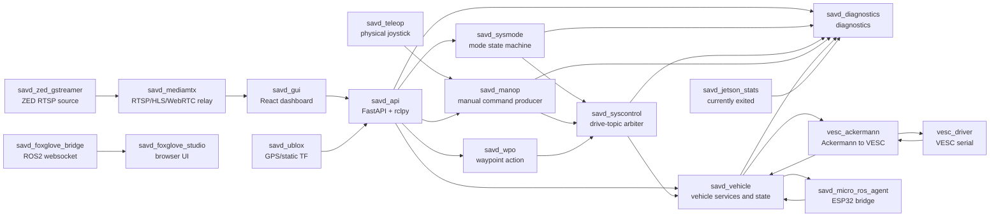

# SAVD Vehicle Container, Source, and Development Guide

AI assistance note: this guide is based on live vehicle inspection notes and command outputs. The English wording, organization, and explanations were polished with help from OpenAI Codex.

- Inspection date: 2026-06-02
- Vehicle host: `172.21.16.162`
- Observed hostname: `GTW-ONX1-E1A4T4E1`
- Observed OS: Ubuntu 22.04.5 LTS, NVIDIA Jetson, `aarch64`
- Observed Docker version: 28.0.4

Main directories on the vehicle:

```text
/home/user/savd/savd_docker
/home/user/savd/savd_gui
/home/user/ros2_ws/src
/home/user/scripts
```

This guide is based on the live Docker Compose stack, launch files, mounted configuration, container source trees, GUI source, ROS2 graph, and API behavior on the vehicle above. The inspection was read-only. No container was restarted, no runtime file was modified, and no recovery script was executed.

This is the default onboarding document for new developers. Read it in order the first time. The point is not to memorize every container name. The point is to understand how a browser action becomes a ROS2 command, how that command is allowed or rejected, how it reaches VESC or ESP32 hardware, and how state comes back to the GUI.

## 1. Start With The System Shape

The SAVD vehicle is not one program. It is a ROS2 system split into Docker containers.

The shortest useful mental model is:

```text
Browser GUI
  -> HTTP API
  -> ROS2 topic/service/action
  -> mode state machine and command arbiter
  -> vehicle abstraction
  -> VESC motor controller and ESP32/micro-ROS controller
```

The GUI never talks to the motor controller directly. The GUI talks to `savd_api`. `savd_api` talks to ROS2. The containers that decide whether a motion command is allowed are `savd_sysmode` and `savd_syscontrol`.

A container being `healthy` only means its healthcheck passed. It does not prove the whole feature works. For example:

- `savd_teleop` can be healthy while the Logitech F710 joystick is not actually connected.
- `savd_ublox` can be healthy while the real GPS node is not running.
- `savd_mediamtx` can be running while one camera source is unavailable.

The active Compose project is `savd_docker`. The current stack is built from:

```text
/home/user/savd/savd_docker/compose.yml
/home/user/savd/savd_docker/compose.zed.yml
/home/user/savd/savd_docker/compose.healthchecks.override.yml
/home/user/savd/savd_docker/compose.zed.dual_stable.override.yml
```

`docker compose ls` showed project `savd_docker` as `running(17)`. The stack defines 18 services. `savd_jetson_stats` is part of the stack but is currently exited.

## 2. The Runtime Layers

The easiest way to read the project is by layers.

| Layer | Containers | What this layer owns |
| --- | --- | --- |
| Web and API | `savd_gui`, `savd_api` | Browser UI, REST routes, OpenAPI client, conversion between HTTP and ROS2. |
| Mode and arbitration | `savd_sysmode`, `savd_syscontrol` | Vehicle mode state machine and selection of the only drive topic that is allowed to control the vehicle. |
| Command producers | `savd_manop`, `savd_wpo`, `savd_teleop` | Manual joystick commands and waypoint-following commands. |
| Vehicle abstraction | `savd_vehicle` | Converts the selected drive command into Ackermann drive, sends gear/diff/fan/VESC-on commands to ESP32, republishes vehicle state. |
| Hardware drivers | `vesc_ackermann`, `vesc_driver`, `savd_micro_ros_agent` | Converts Ackermann to VESC commands, talks to the VESC over serial, bridges ESP32/micro-ROS over serial. |
| Sensors and media | `savd_ublox`, `savd_zed_gstreamer`, `savd_mediamtx` | GPS/static TF, ZED camera RTSP source, RTSP/HLS/WebRTC relay. |
| Observability | `savd_diagnostics`, `savd_foxglove_bridge`, `savd_foxglove_studio`, `savd_jetson_stats` | Diagnostics aggregation, Foxglove debugging, Jetson system metrics. |

The critical boundary is between the command producers and `savd_syscontrol`.

`savd_manop` and `savd_wpo` can publish drive commands, but `savd_vehicle` does not listen to them directly. `savd_vehicle` listens to `/savd_syscontrol/drive_cmds`. `savd_syscontrol` decides which upstream drive topic is active by reading the current mode and the mode metadata from `savd_sysmode`.

That gives the project its safety shape:

```text
many possible drive command sources
  -> one mode state machine
  -> one command arbiter
  -> one vehicle abstraction
  -> hardware
```

## 3. Container Relationships

This diagram shows the runtime relationships. It is more useful than reading the container list first.



When a new developer asks "where should I change this?", start from ownership:

| Question | Owner | Source area |
| --- | --- | --- |
| Which modes exist, which modes are visible, and which transitions are allowed? | `savd_sysmode` | `resources/statemachine.xml`, `savd_sysmode/include/savd_sysmode/sysmode.hpp` |
| Which drive source is allowed in the current mode? | `savd_syscontrol` | `savd_syscontrol/include/savd_syscontrol/syscontrol.hpp` |
| How does the GUI joystick become speed and curvature? | `savd_gui`, `savd_api`, `savd_manop` | `Dashboard.tsx`, `main.py`, `manop.hpp` |
| How do waypoints become curvature and drive commands? | `savd_api`, `savd_wpo` | `wpo_action_client.py`, `wpo_action_server.hpp`, `pure_pursuit.hpp` |
| How do speed and curvature reach the VESC? | `savd_vehicle`, `vesc_ackermann`, `vesc_driver` | `savd.hpp`, `ackermann_to_vesc.cpp`, `vesc_driver.cpp` |
| How are gear, diff lock, fan, and VESC-on sent to the microcontroller? | `savd_vehicle`, `savd_micro_ros_agent`, ESP32 firmware | `savd.hpp`, `SAVDCommand.msg`, ESP32 firmware outside this container stack |
| How does GUI state get updated? | `savd_vehicle`, `savd_diagnostics`, `savd_api`, `savd_gui` | `/savd_vehicle/*`, `/diagnostics_agg`, `main.py`, GUI components |
| Why is video visible or missing? | `savd_zed_gstreamer`, `savd_mediamtx`, `savd_gui` | ZED GStreamer command, `mediamtx.yml`, `Cameras.tsx` |
| Where do ROS2 debugging views come from? | `savd_foxglove_bridge`, `savd_foxglove_studio` | Foxglove bridge websocket and browser studio |

## 4. ROS Names And Launch Remaps

Many source files use relative ROS names such as `drive_cmds`, `mode`, or `set_mode`. The actual runtime names are created by launch files and remaps. Always read the launch file together with the source.

Common examples:

| Name in source | Runtime name |
| --- | --- |
| `joy_cmds_2` in `savd_manop` | `/savd_manop/joy_cmds_2` |
| `drive_cmds` in `savd_manop` | `/savd_manop/drive_cmds` |
| `/mode` in `savd_manop` | `/savd_sysmode/mode` |
| `drive_cmds` in `savd_syscontrol` | `/savd_syscontrol/drive_cmds` |
| `drive_cmds` in `savd_vehicle` | `/savd_syscontrol/drive_cmds` |
| `vesc_drive` in `savd_vehicle` | `/ackermann_cmd` |
| `savd_cmds` in `savd_vehicle` | `/savd_micro_ros/cmd` |
| `savd_state` in `savd_vehicle` | `/savd_micro_ros/state` |
| `commands/motor/speed` in `vesc_ackermann` | `/commands/motor/speed` |
| `sensors/core` in `vesc_driver` | `/sensors/core` |

This is why a topic can look missing when reading source alone. The name may be remapped in `launch/*.launch.py`.

## 5. Main Runtime Flows

### 5.1 GUI Virtual Joystick To Wheels

This is the normal manual-control path from the browser.

```text
savd_gui
  Dashboard.tsx sendJoystickCmds()
    -> PUT /manual/send_joy_cmds
      -> savd_api publishes /savd_manop/joy_cmds_2
        -> savd_manop converts Joy axes to TwistStamped
          -> /savd_manop/drive_cmds
            -> savd_syscontrol forwards it only when the mode metadata points to this drive topic
              -> /savd_syscontrol/drive_cmds
                -> savd_vehicle converts speed/curvature to AckermannDriveStamped
                  -> /ackermann_cmd
                    -> vesc_ackermann converts to motor ERPM and servo position
                      -> /commands/motor/speed and /commands/servo/position
                        -> vesc_driver writes serial packets to the VESC
```

Development ownership:

- Change GUI joystick behavior in `Dashboard.tsx` and `Joystick.tsx`.
- Change HTTP-to-ROS conversion in `savd_api/main.py`.
- Change joystick mapping, deadman logic, and manual mode transitions in `savd_manop/include/savd_manop/manop.hpp`.
- Change whether manual commands are accepted by editing `statemachine.xml` and the mode metadata consumed by `savd_syscontrol`.
- Change steering and speed conversion downstream in `savd_vehicle` or `vesc_ackermann`.

The manual path will not move the vehicle just because `/savd_manop/drive_cmds` exists. `savd_syscontrol` must be in a mode whose metadata selects `/savd_manop/drive_cmds`.

### 5.2 Physical Joystick To Wheels

The physical joystick path feeds the same manual operation node.

```text
/dev/input/js0
  -> savd_teleop joy_node
    -> /savd_manop/joy_cmds
      -> savd_manop
        -> same downstream chain as GUI joystick
```

`savd_manop` gives priority to the physical joystick input. If `/savd_manop/joy_cmds` is active, GUI input on `/savd_manop/joy_cmds_2` does not take over.

Current caveat: the healthcheck override can treat `savd_teleop` as healthy while it is only waiting for a Logitech F710 process. Check `/dev/input/js0` or container logs before assuming the physical joystick is available.

### 5.3 Waypoints To Wheels

Waypoint operation is not a direct "GUI sends velocity" path. The GUI sends a waypoint goal. `savd_wpo` owns the action server and path-following loop.

```text
savd_gui
  Mapbox.tsx handleSendWaypoints()
    -> PUT /wpo/send_waypoints
      -> savd_api WPOActionClient.feature_collection_to_path()
        -> /savd_wpo/waypoints action
          -> WPOActionServer accepts the goal
            -> publishes /savd_wpo/path and /savd_wpo/segment
              -> PurePursuit consumes /savd_wpo/segment and TF
                -> publishes /savd_wpo/curvature and /savd_wpo/current_pose
                  -> WPOActionServer combines curvature with target velocity
                    -> /savd_wpo/drive_cmds
                      -> savd_syscontrol forwards it only in WPO modes
                        -> /savd_syscontrol/drive_cmds
                          -> savd_vehicle and VESC chain
```

Development ownership:

- Change map drawing and send/cancel behavior in `Mapbox.tsx`.
- Change GeoJSON to `nav_msgs/Path` conversion in `wpo_action_client.py`.
- Change WPO goal handling, waypoint progression, and mode transitions in `wpo_action_server.hpp`.
- Change lookahead, target pose, curvature, and TF behavior in `pure_pursuit.hpp`.
- Change which modes allow WPO movement in `statemachine.xml`.

WPO depends on TF. If `utm -> ... -> base_link` is unavailable, pure pursuit cannot produce reliable current pose and curvature.

### 5.4 Gear, Diff Lock, Fan, And VESC-On

These are not part of the speed command topic. They are service calls through `savd_vehicle`, then a periodic command to the ESP32 through micro-ROS.

```text
savd_gui ESP32Control.tsx
  -> PUT /vehicle/set_gear/{LOW|HIGH}
  -> PUT /vehicle/set_diff_lock/{REAR_ON|REAR_OFF|FRONT_ON|FRONT_OFF}
  -> PUT /vehicle/set_fan_speed/{0..100}
    -> savd_api service clients
      -> /savd_vehicle/set_gear
      -> /savd_vehicle/set_diff_lock
      -> /savd_vehicle/set_fan_speed
        -> savd_vehicle updates internal command state
          -> every 50 ms publishes /savd_micro_ros/cmd
            -> savd_micro_ros_agent
              -> ESP32 firmware
```

`savd_micro_ros_agent` is not the ESP32 application. It is only the serial bridge. If the physical meaning of gear, diff lock, or fan needs to change, the final behavior is in ESP32 firmware outside this container stack.

### 5.5 State Back To The GUI

The GUI mostly reads state through `savd_api`. The source of truth is still ROS2.

```text
VESC hardware
  -> vesc_driver publishes /sensors/core
    -> savd_vehicle publishes /savd_vehicle/battery_state and /savd_vehicle/parameters

VESC odometry
  -> vesc_ackermann vesc_to_odom_node publishes /odom
    -> savd_vehicle republishes /savd_vehicle/odom

ESP32 firmware
  -> savd_micro_ros_agent publishes /savd_micro_ros/state
    -> savd_vehicle publishes /savd_vehicle/parameters

ROS diagnostics
  -> savd_diagnostics publishes /diagnostics_agg

savd_api subscribes to all of the above
  -> GUI polls REST endpoints
```

Common GUI reads:

| GUI component | API endpoint | Main ROS source |
| --- | --- | --- |
| `HeaderStatus.tsx` | `/vehicle/battery_state` | `/savd_vehicle/battery_state` |
| `VESCInfo.tsx` | `/vehicle/odom`, `/vehicle/parameters` | `/savd_vehicle/odom`, `/savd_vehicle/parameters` |
| `ESP32Control.tsx` | `/vehicle/parameters` | `/savd_vehicle/parameters` |
| `Mode.tsx` | `/modes/get_current_mode`, `/modes/get_modes` | `/savd_sysmode/mode`, `/savd_sysmode/get_modes` |
| `SystemStatus.tsx` | `/diagnostics` | `/diagnostics_agg` |
| `Mapbox.tsx` | GPS and WPO endpoints | `/ublox_gps_node/fix`, `/savd_wpo/*`, TF-derived WPO pose |

### 5.6 Cameras To The GUI

The active camera path is direct GStreamer RTSP, not the ROS ZED wrapper path.

```text
ZED front/rear cameras
  -> savd_zed_gstreamer gst-zed-rtsp-launch
    -> rtsp://localhost:8554/zed-front
    -> rtsp://localhost:8554/zed-rear
      -> savd_mediamtx pulls those sources
        -> WebRTC pages on http://172.21.16.162:8889/zed-front and /zed-rear
          -> savd_gui iframes
```

Current live status:

- Front stream can be relayed.
- Rear stream currently fails at the source side. MediaMTX logs show the source returning `503 Service Unavailable`.

### 5.7 GPS And TF

The `savd_ublox` container is currently not running the real U-Blox GPS node. The local SAVD launch file is mounted over the upstream `ublox_gps_node-launch.py`, and the `ublox_gps_node` is commented out in that launch description. The running processes are static transform publishers:

```text
map -> odom
utm -> map
```

That means a healthy `savd_ublox` container does not prove `/ublox_gps_node/fix` has real GPS data.

### 5.8 Diagnostics And Foxglove

`savd_diagnostics` runs ROS `diagnostic_aggregator`. It groups diagnostics for GUI display. The GUI does not compute subsystem health by itself; it renders what `savd_api` receives from `/diagnostics_agg`.

Foxglove is a separate debugging path:

```text
ROS2 graph
  -> savd_foxglove_bridge on ws://172.21.16.162:8765
    -> savd_foxglove_studio on http://172.21.16.162:8080
```

Foxglove is for inspection, not for normal vehicle control.

## 6. Safety Boundary

These HTTP routes can change the physical vehicle state or command movement:

```text
PUT /modes/set_mode/{mode}
PUT /manual/send_joy_cmds
PUT /vehicle/set_gear/{gear}
PUT /vehicle/set_diff_lock/{cmd}
PUT /vehicle/set_fan_speed/{speed}
PUT /wpo/send_waypoints
PUT /wpo/cancel_goal
```

These scripts and Docker commands also change runtime state:

```text
./recover_dual_cameras.sh
./start_stack_camera_stable.sh
./start_stack.sh
docker compose restart
docker compose down
docker compose up
```

Before testing anything that could move the vehicle, confirm:

- The wheels are off the ground or the vehicle is physically secured.
- The operator knows how to enter `ESTOP`.
- The GUI STOP button is reachable.
- The current mode is known from `/modes/get_current_mode` or `/savd_sysmode/mode`.
- VESC and ESP32 connection state has been checked.
- People and obstacles are clear.

`SYSTEM ERROR` in the GUI does not always mean the vehicle is physically unable to move. It can also come from stale diagnostics for sensors or optional services.

## 7. Current Container Inventory

Run these from the vehicle to verify the current stack:

```bash
cd /home/user/savd/savd_docker
docker compose -f compose.yml -f compose.zed.yml -f compose.healthchecks.override.yml -f compose.zed.dual_stable.override.yml config --services
docker ps -a --filter name=savd_docker
```

Main stack services:

| Service | Container | Current status | Role |
| --- | --- | --- | --- |
| `savd_gui` | `savd_docker-savd_gui-1` | running healthy | React browser GUI. |
| `savd_api` | `savd_docker-savd_api-1` | running healthy | FastAPI bridge between GUI and ROS2. |
| `savd_sysmode` | `savd_docker-savd_sysmode-1` | running healthy | Mode state machine. |
| `savd_syscontrol` | `savd_docker-savd_syscontrol-1` | running healthy | Drive-command source arbiter. |
| `savd_manop` | `savd_docker-savd_manop-1` | running healthy | Manual operation command producer. |
| `savd_wpo` | `savd_docker-savd_wpo-1` | running healthy | Waypoint action server and pure pursuit. |
| `savd_vehicle` | `savd_docker-savd_vehicle-1` | running healthy | Vehicle abstraction for VESC and ESP32. |
| `vesc_ackermann` | `savd_docker-vesc_ackermann-1` | running healthy | Ackermann to VESC motor/servo conversion. |
| `vesc_driver` | `savd_docker-vesc_driver-1` | running healthy | Serial VESC driver. |
| `savd_micro_ros_agent` | `savd_docker-savd_micro_ros_agent-1` | running healthy | ESP32 micro-ROS serial bridge. |
| `savd_teleop` | `savd_docker-savd_teleop-1` | running healthy | Physical joystick to ROS Joy. |
| `savd_ublox` | `savd_docker-savd_ublox-1` | running healthy | U-Blox container, currently static TF only. |
| `savd_diagnostics` | `savd_docker-savd_diagnostics-1` | running healthy | Diagnostics aggregation. |
| `savd_zed_gstreamer` | `savd_docker-savd_zed_gstreamer-1` | running healthy | ZED camera RTSP source. |
| `savd_mediamtx` | `savd_docker-savd_mediamtx-1` | running | RTSP/HLS/WebRTC relay. |
| `savd_foxglove_bridge` | `savd_docker-savd_foxglove_bridge-1` | running healthy | ROS2 WebSocket bridge for Foxglove. |
| `savd_foxglove_studio` | `savd_docker-savd_foxglove_studio-1` | running healthy | Browser Foxglove Studio. |
| `savd_jetson_stats` | `savd_docker-savd_jetson_stats-1` | exited 127 | Jetson system stats, currently unavailable. |

There is also a `savd_gui-savd_gui-1` container in `Created` state from a different Compose project. It is not the active GUI for the main `savd_docker` stack.

Useful external addresses:

| Function | Address |
| --- | --- |
| Main GUI | `http://172.21.16.162:3000` |
| REST API | `http://172.21.16.162:8000` |
| OpenAPI JSON | `http://172.21.16.162:8000/openapi.json` |
| Foxglove Studio | `http://172.21.16.162:8080` |
| Foxglove Bridge | `ws://172.21.16.162:8765` |
| ZED front WebRTC | `http://172.21.16.162:8889/zed-front` |
| ZED rear WebRTC | `http://172.21.16.162:8889/zed-rear` |
| MediaMTX RTSP | `rtsp://172.21.16.162:8553/zed-front` or `/zed-rear` |
| ZED GStreamer RTSP source | `rtsp://172.21.16.162:8554/zed-front` or `/zed-rear` |
| MediaMTX metrics | `http://172.21.16.162:9998` |

## 8. Container Source Reference

This section is the code map. Use it after reading the flows above.

### 8.1 `savd_gui`

Image:

```text
dockertest3.azurecr.io/savd/gui:latest
```

Run command:

```text
yarn start
```

Source on the host:

```text
/home/user/savd/savd_gui/app
/home/user/savd/savd_gui/app/src
```

Role in the system:

- Provides the browser dashboard.
- Polls vehicle time, diagnostics, current mode, vehicle parameters, ESP32/VESC state, odometry, and WPO state.
- Sends virtual joystick commands while the joystick pointer is active.
- Displays camera pages from MediaMTX WebRTC URLs.
- Embeds Foxglove Studio for debugging.

Important files and methods:

| File | Method or component | Purpose |
| --- | --- | --- |
| `src/App.tsx` | `OpenAPI.BASE = "http://" + url + ":" + port` | Builds the API base URL from the browser hostname. |
| `src/App.tsx` | `synchronizeTime()` | Calls `/current_time`, computes round-trip time and local/vehicle time offset. |
| `src/App.tsx` | `convertToRows()` | Converts `/diagnostics` response into table rows and computes GUI ROS status. |
| `src/components/Dashboard.tsx` | `sendJoystickCmds()` | Builds a `sensor_msgs/Joy` payload and sends `PUT /manual/send_joy_cmds`. |
| `src/components/Dashboard.tsx` | `getDriveCmds()` | Converts joystick pointer state into linear and angular axes. |
| `src/components/Dashboard.tsx` | `requestMode("ESTOP")` | STOP button request to enter `ESTOP`. |
| `src/components/Joystick.tsx` | `updatePosition()` | Normalizes pointer position to joystick x/y values. |
| `src/components/Joystick.tsx` | `deactivateJoystick()` | Returns the joystick visual state to center and marks it inactive. |
| `src/components/VESCInfo.tsx` | `getVehicleLimits()` | Reads `/vehicle/parameters` for velocity, curvature, VESC, and ESP32 state. |
| `src/components/VESCInfo.tsx` | `getDriveCmds()` | Reads `/vehicle/odom` for speed and curvature display. |
| `src/components/ESP32Control.tsx` | `handleGearSubmmit()` | Sends `PUT /vehicle/set_gear/{LOW|HIGH}`. |
| `src/components/ESP32Control.tsx` | `handleDiffLockRearSubmmit()` | Sends rear diff lock commands. |
| `src/components/ESP32Control.tsx` | `handleDiffLockFrontSubmmit()` | Sends front diff lock commands. |
| `src/components/ESP32Control.tsx` | `handleFanSpeedSubmmit()` | Sends fan speed commands. |
| `src/components/Mode.tsx` | `getCurrMode()` | Reads current mode. |
| `src/components/Mode.tsx` | `getModes()` | Reads all modes and hides modes whose metadata has `internal=true`. |
| `src/components/Mode.tsx` | `requestMode()` | Sends mode change requests. |
| `src/components/Mapbox.tsx` | `handleSendWaypoints()` | Sends selected Mapbox geometry to `/wpo/send_waypoints`. |
| `src/components/Mapbox.tsx` | `handleCancelWaypoints()` | Sends `/wpo/cancel_goal`. |
| `src/components/Mapbox.tsx` | `fetchGPS()` | Polls GPS, ZED geo pose, WPO current pose, and WPO path. |
| `src/pages/Cameras.tsx` | camera iframes | Embeds `:8889/zed-front` and `:8889/zed-rear`. |
| `src/pages/Foxglove.tsx` | Foxglove iframe | Opens Foxglove Studio and connects it to the bridge. |

Development notes:

- The generated API client is in `src/client`.
- If an API route changes, regenerate or update the client, otherwise TypeScript and OpenAPI can drift.
- The virtual joystick sends commands only while active.
- Gear and diff controls are restricted in the GUI to modes whose name starts with `MAN`; fan control is not restricted the same way.
- The Mapbox token is currently in `Mapbox.tsx`. It should eventually move to configuration.

### 8.2 `savd_api`

Image:

```text
dockertest3.azurecr.io/savd/ros-humble-api:v1.0
```

Run command:

```text
ros2 launch savd_api savd_api.launch.py
```

Mounted launch file:

```text
/home/user/savd/savd_docker/launch/savd_api.launch.py
  -> /home/ubuntu/ros2_ws/src/savd_api/launch/savd_api.launch.py
```

Source inside the image:

```text
/home/ubuntu/ros2_ws/src/savd_api/savd_api/main.py
/home/ubuntu/ros2_ws/src/savd_api/savd_api/utils/clients/subscriber.py
/home/ubuntu/ros2_ws/src/savd_api/savd_api/utils/clients/publisher.py
/home/ubuntu/ros2_ws/src/savd_api/savd_api/utils/clients/services.py
/home/ubuntu/ros2_ws/src/savd_api/savd_api/utils/clients/wpo_action_client.py
/home/ubuntu/ros2_ws/src/savd_api/savd_api/utils/models
```

Role in the system:

- Exposes the HTTP API consumed by the GUI.
- Creates ROS2 node `/savd_api/savd_api`.
- Subscribes to vehicle state and diagnostics and caches the latest messages.
- Converts HTTP requests into ROS2 publishers, service calls, and action goals.
- Runs `rclpy.spin(bridge)` in a background thread and `uvicorn.run()` in the main thread.

ROS interfaces created in `ROS2Bridge.__init__()`:

```text
subscribe: /savd_vehicle/odom
subscribe: /savd_vehicle/parameters
subscribe: /savd_vehicle/battery_state
subscribe: /diagnostics_agg
subscribe: /gpsfix
subscribe: /ublox_gps_node/fix
subscribe: /zed_multi/zed_front/geo_pose
subscribe: /savd_sysmode/mode
subscribe: /savd_wpo/path
subscribe: /savd_wpo/current_pose
subscribe: /savd_wpo/target_pose

publish: /savd_manop/joy_cmds_2

service client: /savd_sysmode/get_modes
service client: /savd_sysmode/set_mode
service client: /savd_vehicle/set_gear
service client: /savd_vehicle/set_diff_lock
service client: /savd_vehicle/set_fan_speed

action client: /savd_wpo/waypoints
```

Main HTTP routes:

| Route | Method | Purpose |
| --- | --- | --- |
| `/current_time` | GET | Returns ROS current time. |
| `/diagnostics` | GET | Returns aggregated diagnostics. |
| `/modes/get_modes` | GET | Calls `/savd_sysmode/get_modes`. |
| `/modes/get_current_mode` | GET | Returns cached `/savd_sysmode/mode`. |
| `/modes/set_mode/{mode}` | PUT | Calls `/savd_sysmode/set_mode`. |
| `/vehicle/odom` | GET | Returns cached `/savd_vehicle/odom`. |
| `/vehicle/parameters` | GET | Returns cached `/savd_vehicle/parameters`. |
| `/vehicle/battery_state` | GET | Returns cached `/savd_vehicle/battery_state`. |
| `/vehicle/set_gear/{gear}` | PUT | Calls `/savd_vehicle/set_gear`. |
| `/vehicle/set_diff_lock/{cmd}` | PUT | Calls `/savd_vehicle/set_diff_lock`. |
| `/vehicle/set_fan_speed/{speed}` | PUT | Calls `/savd_vehicle/set_fan_speed`. |
| `/manual/send_joy_cmds` | PUT | Publishes `/savd_manop/joy_cmds_2`. |
| `/sensors/gps/fix` | GET | Returns cached `/gpsfix`. |
| `/sensors/navsat/fix` | GET | Returns cached `/ublox_gps_node/fix`. |
| `/sensors/geo/pose` | GET | Returns cached `/zed_multi/zed_front/geo_pose`. |
| `/wpo/send_waypoints` | PUT | Converts GeoJSON to `nav_msgs/Path` and sends WPO action goal. |
| `/wpo/cancel_goal` | PUT | Cancels the active WPO action goal. |
| `/wpo/path` | GET | Converts WPO path to GeoJSON. |
| `/wpo/pure_pursuit/current_pose` | GET | Converts WPO current pose from UTM to longitude/latitude. |

Important methods:

| File | Method | Purpose |
| --- | --- | --- |
| `main.py` | `create_custom_best_effort_qos()` | Creates BEST_EFFORT QoS with deadline and lifespan. |
| `main.py` | `ROS2Bridge.__init__()` | Registers all ROS subscribers, publishers, service clients, action clients, and HTTP routes. |
| `main.py` | `get_diagnostics()` | Reads cached diagnostics from `Subscribers`. |
| `main.py` | `get_modes()` | Calls SysMode service and converts messages to Pydantic models. |
| `main.py` | `set_mode()` | Converts HTTP mode path parameter into `SetString.Request`. |
| `main.py` | `send_joy_cmds()` | Converts frontend Joy model into ROS Joy and publishes it. |
| `main.py` | `send_waypoints()` | Converts FeatureCollection to Path and sends an action goal. |
| `subscriber.py` | `SubscriberWrapper.cb_sub()` | Caches the latest ROS message and refreshes watchdog state. |
| `subscriber.py` | `SubscriberWrapper.cb_timer()` | Clears stale cached data after timeout. |
| `publisher.py` | `PublisherWrapper.publish()` | Thin wrapper around a ROS publisher. |
| `services.py` | `ServiceWrapper.call_service()` | Waits for a service and returns the service response. |
| `wpo_action_client.py` | `send_goal()` | Checks WPO action server and sends waypoint goal. |
| `wpo_action_client.py` | `check_goal_accepted()` | Waits for action goal acceptance or timeout. |
| `wpo_action_client.py` | `cancel_goal()` | Cancels the current WPO goal. |
| `wpo_action_client.py` | `feature_collection_to_path()` | Converts GeoJSON MultiPoint into `nav_msgs/Path`. |
| `wpo_action_client.py` | `lonlat_to_pose_stamped()` | Converts longitude/latitude to UTM pose. |
| `wpo_action_client.py` | `pose_stamped_to_lonlat()` | Converts UTM pose to longitude/latitude. |

Current code notes:

- `services.py` has a `timout` / `timeout` spelling mismatch. Timeout protection may not behave as intended if a service future never completes.
- `main.py` subscribes to `/savd_wpo/target_pose` as `String`, but `PurePursuit` publishes `geometry_msgs/PoseStamped`. The route is not currently exposed, but this should be fixed before exposing target pose through the API.
- Some Pydantic model defaults use `[]`. If the project moves to stricter model settings, use `Field(default_factory=list)`.

### 8.3 `savd_sysmode`

Image:

```text
dockertest3.azurecr.io/savd/ros-humble-sysmode:v1.0
```

Run command:

```text
ros2 launch savd_sysmode savd_sysmode.launch.py
```

Mounted files:

```text
/home/user/savd/savd_docker/launch/savd_sysmode.launch.py
  -> /home/ubuntu/ros2_ws/src/savd_sysmode/launch/savd_sysmode.launch.py
/home/user/savd/savd_docker/resources/statemachine.xml
  -> /home/ubuntu/ros2_ws/src/savd_sysmode/resources/statemachine.xml
```

Source inside the image:

```text
/home/ubuntu/ros2_ws/src/savd_sysmode/src/savd_sysmode_node.cpp
/home/ubuntu/ros2_ws/src/savd_sysmode/include/savd_sysmode/sysmode.hpp
/home/ubuntu/ros2_ws/src/savd_sysmode/include/savd_sysmode/utils.hpp
```

Role in the system:

- Owns the mode state machine.
- Reads mode definitions, transitions, metadata, and privileged flags from `statemachine.xml`.
- Publishes the current mode.
- Provides services to set the mode and list all modes.
- Handles auto transitions such as `ERRACK -> IDLE` and `WPO_FINAL -> WPO`.

Runtime interfaces:

```text
node: /savd_sysmode/savd_sysmode
publish: /savd_sysmode/mode
service: /savd_sysmode/set_mode
service: /savd_sysmode/get_modes
```

Important methods:

| Method | Purpose |
| --- | --- |
| `main()` | Initializes rclcpp and spins `savd::SysMode`. |
| `SysMode::SysMode()` | Declares parameters, creates publisher, timer, services, diagnostics, and calls `initStatemachine()`. |
| `initStatemachine()` | Parses XML modes, transitions, metadata, privileged flags, and the initial mode. |
| `setMode()` | Validates requested mode, checks allowed transitions, handles privileged modes, and starts one-shot timers for auto transitions. |
| `getModes()` | Converts internal modes into `savd_interfaces/msg/Mode` for API and SysControl. |
| `cbTimer()` | Publishes current mode at `mode_pub_rate_ms`. |
| `cbTimerOneShot()` | Performs delayed auto transition. |
| `updateDiagnostics()` | Publishes StateMachine diagnostics. |
| `create_custom_best_effort_profile()` | Creates BEST_EFFORT QoS. |

Important modes:

| Mode | Visible in GUI | Purpose |
| --- | --- | --- |
| `DISABLED` | yes | VESC off, no driving. |
| `IDLE` | yes | Idle but ready. |
| `MANOP` | yes | Manual operation ready. |
| `MANOP_MOVE` | no | Manual operation currently receiving commands. |
| `WPO` | yes | Waypoint operation ready. |
| `WPO_MOVE` | no | Waypoint operation currently executing. |
| `WPO_FINAL` | no | Final waypoint reached, auto transitions back to `WPO`. |
| `WPO_ERROR` | no | Waypoint operation error. |
| `ERROR` | no | General error mode, privileged. |
| `ESTOP` | yes | Emergency stop, privileged. |
| `ERRACK` | yes | Acknowledge error, auto transitions to `IDLE`. |
| `RUTINE` | yes | Present in XML, but no matching active container/source was observed in the main stack. |

The most important metadata key is `drive_topic`. `savd_syscontrol` uses it to decide which command source is active.

### 8.4 `savd_syscontrol`

Image:

```text
dockertest3.azurecr.io/savd/ros-humble-syscontrol:v1.0
```

Run command:

```text
ros2 launch savd_syscontrol savd_syscontrol.launch.py
```

Source inside the image:

```text
/home/ubuntu/ros2_ws/src/savd_syscontrol/src/savd_syscontrol_node.cpp
/home/ubuntu/ros2_ws/src/savd_syscontrol/include/savd_syscontrol/syscontrol.hpp
```

Role in the system:

- Calls `/savd_sysmode/get_modes` on startup.
- Reads each mode's `drive_topic` metadata.
- Subscribes to `/savd_sysmode/mode`.
- When mode changes, switches its active drive-command subscription.
- Republishes the currently allowed drive command to `/savd_syscontrol/drive_cmds`.
- If the publish deadline breaks and the last command was non-zero, publishes a zero-speed command.

Runtime interfaces:

```text
node: /savd_syscontrol/savd_syscontrol
subscribe: /savd_sysmode/mode
dynamic subscribe: /savd_manop/drive_cmds or /savd_wpo/drive_cmds
publish: /savd_syscontrol/drive_cmds
client: /savd_sysmode/get_modes
```

Important methods:

| Method | Purpose |
| --- | --- |
| `main()` | Spins `savd::SysControl`. |
| `SysControl::SysControl()` | Creates publisher, mode subscriber, get_modes client, and diagnostics. |
| `updateModes()` | Waits for `/savd_sysmode/get_modes` and requests all modes. |
| `cbClientGetModes()` | Builds a mode-to-drive-topic map from mode metadata. |
| `cbMode()` | Recreates the active drive-command subscriber when current mode changes. |
| `cbDriveCmds()` | Publishes the selected drive command to `/savd_syscontrol/drive_cmds`. |
| `updateDiagnostics()` | Reports DriveCmds and Mode diagnostics. |

This container is the drive-command arbiter. If manual or waypoint commands are visible upstream but the vehicle does not move, check current mode and `statemachine.xml` before changing VESC code.

### 8.5 `savd_manop`

Image:

```text
dockertest3.azurecr.io/savd/ros-humble-manop:v1.0
```

Run command:

```text
ros2 launch savd_manop savd_manop.launch.py
```

Source inside the image:

```text
/home/ubuntu/ros2_ws/src/savd_manop/src/savd_manop_node.cpp
/home/ubuntu/ros2_ws/src/savd_manop/include/savd_manop/manop.hpp
```

Role in the system:

- Receives physical joystick input from `/savd_manop/joy_cmds`.
- Receives GUI virtual joystick input from `/savd_manop/joy_cmds_2`.
- Processes joystick data only in `MANOP` or `MANOP_MOVE`.
- Requires button `buttons[4]` to be `1`. The GUI payload sets this button to `1`.
- Converts joystick axes to `geometry_msgs/TwistStamped`.
- Requests `MANOP_MOVE` while valid joystick commands arrive and returns to `MANOP` after timeout.

Runtime interfaces:

```text
node: /savd_manop/savd_manop
subscribe: /savd_sysmode/mode
subscribe: /savd_manop/joy_cmds
subscribe: /savd_manop/joy_cmds_2
publish: /savd_manop/drive_cmds
client: /savd_sysmode/set_mode
```

Launch defaults:

```text
max_linear = 2.0
max_angular = 0.8
joy_sub_deadline_ms = 100
drive_cmds_pub_rate_ms = 50
```

Joystick mapping:

```text
linear.x  = axes[1] * max_linear
angular.z = axes[3] * max_angular
```

Important methods:

| Method | Purpose |
| --- | --- |
| `main()` | Spins `savd::ManOp`. |
| `ManOp::ManOp()` | Creates mode and Joy subscribers, drive publisher, set_mode client, diagnostics, and watchdog timers. |
| `cbMode()` | Caches current mode. |
| `cbJoystickCmds1()` | Handles physical joystick input and marks physical input active. |
| `cbJoystickCmds2()` | Handles GUI joystick input only when physical input is inactive. |
| `cbJoystickCmds()` | Checks mode, axes/buttons size, deadman button, and publishes drive command. |
| `setMode()` | Requests transition to `MANOP_MOVE` or back to `MANOP`. |
| `cbClientSetMode()` | Handles set_mode response. |
| `joyTimerCallback()` | Emits WARN on joystick timeout and requests return to `MANOP` from `MANOP_MOVE`. |
| `timerCallback()` | Protects set_mode service call timeout. |

### 8.6 `savd_wpo`

Image:

```text
dockertest3.azurecr.io/savd/ros-humble-wpo:v1.0
```

Run command:

```text
ros2 launch savd_wpo savd_wpo.launch.py
```

Source inside the image:

```text
/home/ubuntu/ros2_ws/src/savd_wpo/src/savd_wpo_node.cpp
/home/ubuntu/ros2_ws/src/savd_wpo/src/pure_pursuit_node.cpp
/home/ubuntu/ros2_ws/src/savd_wpo/include/savd_wpo/wpo_action_server.hpp
/home/ubuntu/ros2_ws/src/savd_wpo/include/savd_wpo/pure_pursuit.hpp
```

Runtime nodes:

| Node | Purpose |
| --- | --- |
| `/savd_wpo/savd_wpo_node` | Waypoint action server, goal execution, mode transitions, drive command publication. |
| `/savd_wpo/pure_pursuit_node` | Pure pursuit controller, current pose lookup, target pose and curvature calculation. |

`WPOActionServer` interfaces:

```text
action server: /savd_wpo/waypoints
subscribe: /savd_sysmode/mode
subscribe: /savd_wpo/curvature
subscribe: /savd_wpo/current_pose
publish: /savd_wpo/drive_cmds
publish: /savd_wpo/segment
publish: /savd_wpo/path
client: /savd_sysmode/set_mode
```

`PurePursuit` interfaces:

```text
subscribe: /savd_wpo/segment
publish: /savd_wpo/curvature
publish: /savd_wpo/current_pose
publish: /savd_wpo/target_pose
TF lookup: target frame -> base_link
```

Important `WPOActionServer` methods:

| Method | Purpose |
| --- | --- |
| `WPOActionServer::WPOActionServer()` | Creates action server, subscribers, publishers, set_mode client, and diagnostics. |
| `handle_goal()` | Accepts goals only when there are at least two waypoints. |
| `handle_cancel()` | Accepts cancel requests. |
| `handle_accepted()` | Starts goal execution in a separate thread. |
| `execute()` | Main loop: enters `WPO_MOVE`, publishes current segment, uses curvature, publishes drive commands, enters `WPO_FINAL` at the end. |
| `curvatureCallback()` | Caches pure-pursuit curvature. |
| `poseCallback()` | Caches current pose. |
| `cbMode()` | Caches current mode. |
| `setMode()` | Requests WPO mode transitions. |
| `distanceBetween()` | Checks distance to waypoint. |

Important `PurePursuit` methods:

| Method | Purpose |
| --- | --- |
| `PurePursuit::PurePursuit()` | Creates publishers, subscriber, timer, and TF listener. |
| `cbTimer()` | Periodically gets current pose and runs pure pursuit when active. |
| `getCurrentPose()` | Uses TF to transform `base_link` into the path segment frame. |
| `cbSegment()` | Activates controller when a path segment arrives. |
| `executePurePursuit()` | Computes target point and curvature for the current two-point segment. |
| `findIntersections()` | Finds intersections between lookahead circle and line segment. |
| `calculateCurvature()` | Calculates curvature from target point and current heading. |
| `steerTowardClosestPoint()` | Falls back to steering toward the closest point when no intersection is found. |
| `getClosestPointOnLine()` | Projects current position onto the path segment. |
| `normalizeAngle()` | Normalizes angle to `[-pi, pi]`. |
| `getYawFromQuaternion()` | Converts quaternion to yaw. |

Current code notes:

- `findIntersections()` computes slope as `dy / dx`. Vertical segments can divide by zero. Handle vertical geometry before relying on WPO in all waypoint shapes.
- WPO depends on TF. If `utm -> ... -> base_link` is not available, the controller cannot reliably publish curvature.
- The action server expects the mode to be `WPO` or `WPO_MOVE`.

### 8.7 `savd_vehicle`

Image:

```text
dockertest3.azurecr.io/savd/ros-humble-vehicle:v1.0
```

Run command:

```text
ros2 launch savd_vehicle savd.launch.py
```

Source inside the image:

```text
/home/ubuntu/ros2_ws/src/savd_vehicle/src/savd_node.cpp
/home/ubuntu/ros2_ws/src/savd_vehicle/include/savd_vehicle/savd.hpp
/home/ubuntu/ros2_ws/src/savd_vehicle/include/savd_vehicle/vehicle_wrapper.hpp
```

Role in the system:

- Receives the final selected drive command from `/savd_syscontrol/drive_cmds`.
- Converts speed and curvature into Ackermann steering:

```text
speed = twist.linear.x
steering_angle = atan(wheelbase * twist.angular.z)
```

- Publishes `/ackermann_cmd` for `vesc_ackermann`.
- Receives VESC state and publishes battery state and connection parameters.
- Receives ESP32 state and publishes vehicle parameters.
- Publishes `/savd_micro_ros/cmd` every 50 ms with:

```text
acknowledge_error
vesc_on
servo_gear
servo_diff_front
servo_diff_rear
fan_speed
request_shutdown
```

Runtime interfaces:

```text
node: /savd_vehicle/savd_vehicle
subscribe: /savd_syscontrol/drive_cmds
subscribe: /savd_sysmode/mode
subscribe: /sensors/core
subscribe: /odom
subscribe: /savd_micro_ros/state
subscribe: /savd_manop/joy_cmds
publish: /ackermann_cmd
publish: /savd_micro_ros/cmd
publish: /savd_vehicle/odom
publish: /savd_vehicle/parameters
publish: /savd_vehicle/battery_state
service: /savd_vehicle/set_fan_speed
service: /savd_vehicle/set_gear
service: /savd_vehicle/set_diff_lock
client: /savd_sysmode/set_mode
```

Important methods:

| Method | Purpose |
| --- | --- |
| `VehicleWrapper::VehicleWrapper()` | Creates generic odom, parameters, battery publishers, and drive subscriber. |
| `VehicleWrapper::cbDriveCmds()` | Pure virtual drive-command callback implemented by `SAVD`. |
| `SAVD::SAVD()` | Declares vehicle parameters and creates VESC, ESP32, mode, Joy, service, timer, and diagnostic interfaces. |
| `cbDriveCmds()` | Converts `TwistStamped` to `AckermannDriveStamped`. |
| `cbMode()` | Sets `vesc_on_` based on mode and sets `acknowledge_error_` in `ERRACK`. |
| `cbSAVDState()` | Handles ESP32 state, requests `ERROR` on fault, and assembles `/savd_vehicle/parameters`. |
| `cbVescState()` | Converts VESC state into battery state and refreshes VESC watchdog. |
| `cbOdom()` | Republishes VESC odometry to `/savd_vehicle/odom`. |
| `cbCmdTimer()` | Publishes `SAVDCommand` to ESP32 every 50 ms. |
| `cbWdTimerState()` | One-second watchdog for micro-ROS and VESC timeouts. |
| `cbServiceFanSpeed()` | Converts fan percent 0-100 to 0-255. |
| `cbServiceGear()` | Converts `LOW` and `HIGH` into servo pulse width. |
| `cbServiceDiffLock()` | Converts rear/front diff commands into servo pulse width. |
| `cbJoyCmds()` | Handles physical joystick buttons for mode, gear, and diff lock. |
| `setMode()` | Requests `ERROR`, `ERRACK`, and related mode changes. |

Important launch defaults:

```text
wheelbase = 0.535
vel_max = 2.0
crvt_max = 0.8
vesc_off_modes = ["DISABLED"]
servo_gear_pw_min_max = [1800, 1200]
servo_diff_front_pw_min_max = [1800, 1200]
servo_diff_rear_pw_min_max = [1200, 1800]
```

Current code notes:

- Diagnostics registration binds `MicroROSConn` and `VESCConn` to `"State"` but watchdog updates use `"MicroROSConn"` and `"VescConn"`. Diagnostics can display those items incorrectly.
- `params_["vehice_mode"]` is misspelled. The GUI does not currently depend on this key, but future parameter displays should account for it.

### 8.8 `vesc_ackermann`

Image:

```text
dockertest3.azurecr.io/savd/ros-humble-vesc:v1.0
```

Run command:

```text
ros2 launch vesc_ackermann vesc_ackermann.launch.py
```

Mounted config:

```text
/home/user/savd/savd_docker/config/vesc_config.yaml
  -> /home/ubuntu/ros2_ws/src/vesc_driver/params/vesc_config.yaml
```

Source inside the image:

```text
/home/ubuntu/ros2_ws/src/vesc_ackermann/src/ackermann_to_vesc.cpp
/home/ubuntu/ros2_ws/src/vesc_ackermann/src/vesc_to_odom.cpp
```

Runtime nodes:

| Node | Purpose |
| --- | --- |
| `ackermann_to_vesc_node` | Converts `/ackermann_cmd` into VESC motor speed and servo position commands. |
| `vesc_to_odom_node` | Converts VESC telemetry and servo command feedback into `/odom` and `/tf`. |

Important methods:

| File | Method | Purpose |
| --- | --- | --- |
| `ackermann_to_vesc.cpp` | `AckermannToVesc::AckermannToVesc()` | Reads conversion parameters and creates publishers/subscribers. |
| `ackermann_to_vesc.cpp` | `ackermannCmdCallback()` | Converts speed to ERPM and steering angle to servo position. |
| `vesc_to_odom.cpp` | `VescToOdom::VescToOdom()` | Reads odom frame, base frame, wheelbase, and conversion parameters. |
| `vesc_to_odom.cpp` | `vescStateCallback()` | Integrates odometry and publishes `/odom` and TF. |
| `vesc_to_odom.cpp` | `servoCmdCallback()` | Caches latest servo command for angular velocity estimation. |

Current VESC conversion parameters:

```text
speed_to_erpm_gain: 8480.0
speed_to_erpm_offset: 0.0
steering_angle_to_servo_gain: -0.815
steering_angle_to_servo_offset: 0.475
wheelbase: 0.535
servo_min: 0.18
servo_max: 0.85
speed_min: -46250.0
speed_max: 46250.0
publish_tf: true
```

### 8.9 `vesc_driver`

Image:

```text
dockertest3.azurecr.io/savd/ros-humble-vesc:v1.0
```

Run command:

```text
while [ ! -e /dev/serial/by-id/usb-STMicroelectronics_ChibiOS_RT_Virtual_COM_Port_304-if00 ]; do
  echo 'Waiting for VESC ...'
  sleep 1
done
ros2 launch vesc_driver vesc_driver.launch.py
```

Source inside the image:

```text
/home/ubuntu/ros2_ws/src/vesc_driver/src/vesc_driver.cpp
/home/ubuntu/ros2_ws/src/vesc_driver/src/vesc_interface.cpp
/home/ubuntu/ros2_ws/src/vesc_driver/src/vesc_packet.cpp
/home/ubuntu/ros2_ws/src/vesc_driver/src/vesc_packet_factory.cpp
```

Role in the system:

- Opens the VESC serial device.
- Subscribes to motor and servo command topics.
- Sends serial packets to the VESC.
- Requests and publishes VESC state and IMU data.

Serial device:

```text
/dev/serial/by-id/usb-STMicroelectronics_ChibiOS_RT_Virtual_COM_Port_304-if00 -> ttyACM2
```

Runtime interfaces:

```text
subscribe: /commands/motor/duty_cycle
subscribe: /commands/motor/current
subscribe: /commands/motor/brake
subscribe: /commands/motor/speed
subscribe: /commands/motor/position
subscribe: /commands/servo/position
publish: /sensors/core
publish: /sensors/imu
publish: /sensors/imu/raw
publish: /sensors/servo_position_command
```

Important methods:

| Method | Purpose |
| --- | --- |
| `VescDriver::VescDriver()` | Connects serial port, creates publishers/subscribers, and starts the 50 Hz timer. |
| `timerCallback()` | Requests firmware version during initialization, then state and IMU data. |
| `vescPacketCallback()` | Handles `Values`, `FWVersion`, and `ImuData` packets and publishes ROS messages. |
| `vescErrorCallback()` | Logs VESC interface errors. |
| `dutyCycleCallback()` | Sends duty-cycle command. |
| `currentCallback()` | Sends motor current command. |
| `brakeCallback()` | Sends brake current command. |
| `speedCallback()` | Sends motor speed ERPM command. |
| `positionCallback()` | Sends motor position command. |
| `servoCallback()` | Sends servo position and publishes clipped servo position. |
| `CommandLimit::CommandLimit()` | Reads command min/max parameters. |
| `CommandLimit::clip()` | Clips out-of-range commands. |

Current log confirmation:

```text
Connected to VESC with firmware version 6.5
```

### 8.10 `savd_micro_ros_agent`

Image:

```text
dockertest3.azurecr.io/savd/ros-humble-micro-ros-agent:v1.0
```

Run command:

```text
ros2 run micro_ros_agent micro_ros_agent serial \
  --dev /dev/serial/by-id/usb-1a86_USB_Single_Serial_54FC036358-if00 -v4
```

Source inside the image:

```text
/home/ubuntu/ros2_ws/src/uros/micro-ROS-Agent/micro_ros_agent/src/main.cpp
```

Role in the system:

- Bridges the ESP32 micro-ROS client into the ROS2 graph.
- Carries `/savd_micro_ros/cmd` from `savd_vehicle` to the ESP32.
- Carries `/savd_micro_ros/state` from the ESP32 back to `savd_vehicle`.

Serial device:

```text
/dev/serial/by-id/usb-1a86_USB_Single_Serial_54FC036358-if00 -> ttyACM0
```

Important methods:

| Method | Purpose |
| --- | --- |
| `main()` | Creates the `uros::agent::Agent`. |
| `micro_ros_agent.create()` | Parses serial/UDP arguments and initializes the agent. |
| `micro_ros_agent.run()` | Runs the agent event loop. |

The container does not define the ESP32 business logic. It only bridges the microcontroller's micro-ROS client.

### 8.11 `savd_teleop`

Image:

```text
dockertest3.azurecr.io/savd/ros-humble-teleop-tools:v1.0
```

Run command:

```text
while [ ! -e /dev/input/js0 ]; do
  echo 'Waiting for Logitech F710 ...'
  sleep 1
done
ros2 launch joy_teleop joy_teleop.launch.py
```

Mounted files:

```text
/dev/input -> /dev/input
/home/user/savd/savd_docker/launch/savd_teleop.launch.py
  -> /home/ubuntu/ros2_ws/src/teleop_tools/joy_teleop/launch/joy_teleop.launch.py
```

Actual launch behavior:

```text
package: joy
executable: joy_node
remap: /joy -> /savd_manop/joy_cmds
```

Role in the system:

- Waits for a Linux joystick device at `/dev/input/js0`.
- Runs `joy_node`.
- Publishes raw joystick axes and buttons to `/savd_manop/joy_cmds`.
- Does not map joystick axes into speed. That mapping is in `savd_manop`.

Current caveat:

- The healthcheck can pass while the process is waiting for Logitech F710.
- Confirm real joystick availability with `/dev/input/js0`, ROS topic data, or logs.

### 8.12 `savd_ublox`

Image:

```text
dockertest3.azurecr.io/savd/ros-humble-ublox:latest
```

Run command:

```text
ros2 launch ublox_gps ublox_gps_node-launch.py
```

Mounted files:

```text
/home/user/savd/savd_docker/launch/savd_ublox.launch.py
  -> /home/ubuntu/ros2_ws/src/ublox/ublox_gps/launch/ublox_gps_node-launch.py
/home/user/savd/savd_docker/config/zed_f9p.yaml
  -> /home/ubuntu/ros2_ws/src/ublox/ublox_gps/config/zed_f9p.yaml
```

Source/package paths:

```text
/home/ubuntu/ros2_ws/src/ublox/ublox_gps
/home/ubuntu/ros2_ws/src/ublox/ublox_msgs
/home/ubuntu/ros2_ws/src/ublox/ublox_serialization
/home/ubuntu/ros2_ws/src/ntrip_client
```

Expected role:

- Launch U-Blox GPS node.
- Publish `/ublox_gps_node/fix` or related GPS topics.
- Support NTRIP/RTK-related configuration.

Current actual behavior:

The mounted launch file creates an `ublox_gps_node` object, but the node is commented out in the returned launch description. In the file this appears as a commented `ublox_gps_node,` entry.

Current processes are static transform publishers:

```text
static_tf_map_to_odom: map -> odom
static_tf_utm_to_map: utm -> map, translation 457372 5324834 0
```

Serial device exists:

```text
/dev/serial/by-id/usb-u-blox_AG_-_www.u-blox.com_u-blox_GNSS_receiver-if00 -> ttyACM1
```

Current impact:

- `/sensors/gps/fix` has no real fix.
- `/sensors/navsat/fix` has no real fix.
- Diagnostics reports `/savd/U-Blox` as `Stale`.

### 8.13 `savd_diagnostics`

Image:

```text
dockertest3.azurecr.io/savd/ros-humble-diagnostics:v1.0
```

Run command:

```text
ros2 launch savd_diagnostics savd_diagnostics.launch.py
```

Config:

```text
/home/user/savd/savd_docker/config/diagnostics.yaml
```

Role in the system:

- Runs ROS `diagnostic_aggregator`.
- Groups subsystem diagnostics.
- Publishes `/diagnostics_agg`.
- Feeds the GUI System Status page through `savd_api`.

Configured diagnostic groups:

```text
ManOp
SysControl
SysMode
Vehicle
U-Blox
JetsonStats
ZEDXFront
ZEDXRear
```

Current diagnostics observed:

```text
/savd/ZEDXFront -> Stale
/savd/ZEDXRear -> Stale
/savd/JetsonStats -> Stale
/savd/ManOp -> OK
/savd/SysControl -> OK
/savd/SysMode -> OK
/savd/U-Blox -> Stale
/savd/Vehicle -> Error
/savd -> Error
```

Diagnostics are useful, but they are not the only truth. For motion debugging, also inspect the actual ROS topics in the control chain.

### 8.14 `savd_zed_gstreamer`

Image:

```text
ros-zed-gstreamer-l4t-r36.3.0-zedsdk-5.0.0:latest
```

Run command:

```text
gst-zed-rtsp-launch --address=0.0.0.0 \
  --stream '/zed-front=( zedsrc camera-sn=47170859 ... rtph264pay ... )' \
  --stream '/zed-rear=( zedsrc camera-sn=42184532 ... rtph264pay ... )'
```

Source/program paths:

```text
/usr/bin/gst-zed-rtsp-launch
/home/ubuntu/ros2_ws/src/zed_components
/home/ubuntu/ros2_ws/src/zed_wrapper
/home/ubuntu/ros2_ws/src/zed-ros2-interfaces
```

Role in the system:

- Uses the Stereolabs ZED SDK and GStreamer.
- Publishes RTSP streams directly.
- The active runtime video path is direct GStreamer RTSP, not ROS2 ZED wrapper topics.

Camera serial numbers:

```text
front: 47170859
rear: 42184532
```

RTSP source port:

```text
8554
```

Current status:

- Front source can be relayed by MediaMTX.
- Rear source returns `503 Service Unavailable`.
- Logs mostly show client connection events and do not expose a clear root cause.

### 8.15 `savd_mediamtx`

Image:

```text
bluenviron/mediamtx:latest
```

Run command:

```text
/mediamtx
```

Config:

```text
/home/user/savd/savd_docker/config/mediamtx.yml -> /mediamtx.yml
```

Role in the system:

- Pulls RTSP streams from `savd_zed_gstreamer`.
- Relays them as RTSP, HLS, and WebRTC.
- Provides browser pages embedded by the GUI camera page.

Configured paths:

```text
zed-front:
  source: rtsp://localhost:8554/zed-front

zed-rear:
  source: rtsp://localhost:8554/zed-rear
```

Ports:

```text
RTSP: 8553
HLS: 8888
WebRTC: 8889
metrics: 9998
```

Current checks:

```text
front_hls=200
rear_hls=404
```

Current log pattern:

```text
[path zed-rear] [RTSP source] bad status code: 503 (Service Unavailable)
[WebRTC] closed: no stream is available on path 'zed-rear'
```

MediaMTX is not the root cause of the rear-camera failure. It fails because the upstream `rtsp://localhost:8554/zed-rear` source is not available.

### 8.16 `savd_foxglove_bridge`

Run command:

```text
ros2 run foxglove_bridge foxglove_bridge
```

Role:

- Exposes ROS2 data to Foxglove over WebSocket.
- Uses port `8765`.
- Supports debugging of topics, TF, and diagnostics.
- Does not control the vehicle.

### 8.17 `savd_foxglove_studio`

Run command:

```text
caddy run --config /etc/caddy/Caddyfile --adapter caddyfile
```

Mounted layout:

```text
/home/user/savd/savd_docker/config/foxglove-layout.json
  -> /foxglove/default-layout.json
```

Role:

- Browser-hosted Foxglove Studio.
- Uses port `8080`.
- Works with `savd_foxglove_bridge`.

### 8.18 `savd_jetson_stats`

Image:

```text
dockertest3.azurecr.io/savd/ros-humble-jetson-stats:v1.0
```

Run command:

```text
ros2 run ros2_jetson_stats ros2_jtop
```

Expected mount:

```text
/run/jtop.sock -> /run/jtop.sock
```

Expected role:

- Publish Jetson CPU, GPU, temperature, power, and memory diagnostics.

Current status:

```text
Exited (127)
```

Current effect:

- `JetsonStats` diagnostics are stale.
- The GUI System Status can report an overall error partly because this optional diagnostics source is missing.

### 8.19 Other Containers And Optional Paths

`savd_gui-savd_gui-1`:

- Status: `Created`.
- Project: separate `savd_gui` Compose project.
- Not the active GUI in the current main stack.

`savd_multi_zed`:

- Present as an optional ZED ROS2 wrapper style path in compose material, but not part of the active main service list.
- The active camera path is `savd_zed_gstreamer -> savd_mediamtx`.

`record_ros2bag`:

- Optional recording service pattern.
- Useful for capturing ROS2 topics, but it changes runtime behavior by recording data and should not be treated as part of the active control path.

## 9. Custom ROS Interfaces

Custom interface package:

```text
/home/ubuntu/ros2_ws/src/savd_interfaces
/home/user/ros2_ws/src/savd_interfaces/savd_interfaces
```

Messages:

| File | Purpose |
| --- | --- |
| `msg/Mode.msg` | Mode description used by the state machine and GUI/API. |
| `msg/KeyValuePair.msg` | Metadata and parameter key-value pairs. |
| `msg/Parameters.msg` | Vehicle parameter list. |
| `msg/Success.msg` | Common success/failure response. |
| `msg/SAVDCommand.msg` | Command sent to ESP32. |
| `msg/SAVDState.msg` | State returned by ESP32. |
| `msg/DriveCmd.msg`, `DriveCmdStamped.msg` | Older or alternate drive command types. The current main chain mostly uses `TwistStamped` and `AckermannDriveStamped`. |

Services:

| File | Purpose |
| --- | --- |
| `srv/SetString.srv` | Used for set mode, gear, and diff lock. |
| `srv/SetInt.srv` | Used for fan speed. |
| `srv/GetModes.srv` | Returns all modes. |

Action:

| File | Purpose |
| --- | --- |
| `action/Waypoints.action` | Waypoint task. Goal contains `nav_msgs/Path`. |

## 10. Where To Change Things

### 10.1 Launch, Runtime Parameters, And Config

These files are on the host. Edits take effect after restarting or recreating the relevant container:

```text
/home/user/savd/savd_docker/launch/*.launch.py
/home/user/savd/savd_docker/config/*.yaml
/home/user/savd/savd_docker/config/*.yml
/home/user/savd/savd_docker/resources/statemachine.xml
/home/user/savd/savd_docker/compose*.yml
/home/user/savd/savd_docker/components/compose*.yml
```

Common changes:

| Change | File area |
| --- | --- |
| Add or edit modes and transitions | `resources/statemachine.xml` |
| Change drive topic selected by a mode | mode metadata in `statemachine.xml` |
| Change VESC serial device, speed conversion, steering limits | `config/vesc_config.yaml` |
| Change ZED camera serial number, bitrate, FPS | `compose.zed.yml` and camera overrides |
| Change diagnostics grouping | `config/diagnostics.yaml` |
| Change which launch file is mounted into a container | `compose*.yml` or `components/compose*.yml` |

### 10.2 GUI Development

GUI source:

```text
/home/user/savd/savd_gui/app/src
```

Start with:

```text
src/App.tsx
src/components/Dashboard.tsx
src/components/Mode.tsx
src/components/VESCInfo.tsx
src/components/ESP32Control.tsx
src/components/Mapbox.tsx
src/client
```

If the API changes, keep the OpenAPI-generated client in sync.

### 10.3 API Development

Host source exists at:

```text
/home/user/ros2_ws/src/savd_api/savd_api/savd_api/main.py
```

The running container currently uses source inside the image. Only the launch file is mounted from the host. To make API code changes affect the running stack, rebuild the API image or mount the source directory during development.

Where to change API behavior:

| Change | Code area |
| --- | --- |
| Add HTTP route | `main.py` |
| Add ROS subscriber | `ROS2Bridge.__init__()` with `self.subs.add_subscriber()` |
| Add ROS publisher | `self.pubs.add_publisher()` |
| Add service client | `self.srvs.add_service()` |
| Add action client | Follow `WPOActionClient` |

### 10.4 C++ Control Logic

The main business logic for these packages is inside images, not mounted from the host:

```text
savd_sysmode
savd_syscontrol
savd_manop
savd_wpo
savd_vehicle
```

Changing only `/home/user/savd/savd_docker/launch` will not change their C++ behavior. For real logic changes, get the source repository, edit the package, run `colcon build`, and rebuild the corresponding Docker image.

Do not edit source directly inside a running container as a normal development workflow. It will be lost when the container is rebuilt, and the team will not be able to track the change.

### 10.5 ESP32 Behavior

`savd_micro_ros_agent` is only a bridge. It does not contain the ESP32 application logic.

The ROS messages visible in this stack are:

```text
/savd_micro_ros/cmd
/savd_micro_ros/state
```

If gear, diff lock, fan, shutdown, or low-level board behavior must change, find the ESP32 firmware source.

## 11. Debugging Playbooks

### 11.1 Start With Containers

```bash
cd /home/user/savd/savd_docker
docker ps -a --filter name=savd_docker
docker compose -f compose.yml -f compose.zed.yml -f compose.healthchecks.override.yml -f compose.zed.dual_stable.override.yml ps
```

### 11.2 Then Check The ROS Graph

```bash
ros2 node list
ros2 topic list
ros2 service list
ros2 action list
```

### 11.3 Manual Control Does Not Move

Check in this order:

```bash
ros2 topic echo /savd_sysmode/mode
ros2 topic echo /savd_manop/joy_cmds_2
ros2 topic echo /savd_manop/drive_cmds
ros2 topic echo /savd_syscontrol/drive_cmds
ros2 topic echo /ackermann_cmd
ros2 topic echo /commands/motor/speed
ros2 topic echo /sensors/core
```

Interpretation:

- If `/savd_manop/joy_cmds_2` has data but `/savd_manop/drive_cmds` does not, inspect `savd_manop` mode/deadman/input-priority logic.
- If `/savd_manop/drive_cmds` has data but `/savd_syscontrol/drive_cmds` does not, inspect current mode and `drive_topic` in `statemachine.xml`.
- If `/ackermann_cmd` exists but `/commands/motor/speed` does not, inspect `vesc_ackermann`.
- If `/commands/motor/speed` exists but `/sensors/core` does not change, inspect `vesc_driver`, the VESC serial device, and VESC power/state.

### 11.4 GUI Has No Data

Check API first:

```bash
curl http://172.21.16.162:8000/current_time
curl http://172.21.16.162:8000/diagnostics
curl http://172.21.16.162:8000/modes/get_current_mode
curl http://172.21.16.162:8000/vehicle/parameters
```

If the API is good, inspect browser/network/frontend behavior. If the API is stale or empty, inspect `savd_api` logs and the ROS topics it subscribes to.

### 11.5 Camera Does Not Display

Check the chain in order:

```text
ZED hardware
  -> savd_zed_gstreamer RTSP :8554
    -> savd_mediamtx source
      -> WebRTC :8889
        -> GUI iframe
```

Probe source first:

```bash
ffprobe rtsp://127.0.0.1:8554/zed-front
ffprobe rtsp://127.0.0.1:8554/zed-rear
```

Then relay:

```bash
ffprobe rtsp://127.0.0.1:8553/zed-front
ffprobe rtsp://127.0.0.1:8553/zed-rear
```

Then browser pages:

```text
http://172.21.16.162:8889/zed-front
http://172.21.16.162:8889/zed-rear
```

If the source on `:8554` fails, MediaMTX cannot fix it.

### 11.6 Waypoint Operation Does Not Execute

Check:

```bash
ros2 action list
ros2 topic echo /savd_wpo/segment
ros2 topic echo /savd_wpo/curvature
ros2 topic echo /savd_wpo/current_pose
ros2 topic echo /savd_wpo/drive_cmds
ros2 topic echo /tf
```

Confirm:

- Current mode is `WPO` or `WPO_MOVE`.
- The path has at least two points.
- `utm -> ... -> base_link` TF is available.
- Pure pursuit receives `/savd_wpo/segment`.
- Pure pursuit publishes `/savd_wpo/curvature`.
- `savd_syscontrol` is forwarding `/savd_wpo/drive_cmds`.

## 12. Current Known Issues And Development Debt

These items were observed from current source or live runtime state.

| Location | Issue | Impact |
| --- | --- | --- |
| `savd_jetson_stats` | `/run/jtop.sock` mount/runtime path fails and the container exits 127. | JetsonStats diagnostics are stale. |
| `savd_api/utils/clients/services.py` | `timout` and `timeout` spelling mismatch. | Service-call timeout protection may fail. |
| `savd_api/main.py` | `/savd_wpo/target_pose` is subscribed as `String`, but publisher is `PoseStamped`. | Fix before exposing target pose through API. |
| `savd_vehicle/include/savd_vehicle/savd.hpp` | Diagnostic registration keys and update keys do not match. | MicroROS/VESC diagnostics can display incorrectly. |
| `savd_vehicle/include/savd_vehicle/savd.hpp` | `vehice_mode` typo. | Parameter key is inconsistent. |
| `savd_wpo/include/savd_wpo/pure_pursuit.hpp` | `findIntersections()` can divide by zero on vertical path segments. | Some waypoint geometry can break pure pursuit. |
| `savd_ublox` | Local `savd_ublox.launch.py` is mounted over `ublox_gps_node-launch.py`, but the real GPS node is commented out. | Healthy container does not mean GPS fix exists. |
| `Mapbox.tsx` | Mapbox token is in source. | Configuration and credential handling should be cleaned up. |
| `savd_teleop` | Healthcheck can pass while waiting for Logitech F710. | Healthy status does not guarantee physical joystick input. |

## 13. Recommended Reading Order For New Developers

Do not start with Dockerfiles. Read the control path first:

1. `resources/statemachine.xml`: modes, transitions, visibility, and `drive_topic` metadata.
2. `savd_sysmode/include/savd_sysmode/sysmode.hpp`: how the state machine is loaded and enforced.
3. `savd_syscontrol/include/savd_syscontrol/syscontrol.hpp`: how the active drive topic is selected.
4. `savd_manop/include/savd_manop/manop.hpp`: how manual joystick input becomes speed and curvature.
5. `savd_vehicle/include/savd_vehicle/savd.hpp`: how speed/curvature becomes Ackermann and ESP32 commands.
6. `vesc_ackermann/src/ackermann_to_vesc.cpp`: how Ackermann becomes VESC motor and servo commands.
7. `savd_api/savd_api/main.py`: how GUI HTTP requests enter ROS2.
8. `savd_gui/app/src/components/Dashboard.tsx` and `Mapbox.tsx`: what the GUI actually sends.
9. `savd_wpo/include/savd_wpo`: waypoint action handling and pure pursuit.

After that, most vehicle questions reduce to three checks:

```text
Who is trying to control the vehicle?
Is the current mode allowing that source?
Did the command reach VESC or ESP32?
```
